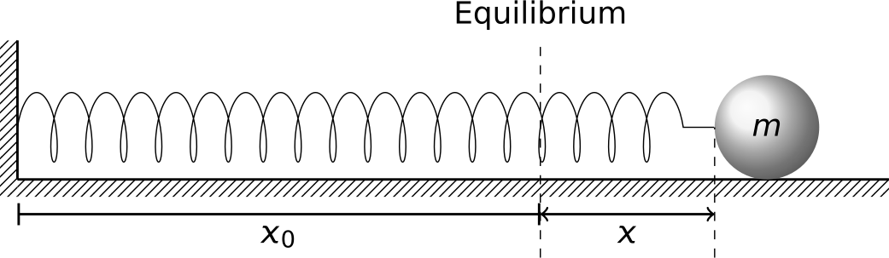
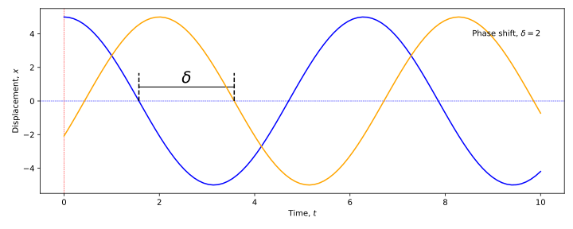
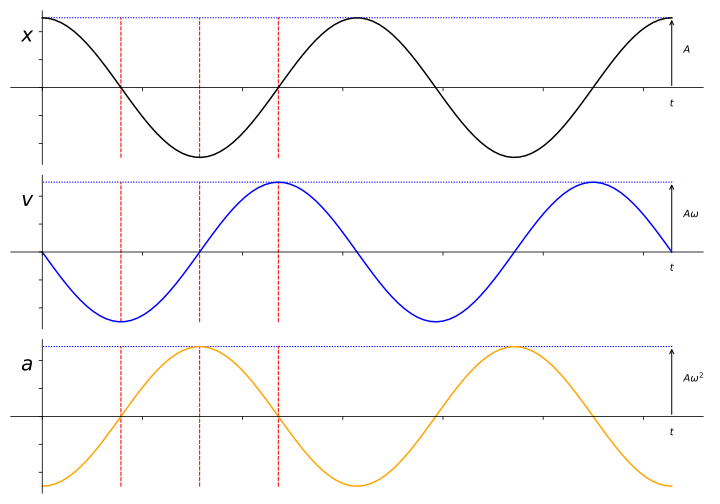
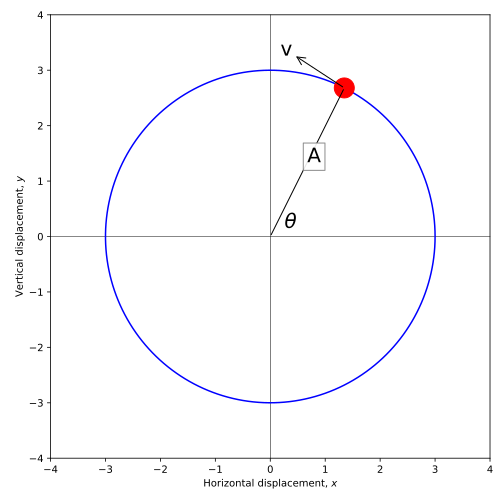
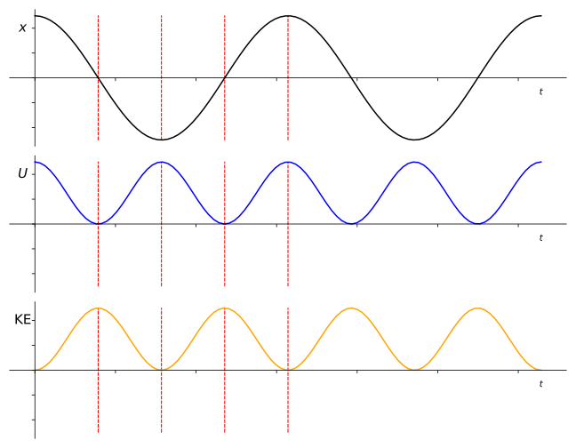

# Simple Harmonic Motion {#sec:shm}

Simple harmonic motion (SHM) is a simple and common type of oscillatory motion. It is a model which is widely used in modelling systems due to its simplicity.  

In general, an object will move under SHM where its acceleration is:

1. proportional to its displacement, but
1. in the opposite direction.

The force causing this acceleration is often termed a *restoring force* as it acts to push the object back to its starting point. 

## A simple example of SHM {#sec:ch1-simpleshmexample}

Consider a block on a spring (Figure \@ref(fig:ch1-blockonspring1))

```{r echo=FALSE, ch1-blockonspring1, out.width='70%', fig.show='hold', fig.align="center", auto_pdf=TRUE, fig.cap="A mass on a spring, stretched distance $x$ past its equilibrium length $x_0$"}

```

By Hooke's law, the spring exerts a force on the block proportional to its displacement $x$, but in the opposite direction, pushing the block back to its equilbrium position, shown mathematically in Equation \@ref(eq:hookeslaw1):

\begin{equation}
F_x = -kx
(\#eq:hookeslaw1)
\end{equation}

In this example, $F_x$ is considered a **restoring force**, while $k$ is the force constant of the spring.

Applying Newton's Second Law to this problem, we can obtain the mathematical description of the system:

\begin{equation}
\begin{aligned}
F_x = ma_x \\
-kx = m\frac{\textrm{d}^2 x}{\textrm{d} t^2}
\end{aligned}
\end{equation}

... and through rearrangement and combination with Equation \@ref(eq:hookeslaw1) we obtain the description of how this mass will move (Equation \@ref(eq:shm-massonspring1)):

\begin{equation}
\frac{\textrm{d}^2 x}{\textrm{d} t^2} = -\frac{k}{m}x
(\#eq:shm-massonspring1)
\end{equation}

The general form of this expresssion for any system can be considered as shown in Equation \@ref(eq:shm-general-massonspring1)

\begin{equation}
\frac{\textrm{d}^2 x}{\textrm{d} t^2} = -Cx \quad\mathrm{or}\quad\ddot{x} = -Cx
(\#eq:shm-general-massonspring1)
\end{equation}

...where $C$ is a positive constant which depends on the system and represents a ratio of the elastic ($k$) and inertial ($m$) contributions within the system.

### Key terms

* **Period**: The time $T$ for one complete oscilation back and forth (units s)
* **Frequency**: The reciprocal of the period; $f = \frac{1}{T}$, units s^-1^ or Hz.

## Positioning in SHM {#sec:shm-position}

SHM can be described by a general equation of motion, defining the position ($x$) of the oscillating mass using a cosine function (Equation \@ref(eq:shm-general-positionx1))

\begin{equation}
x = A \cos (\omega t + \delta)
(\#eq:shm-general-positionx1)
\end{equation}

The parameters in this equation are:

* $A$: The amplitude of the oscillation
* $\omega t + \delta$: Phase of motion
* $\delta$: Phase constant

For any single oscillator, the time origin can always be chosen so that $\delta = 0$. For two or more oscillators there will generally be a phase difference between them (*i.e.* they will not always be at the same 'zero' position at time zero - Figure \@ref(fig:ch1-shmpos-1))

**Figure of position vs time for two oscilators**

```{r echo=FALSE, ch1-shmpos-1, out.width='70%', fig.show='hold', fig.align="center", auto_pdf=TRUE, fig.cap="An illustration of the changing position of two oscillators with respect to time, with a relative phase shift of 2 radians. "}

```

## Velocity in SHM {#sec:shm-velocity}

To find the velocity of the oscillating mass, we can simply find the first derivative of its position with respect to time (Equation \@ref(eq:shm-general-velocityx1)):

\begin{equation}
\begin{array}{rcl}
v & = & \frac{\textrm{d}x}{\textrm{d}t}\\
&=& -A \omega \sin (\omega t + \delta)\\
\end{array}
(\#eq:shm-general-velocityx1)
\end{equation}

A quick inspection of this shows that the velocity $v$ is maximised when $x$ is at a minimum; *i.e.* as the object passes through its equilibirum position.

## Acceleration in SHM  {#sec:shm-acceleration}

Again, to find the acceleration, we find the second derivative of its position with respect to time (Equation \@ref(eq:shm-general-accelerationx1)):

\begin{equation}
\begin{array}{rcl}
a & = & \frac{\textrm{d}v}{\textrm{d}t} = \frac{\textrm{d}^2 x}{\textrm{d}t^2}\\
&=& -A \omega^2 \cos (\omega t + \delta)\\
\end{array}
(\#eq:shm-general-accelerationx1)
\end{equation}

...or, to use the Newtonian "dot" notation (Equation \@ref(eq:shm-general-accelerationx2)):

\begin{equation}
a = \ddot{x} = -\omega^2 x
(\#eq:shm-general-accelerationx2)
\end{equation}

If we now compare this with Equation \@ref(eq:shm-massonspring1) we can see that we have an expression for $\omega$ for the oscillating mass $m$ on a spring of force constant $k$ (Equation \@ref(eq:shm-general-omega1)):

\begin{equation}
\begin{array}{rcl}
\omega^2 &=& \frac{k}{m}\\
\omega &=& \sqrt{\frac{k}{m}}
\end{array}
(\#eq:shm-general-omega1)
\end{equation}

## Comparing displacement, velocity and acceleration {#sec:shm-comparing-xva}

When we now compare the displacement, velocity and acceleration we make a number of observations.  Firstly, they are all sinusoidal functions; variously sine and cosine functions. However, when we overlay these we have a better indication of how they interrelate (Figure \@ref(fig:shm-general-comparison-xva))


```{r echo=FALSE, shm-general-comparison-xva, out.width='70%', fig.show='hold', fig.align="center", auto_pdf=TRUE, fig.cap="Comparing the changes of position, velocity and acceleration with time for a harmonic oscillator. Note that when $x$ is at zero, $v$ is maximised, while $a$ is at a maximum when $v$ is zero. The relative amplitudes of each of the waves is given."}

```

We can now make a few more observations:

* When the displacement $x$ is at a maximum ($x_\textrm{max}$), the velocity $v$ is zero while the acceleration is at its maximum **but negative with respect to displacement** ($a=  -a_\textrm{max}$)
* When the displacement $x$ is zero, the velocity $v$ is at its maximum value ($v = \pm v_\textrm{max}$) and the acceleration is zero.
* The pattern repeats with each period; namely $x_0$ (displacement at time $t = 0$) is equal to the displacement $x_T$ (displacement after one period of oscillation, $T$), and the same for the acceleration and velocity.
* In general, $x_t = x_{t+T}$; the displacement at time $t$ is equal to the displacement at the time $t$ plus one period of oscillation, $T$.

This allows us to compare the displacement, velocity and acceleration at four points in the oscillation (Table \@ref(tab:ch1-xva-comparison1)):


Table: (\#tab:ch1-xva-comparison1) Relating the displacement, velocity and acceleration at different times in the oscillation for a simple harmonic oscillator.

| Time | Displacement, $x$ | Velocity, $v$ | Acceleration, $a$ |
| :--- | :--- | :--- | :--- |
| $t = 0$ | $x_0 = A$ | $v_0 = 0$ | $a_0 = -a_{\textrm{max}}$ |
| $t = \frac{T}{4}$ | $x_{\frac{T}{4}} = 0$ | $v_{\frac{T}{4}} = -v_\textrm{max}$ | $a_{\frac{T}{4}} = 0$ |
| $t = \frac{T}{2}$ | $x_{\frac{T}{2}} = -A$ | $v_{\frac{T}{2}} = 0$ | $a_{\frac{T}{2}} = a_{\textrm{max}}$ |
| $t = \frac{3T}{4}$ | $x_{\frac{3T}{4}} = 0$ | $v_{\frac{3T}{4}} = v_\textrm{max}$ | $a_{\frac{3T}{4}} = 0$ |
| $t = T$ | $x_T = x_0 = A$ | $v_T = v_0 = 0$ | $a_T = a_0 = -a_{\textrm{max}}$ |

## Initial conditions {#sec:shm-initialconditions}

We mentioned in Section \@ref(sec:shm-comparing-xva) that the displacement, velocity and acceleration expressions were based on sinusoial functions, and each function had a scaling factor $A$ (the **amplitude** of the oscillation) and a **phase** component $\delta$. In most problems, we wish to determine the value of these constants.  In order to determine these, we establish the initial conditions of the oscillation.

In Figure \@ref(fig:shm-general-comparison-xva) we defined our displacement at $+A$ which set up the rest of the problem. However, we will not always be so fortunate.  For a general case, we then need to be more discerning.

We can establish expressions for both the amplitude and the phase component by setting $t = 0$ in our general expressions (Equation \@ref(eq:ch1-shm-initconditions1)):

\begin{equation}
\begin{array}{rclcrcl}
x &=& A  \cos (\omega t + \delta)       & \rightarrow & x_0 &=& A  \cos (\delta)\\
v &=& -A \omega \sin (\omega t + \delta)& \rightarrow & v_0 &=& -A \omega \sin ( \delta)
\end{array}
(\#eq:ch1-shm-initconditions1)
\end{equation}

We now treat these as simultaneous equations to find $\delta$ and $A$ (Equation \@ref(eq:ch1-shm-initconditions2))^[Note that we use the trigonometric identity $\cos^2 \alpha + \sin^2 \alpha = 1$ to find $A$]:

\begin{equation}
\begin{array}{rcl}
\tan \delta = \dfrac{\sin \delta}{\cos \delta} = -\dfrac{v_0}{\omega x_0} & \textrm{and} & A^2 = x_0^2 + \dfrac{v_0^2}{\omega^2}
\end{array}
(\#eq:ch1-shm-initconditions2)
\end{equation}

## Frequency and angular frequency {#sec:shm-freq-angularfreq}

In Section \@ref(sec:shm-comparing-xva) we stated that the nature of the oscillation meant that it repeats after every oscillation; mathematically $x(t) = x(t + T)$; the position $x$ at time $t$ is equal to the position at time $(t+T)$. 

When we apply this to the velocity, we obtain the following expression:

\begin{equation}
\begin{array}{rcl}
v(t) &=& v(t+T) \\
A \cos (\omega t + \delta) &=& A \cos (\omega (t+T) + \delta) \\
&=& A \cos ([\omega t + \delta] + \omega T)
\end{array}
\end{equation}

Due to the cyclic nature of a cosine function, $\cos (\alpha) = \cos (\alpha + 2\pi)$, this must therefore mean (Equation \@ref(eq:ch1-definingomega1)):

\begin{equation}
\omega T = 2\pi \hspace{10pt} \textrm{or} \hspace{10pt} \omega = \frac{2\pi}{T}
(\#eq:ch1-definingomega1)
\end{equation}

This gives us a way to think about $\omega$; its connection to circular motion (the clue is the $2\pi$!). It can be thought of as the **angular frequency**, with units radians s^-1^, and an oscillation of $2\pi$ radians corresponds to one period of oscillation.

Additionally, since the frequency of the oscillation $f$ is the reciprocal of the period of oscillation ($f = \frac{1}{T}$), the angular frequency can be rewritten as $\omega = 2\pi f$, and $f = \frac{\omega}{2\pi}$.

For the spring system we discussed in Section \@ref(sec:ch1-simpleshmexample), we stated that the angular frequency $\omega = \sqrt{\frac{k}{m}}$. Therefore we can obtain an expression for the frequency of our oscillator (Equation \@ref(eq:ch1-freq-angfreq1))

\begin{equation}
f = \frac{1}{T} = \frac{1}{2\pi}\sqrt{\frac{k}{m}}
(\#eq:ch1-freq-angfreq1)
\end{equation}

Inspection of this equation reveals the behaviour of our oscillator:

* If we have a stiffer spring (larger $k$), we expect the frequency $f$ to increase,
* If we use an oscillator with larger mass (larger $m$), we would expect the frequency ($f$) to decrease.
* The frequency (and therefore period) of simple harmonic oscillation is independent of amplitude.^[A caveat to this is for large amplitudes where other factors start to affect the behaviour. But this is then no longer *simple* harmonic motion!]

## SHM and circular motion {#sec:ch1-shmcircmotion1}

We mentioned an "angular frequency" for SHM; this would appear to suggest behaviour akin to circular motion. It is therefore worth exploring our descriptions of circular motion.

Imagine a point mass moving in a circle (Figure \@ref(fig:ch1-circularmotion1)). For convenience, we imagine this using Cartesian $x-y$ axes, shown in Figure \@ref(fig:ch1-circularmotion1).

```{r echo=FALSE, ch1-circularmotion1, out.width='70%', fig.show='hold', fig.align="center", auto_pdf=TRUE, fig.cap="A particle moving in a circle of radius $A$ can be assumed to have an instantaneous linear velocity $v$. The $x$ and $y$ components of the motion are found from trigonometry of the radius $A$ and the angle $θ$."}

```

The particle of mass $m$ is moving in a circle of radius $A$ with instantaneous linear velocity $v$; the radius makes an angle $\theta$ with the $x$-axis.  We now look at how its position maps onto each of the axes:

* The angular velocity of the particle is $\omega$; found *via* $\frac{v}{A}$
  * We can then describe $\theta$ in terms of $\omega$:
  * $\theta = \omega t + \delta$ ($\delta$ is the angle at time $t=0$)
* The particle's position on the $x$-axis is therefore found *via*:
  * $x = A \cos \theta = A \cos (\omega t + \delta)$
  * This corresponds with the expression for SHM for a particle moving in a linear fashion (Equation \@ref(eq:shm-general-positionx1)).

We can also consider how its position maps onto the $y$-axis:

* The position on the $y$-axis is found *via*:
  * $y = A \sin \theta = A \sin (\omega t + \delta) \equiv A \cos(\omega t + [\delta - \frac{\pi}{2}])$
  * This once again corresponds with the expression for SHM for a particle moving in a linear fashion.
  * The $y$-component of the motion is $\frac{\pi}{2}$ out of phase wiht the $x$-component
  
This illustrates that circular motion is a combination of two perpendicular SHM oscillations of the same frequency and amplitude, but a relative phase of $\frac{\pi}{2}$.

## Energy in SHM {#sec:ch1-shm-energy1}

As with all isolated systems, the total energy $E$ of the simple harmonic oscillator is constant, however the contributions from potential energy ($U$) and KE vary with time.

\begin{equation}
E = KE + U = \textrm{constant}
\end{equation}

Let's go back to the condition for SHM; there is a restoring force proportional to the displacement:

\begin{equation}
F = -kx
\end{equation}

Knowing that the potential energy is the first derivative of the force, we can integrate this force expression (with respect to $x$) to get back to the energy statement:^[The constant of integration will evaluate to zero from the starting condition $U = 0$ at zero displacement.] 

\begin{equation}
\begin{array}{rcl}
U &=& \int F \mathrm{d}x \\
& =& \frac{1}{2}kx^2 \hspace{10pt} [+C]
\end{array}
(\#eq:ch1-potentialfromforce1)
\end{equation}

However, we already have an expression for how the displacement, $x$, varies with time (Equation \@ref(eq:shm-general-positionx1)); let's now substitute this into the result from Equation \@ref(eq:ch1-potentialfromforce1):

\begin{equation}
U = \frac{1}{2}kA^2 \cos^2 (\omega t + \delta)
(\#eq:ch1-potentialfromforce2)
\end{equation}

We can also generate an expression for the kinetic energy; remember that kinetic energy can be found from $\frac{1}{2}mv^2$; so we  use the expression for $v$ given in Equation \@ref(eq:shm-general-velocityx1):

\begin{equation}
\begin{array}{rcl}
KE &=& \frac{1}{2} mv^2 \\
& =& \frac{1}{2} m A^2 \omega^2 \sin^2 (\omega t + \delta)
\end{array}
(\#eq:ch1-potentialfromforce3)
\end{equation}

We can simplify this using Equation \@ref(eq:shm-general-accelerationx1) for a particle on a spring, where $\omega^2 = \frac{k}{m}$:

\begin{equation}
KE = \frac{1}{2}kA^2 \sin^2 (\omega t + \delta)
(\#eq:ch1-potentialfromforce4)
\end{equation}

Combining the result of Equations \@ref(eq:ch1-potentialfromforce2) and \@ref(eq:ch1-potentialfromforce4) we find the result in Equation \@ref(eq:ch1-potentialfromforce5):

\begin{equation}
\begin{array}{rcl}
E_\textrm{total} &=& U + KE \\
& =& \frac{1}{2}kA^2 \cos^2 (\omega t + \delta) + \frac{1}{2}kA^2 \sin^2 (\omega t + \delta)\\
& =& \frac{1}{2}kA^2 \left[ \cos^2 (\omega t + \delta) + \sin^2 (\omega t + \delta)\right]\\
&=& \frac{1}{2}kA^2
\end{array}
(\#eq:ch1-potentialfromforce5)
\end{equation}

This result tells us that the total energy in a simple harmonic oscillation is **proportional to the square of the amplitude**.

```{r echo=FALSE, ch1-energyinshm, out.width='70%', fig.show='hold', fig.align="center", auto_pdf=TRUE, fig.cap="Comparing how the kinetic energy (KE) and potential energy (U) of an harmonic oscillator varies with displacement $x$ about the equilibrium position. "}

```

### Points to bear in mind

* $U = U_\mathrm{max}$ at $x = ±x_\mathrm{max}$
* $KE = KE_\mathrm{max}$ at $x = 0$
* $U_\mathrm{average} = KE_\mathrm{average} = \frac{1}{2}E_\mathrm{total}$

<!-- You can label chapter and section titles using `{#label}` after them, e.g., we can reference Chapter \@ref(intro). If you do not manually label them, there will be automatic labels anyway, e.g., Chapter \@ref(methods). -->

<!-- Figures and tables with captions will be placed in `figure` and `table` environments, respectively. -->

<!-- ```{r nice-fig, fig.cap='Here is a nice figure!', out.width='80%', fig.asp=.75, fig.align='center'} -->
<!-- par(mar = c(4, 4, .1, .1)) -->
<!-- plot(pressure, type = 'b', pch = 19) -->
<!-- ``` -->

<!-- Reference a figure by its code chunk label with the `fig:` prefix, e.g., see Figure \@ref(fig:nice-fig). Similarly, you can reference tables generated from `knitr::kable()`, e.g., see Table \@ref(tab:nice-tab). -->

<!-- ```{r nice-tab, tidy=FALSE} -->
<!-- knitr::kable( -->
<!--   head(iris, 20), caption = 'Here is a nice table!', -->
<!--   booktabs = TRUE -->
<!-- ) -->
<!-- ``` -->

<!-- You can write citations, too. For example, we are using the **bookdown** package [@R-bookdown] in this sample book, which was built on top of R Markdown and **knitr** [@xie2015]. -->
