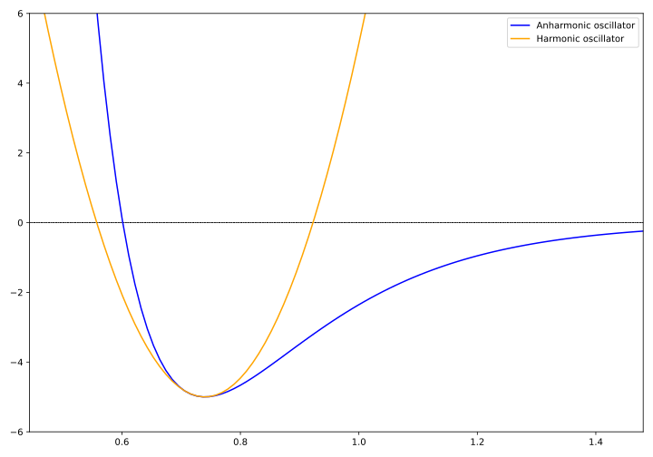
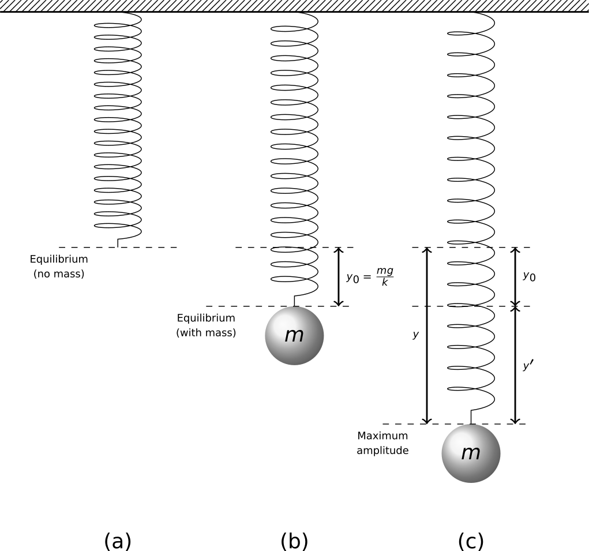
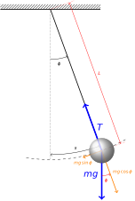
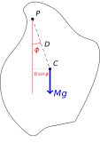

# SHM in Real Systems {#sec:shm-real}

*Textbook link: Tipler and Mosca: Ch 14.2 to 14.4*

## General motion near equilibrium

A way of thinking about SHM is that it is a point mass oscillating within a potential energy field. As with any potential energy field, the force on this particle is given by the gradient of the potential energy and is directed down the potential energy slope. Mathematically, for a potential energy field, the force may be found as follows (Equation \@ref(eq:ch2-forceenergyderiv1)):

\begin{equation}
F = - \frac{\mathrm{d}U}{\mathrm{d}r}
(\#eq:ch2-forceenergyderiv1)
\end{equation}

In a one-dimensional system, this is expressed as follows (Equation \@ref(eq:ch2-forceenergyderiv2)):

\begin{equation}
F_x = - \frac{\mathrm{d}U}{\mathrm{d}x}
(\#eq:ch2-forceenergyderiv2)
\end{equation}

As mentioned in Section \@ref(sec:ch1-simpleshmexample), under SHM the force is proportional to the displacement from the equilibrium position and in the opposite direction; i.e.:

\begin{equation}
F_x = -kx
(\#eq:ch2-hookeslaw1)
\end{equation}

Applying the principle from Equation \@ref(eq:ch2-forceenergyderiv1) we can therefore integrate this experession with respect to $x$ to obtain the expression for our potential energy.  We covered this in Section \@ref(sec:ch1-shm-energy1), and we found the result (Equation \@ref(eq:ch2-potentialfromforce1); remember that, due to initial conditions, the constant of integration reduces to zero). 

\begin{equation}
U  = \frac{1}{2}kx^2 
(\#eq:ch2-potentialfromforce1)
\end{equation}

Simple inspection and recall of our mathematics knowledge tells us that this simple equation represents a parabola.  This gives us a series of useful points to bear in mind:

* A parabolic potential energy function implies SHM and *vice versa*;
* For small amplitudes of oscillation, many potential energy functions may be *approximated* by a parabola (*e.g.* a pendulum, vibrating molecules)
* A system undergoing SHM is called a **harmonic oscillator**.

The simplicity of the **simple harmonic oscillator** model is what makes it such a generally useful system to consider.

## Example: a diatomic molecule {#sec:ch2-diatomicmolecule}

A diatomic molecule is a useful system to consider as an example because it can be very usefully approximated to a harmonic oscillator.  The potential energy curve for a vibrating diatomic molecule (in this case the H_2_ hydrogen molecule) is shown in Figure \@ref(fig:ch2-diatomicmolecule1).


```{r echo=FALSE, ch2-diatomicmolecule1, out.width='70%', fig.show='hold', fig.align="center", auto_pdf=TRUE, fig.cap="Comparing the Morse potential of the anharmonic oscillator with the harmonic approximation. Near equilibrium, the harmonic oscillator model approximates diatomic behaviour, however this rapidly deviates from reality. "}

```

The potential of a vibrating diatomic is known as the Morse potential; the form of this is outwith this discussion, however it is useful to think that, for small displacements around the equilibrium separation the potential energy curve approximates a parabola.  We can therefore re-draw our potential energy curve as such, and show this in Figure \@ref(fig:ch2-diatomicmolecule2).^[Simplistically, the deviation is due to nuclear repulsion at high compression, while at large extension the bond eventually breaks - the "zero potential" point.]


```{r echo=FALSE, ch2-diatomicmolecule2, out.width='70%', fig.show='hold', fig.align="center", auto_pdf=TRUE, fig.cap="The parabolic approximation of a diatomic molecule, showing the potential varying with compression or extension from equilibrium separation, $r_0$. "}
knitr::include_graphics("visualisations//latex/ch2-diatomicmolecule2.svg")
```

The equation of the parabola shown in \@ref(fig:ch2-diatomicmolecule2) takes the following form:

\begin{equation}
U(r) = A + B(r - r_0)^2
(\#eq:ch2-diatomicmolecule1)
\end{equation}

...where $A$ and $B$ are constants relating to the molecular system under consideration, and $r_0$ is the equilibrium bond length.

The force on the bond can then be found from the first derivative of the bond potential described in Equation \@ref(eq:ch2-diatomicmolecule1):

\begin{equation}
\begin{array}{rcl}
F_r &=& - \dfrac{\mathrm{d}U}{\mathrm{d}r} \\
\\
&=& -2B(r-r_0)\\
\end{array}
(\#eq:ch2-diatomicmolecule2)
\end{equation}

Since the term $(r-r_0)$ is the displacement from the equilibrium position, we see that the force, $F_r$ is a **restoring force** and is proportional to the displacement (and in the opposite direction!), telling us that the motion is SHM.  In this example however, the parabolic approximation fails at larger amplitudes.

## Example: Mass on a vertical spring {#sec:ch2-massverticalspring}

In Section \@ref(sec:ch1-simpleshmexample) we considered a mass on a horizontal spring; there was only a single force acting on the mass (the force from the spring), however we are now considering a vertical spring and must consider the effects of gravity (Figure \@ref(fig:ch2-massverticalspring1)).

```{r echo=FALSE, ch2-massverticalspring1, out.width='70%', fig.show='hold', fig.align="center", auto_pdf=TRUE, fig.cap="A particle oscillating on a vertical spring.  There are two equilibrium positions corresponding to the equilibrium position of the unladen spring (a) and the equilibrium position of the mass loaded on spring (b), where the weight of the load is balanced by the force from the extended spring."}

```


In this case we need to work through a slightly different process to find the equation of motion, chiefly because the equilibrium displacement of the mass ($y_0$) is different from the equilibrium position of the spring.

The equilibrium position of the mass $y_0$ is lower than the equilibrium extension of the spring (gravity on the mass causes the spring to stretch).  This is found by relating the force from the spring and the force of gravity acting on the mass (Equation \@ref(eq:ch2-massverticalspring1)):

\begin{equation}
\begin{array}{rcl}
\mathrm{Force~due~to~spring~extension} &=& \mathrm{Gravity~acting~on~mass}\\
k y_0 &=& mg\\
y_0 &=& \dfrac{mg}{k}\\
\end{array}
(\#eq:ch2-massverticalspring1)
\end{equation}

We now apply Newton's Second Law to obtain an expression for the acceleration on the mass due to the forces acting on it (the spring force and gravity).

\begin{equation}
\begin{array}{rcl}
m\ddot{y}&=&  \textrm{spring force} + \textrm{gravity} \\
m\dfrac{\mathrm{d}^2 y}{\mathrm{d} t^2} &=& -ky + mg\\
\end{array}
(\#eq:ch2-massverticalspring2)
\end{equation}

In this expression, $y$ is the total extension of the spring (the extension to the mass equilibrium point, $y_0$ plus the displacement from this point, $y^\prime$).

We now substitute a variable; since $y = y_0 + y^\prime$, we substitute $y$ for $y^\prime$:

* $y = y_0 + y^\prime$
* $y^\prime = y - y_0$

Since $y_0$ is a constant:

\begin{equation}
\dfrac{\mathrm{d} y^\prime}{\mathrm{d} t} = \dfrac{\mathrm{d} y}{\mathrm{d} t} \hspace{10pt} \textrm{and} \hspace{10pt} \dfrac{\mathrm{d}^2 y^\prime}{\mathrm{d} t^2} = \dfrac{\mathrm{d}^2 y}{\mathrm{d} t^2}
\end{equation}

Replacing $y$ for $(y_0 + y^\prime)$ in Equation \@ref(eq:ch2-massverticalspring2), we obtain Equation \@ref(eq:ch2-massverticalspring3):


\begin{equation}
m\dfrac{\mathrm{d}^2 y^\prime}{\mathrm{d} t^2} = -k(y_0 + y^\prime) + mg
(\#eq:ch2-massverticalspring3)
\end{equation}

Since $ky_0 = mg$ (Equation \@ref(eq:ch2-massverticalspring1)), we can therefore eliminate these terms from Equation \@ref(eq:ch2-massverticalspring3), and rewrite as Equation \@ref(eq:ch2-massverticalspring4):

\begin{equation}
m\dfrac{\mathrm{d}^2 y^\prime}{\mathrm{d} t^2} = -k y^\prime
(\#eq:ch2-massverticalspring4)
\end{equation}

This means that, in reference to Figure \@ref(fig:ch2-massverticalspring1), we still have SHM centered on the equilibrium position of the mass.  This may seem like a self-evident result, however it is useful to recognise the role of gravity; its effect is to shift the equilibrium position of the oscillation from $y = 0$ (the equilibrium position of the spring) to $y = y_0$ ($y^\prime = 0$).

Let's now consider the energy in this system. The system already contains some elastic energy as the spring is already stretched to $y_0$ by the gravity acting on the mass:

\begin{equation}
\textrm{elastic potential energy} = \frac{1}{2}ky^2 - \frac{1}{2}ky_0^2
\end{equation}

The gravitational potential energy (relative to the starting position $y_0$) is  given by:

\begin{equation}
\textrm{gravitational potential energy} = mg(y-y_0)
\end{equation}

The total potential energy is therefore given by Equation \@ref(eq:ch2-massverticalspring5):


\begin{equation}
U = \frac{1}{2}ky^2 - \frac{1}{2}ky_0^2 - mg(y-y_0)
(\#eq:ch2-massverticalspring5)
\end{equation}

We can then show that the total potential energy expression in Equation \@ref(eq:ch2-massverticalspring5) can be simplified to that shown in Equation \@ref(eq:ch2-massverticalspring6):

\begin{equation}
U = \frac{1}{2} ky^{\prime 2}
(\#eq:ch2-massverticalspring6)
\end{equation}

**You should ensure you understand how this simplification is done**; this is left as an exercise.

Overall, the expression for the total potential energy shown in Equation \@ref(eq:ch2-massverticalspring6) will still yield a parabola and as such the oscillation is still a simple harmonic oscillation as before.

## The Simple Pendulum {#sec:ch2-simplependulum}

A pendulum is a mechanically simple oscillating system; its oscillation can be considered SHM for small displacements. A simple pendulum is shown in Figure \@ref(fig:ch2-simplependulum1), and it is worth quickly revisiting this example as we will extend this in our futher examples.

```{r echo=FALSE, ch2-simplependulum1, out.width='70%', fig.show='hold', fig.align="center", auto_pdf=TRUE, fig.cap="A simple pendulum, consisting of a mass $m$ swinging on a string of length $L$. At angle $\\phi$, the weight of the mass $mg$ can be resolved into components to determine the mechanics of the system."}

```


For small dispalcements (small $\phi$), the equation of motion can be considered as in Equation \@ref(eq:ch2-simplependulum1):

\begin{equation}
\frac{\mathrm{d}^2 \phi}{\mathrm{d} t^2} = -\frac{g}{L}\sin \theta \approx -\frac{g \phi}{L} \textrm{for small} \phi
(\#eq:ch2-simplependulum1)
\end{equation}

This is SHM, with angular frequency $\omega$ and period $T$ found as in Equation \@ref(eq:ch2-simplependulum2):

\begin{equation}
\omega^2 = \frac{g}{L} \hspace{15pt} and \hspace{15pt} T = 2\pi \sqrt{\frac{L}{g}}
(\#eq:ch2-simplependulum2)
\end{equation}

The solution for the equation of motion of this system then becomes (Equation \@ref(eq:ch2-simplependulum3)):

\begin{equation}
\phi = \phi_0 \cos (\omega t + \delta)
(\#eq:ch2-simplependulum3)
\end{equation}

...where $\phi_0$ is the amplitude of the system and $\delta$ is the phase constant.  Notice that, for the pendulum we express the amplitude in terms of the angle of the string rather than an absolute distance (shown as $s$ in Figure \@ref(fig:ch2-simplependulum1)).

## The Physical Pendulum {#sec:ch2-physicalpendulum}

Many oscillating systems demonstrate rotational oscillations under gravity akin to the simple pendulum. In this case, the system rotates around a pivot, $P$, and this can then be considered as a pendulum with the centre of mass acting as the 'bob'. An example of a general system is shown in Figure \@ref(fig:ch2-physicalpendulum1).

```{r echo=FALSE, ch2-physicalpendulum1, out.width='40%', fig.show='hold', fig.align="center", auto_pdf=TRUE, fig.cap="A physical pendulum, consisting of a physical object of mass $M$ swinging on a pivot through point $P$ of length $L$. At angle $\\phi$, the weight of the mass $Mg$ can again be resolved into components to determine the mechanics of the system."}

```

Now, as a restoring force, we consider the **torque** of the centre of mass around the pivot. Remember that the torque is defined as the product of the force and the **perpendicular distance of the force's line of action from the pivot**.  If using vectors, this is considered as the **cross product** of the force vector $\mathbf{F}$ with the position vector of the centre of mass from the pivot, $\mathbf{D}$ (Equation \@ref(eq:ch2-physicalpendulum1)):

\begin{equation}
\begin{array}{rcl}
\textrm{Torque about pivot $P$} &=& \mathbf{F} \times \mathbf{D} \\
&=& \mathbf{\hat{n}}~ |F| |D| \sin \phi \\
&=& \mathbf{\hat{n}}~ mg D \sin \phi = \tau \mathbf{\hat{n}} 
\end{array}
(\#eq:ch2-physicalpendulum1)
\end{equation}

In this case, the unit vector $\mathbf{\hat{n}}$ is perpendicular to the plane of rotation and is included for completeness' sake. What we are interested in is the magnitude of this torque vector, $\tau$.

Recall from rotational motion that the angular acceleration $\alpha$ and the torque $\tau$ are connected via the moment of inertia $I$ (Equation \@ref(eq:ch2-physicalpendulum2)):^[Note that the appearance of the negative sign indicates that the torque force is opposite to the direction of increasing $\phi$]

\begin{equation}
\begin{array}{rcl}
I \dfrac{\mathrm{d}^2 \phi}{\mathrm{d} t^2}  &=& I\alpha =\tau \\
&=& -mgD \sin \phi
\end{array}
(\#eq:ch2-physicalpendulum2)
\end{equation}

We now approximate this for small $\phi$:

\begin{equation}
\frac{\mathrm{d}^2 \phi}{\mathrm{d} t^2} = -\frac{mgD\phi}{I} = -\omega^2 \phi
\end{equation}

This allows us to identify expressions again for the angular frequency, $\omega$, and the period $T$ (Equation \@ref(eq:ch2-physicalpendulum3)):

\begin{equation}
\omega^2 = \frac{mgD}{I} \hspace{15pt} and \hspace{15pt} T = 2\pi \sqrt{\frac{I}{mgD}}
(\#eq:ch2-physicalpendulum3)
\end{equation}

We can compare this result with that for the simple pendulum shown in Equation \@ref(eq:ch2-simplependulum2); if we remember that the moment of inertia $I$ is defined as $I = mD^2$, we can substitute this into Equation \@ref(eq:ch2-physicalpendulum3) and see that this is a general case for any rotating body:

\begin{equation}
T_\textrm{simple pendulum} = 2\pi \sqrt{\frac{I_\textrm{simple pendulum}}{mgD}} = 2\pi \sqrt{\frac{mD^2}{mgD}} = 2\pi \sqrt{\frac{D}{g}}
\end{equation}

...giving us our expected result (where the general term $D$ can be replaced for the length of the simple pendulum, $L$).


