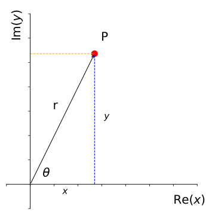
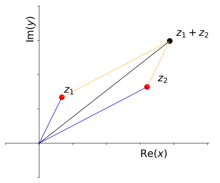

# Complex Numbers {#sec:ch3-complexnumbers}

*Textbook link: Jordan and Smith, Ch. 6*

As we move on with our descriptions of oscillations and, in particular, wave behaviour, the mathematics can become increasingly involved.  We can greatly simplify the mathematics by using **complex numbers** in our derivations.  For now, it is useful to quickly revisit the complex number concept.

While the idea of a "complex number" sounds ... *complex*, the use of these numbers becomes straightforward as we apply our familiar mathematical techniques. In the context of mathematics, the term **complex** simply means 'more than one part'; therefore, a **complex number** is a number with more than one part.  It is this two-component nature of a complex number which makes them so useful in many aspects of Physics, and particularly when describing wave behaviour.

## Overview of complex numbers {#sec:ch3-complexoverview}

The general form of a complex number $z$ is shown in Equation \@ref(eq:ch3-complexnumber1):

\begin{equation}
z = a + \mathrm{i}b
(\#eq:ch3-complexnumber1)
\end{equation}

The symbol $z$ is a general term for a complex number, and has two components, a "real" component $a$ and an "imaginary" component, $b$.  The imaginary number, $\mathrm{i}$, is defined using the process shown in  Equation \@ref(eq:ch3-complexnumber2):

\begin{equation}
\begin{array}{rcl}
x^2 &=& -1 \\
x &=& \pm \mathrm{i}\\
i^2 &=& -1
\end{array}
(\#eq:ch3-complexnumber2)
\end{equation}

The terms 'real' and 'imaginary' are nothing more than labels. Neither is any more or less "realistic" than the other nor is it any less valid. Some may claim that the number $\mathrm{i}$ is a 'pretend' number; however were this to be true, it would not be as useful as it is!^[Remember that negative numbers were once seen as 'pretend numbers', as you could not have negative eight apples. They have since become indispensable in many applications, not least financial transactions!].

The next useful concept to recall is the **complex conjugate**, $z^*$. This is defined as in Equation \@ref(eq:ch3-complexnumber3):

\begin{equation}
\begin{array}{rcl}
z &=& a + \mathrm{i}b \\
z* &=& a - \mathrm{i}b \\
zz^* &=& a^2 + b^2
\end{array}
(\#eq:ch3-complexnumber3)
\end{equation}

In general, for any complex number of the form $z = a \pm \mathrm{i}b$, there exists its complex conjugate, $z^* = a \mp \mathrm{i}b$ such that $zz^*$ is a wholly real number and equal to $a^2 + b^2$.

The complex conjugate is particularly useful when finding fractions of complex numbers as it is used to make the denominator of the fraction wholly "real".

## Useful results for complex numbers {#sec:ch3-complexusefulresults}

There are a number of useful results worth remembering when handling complex numbers, and these are listed here.

For a pair of complex numbers, $z_1$ and $z_2$:

\begin{equation}
\begin{array}{rcl}
z_1 &=& a_1 + \mathrm{i}b_1 \\
z_2 &=& a_2 + \mathrm{i}b_2 
\end{array}
(\#eq:ch3-complexnumber4)
\end{equation}

...we can establish the following principles:

* Equality:

\begin{equation}
\textrm{If} \hspace{15pt} a_1 = a_2 \hspace{15pt} \textbf{and} \hspace{15pt} b_1 = b_2  \hspace{15pt} \textrm{then}  \hspace{15pt} z_1 = z_2
\end{equation}

* Addition and subtraction:

\begin{equation}
\begin{array}{rcl}
z_1 + z_2 &=& (a_1 + a_2) + \mathrm{i}(b_1 + b_2) \\
z_1 - z_2 &=& (a_1 - a_2) + \mathrm{i}(b_1 - b_2) \\
\end{array}
\end{equation}

* Products:

\begin{equation}
\begin{array}{rcl}
z_1 \times  z_2 &=& (a_1 + \mathrm{i}b_1) (a_2 + \mathrm{i}b_2) \\
 &=& (a_1 a_2 - b_1 b_2) + \mathrm{i}(a_1 b_2 + a_2 b_1) \\
\end{array}
\end{equation}

* Reciprocal:

\begin{equation}
\frac{1}{z} = \frac{z^* }{z z^* } = \frac{a - \mathrm{i}b }{a^2 + b^2 }
\end{equation}

* Division:

\begin{equation}
\frac{z_1}{z_2} = \frac{z_1 z_2^* }{z_2 z_2^* } = \frac{(a_1 a_2 + b_1 b_2) - \mathrm{i}(a_1 b_2 - a_2 b_1)}{a_2^2 + b_2^2 }
\end{equation}

Other useful principles which involve the complex conjugate are listed in Equation \@ref(eq:ch3-complexnumber5) below:

\begin{equation}
\begin{array}{rcl}
(z_1 + z_2)^* &=& z_1^* + z_2^*\\
(z_1  z_2)^* &=& z_1^* + z_2^* \\
\left( \dfrac{z_1}{z_2} \right)^* &=& \dfrac{z_1^* }{z_2^* } \\
a = \mathrm{Re}(z) &=& \dfrac{1}{2}(z + z^* ) \\
b = \mathrm{Im}(z) &=& \dfrac{1}{2}(z - z^* ) 
\end{array}
(\#eq:ch3-complexnumber5)
\end{equation}


## The Argand Diagram {#sec:ch3-arganddiagram}

Since a complex number consists of two independent components, we have another way to describe these numbers. Complex numbers can be plotted on a graph, with the '**real**' component plotted on one axis (the $x$-axis) and the '**imaginary**' component plotted on the other axis (the $y$-axis). This is the basis of the Argand diagram (Figure \@ref(fig:ch3-argand1)).

```{r echo=FALSE, ch3-argand1, out.width='70%', fig.show='hold', fig.align="center", auto_pdf=TRUE, fig.cap="A typical Argand diagram, showing the Real ('Re') axis and the Imaginary ('Im') axis. The point $P$ can be defined in '$x,y$' terms (the 'complex number'), or can be defined as polar '$r,\\theta$' terms (termed 'modulus' and 'argument')"}

```


This allows us to define a complex number in terms of a **modulus** (radial distance from the origin) and an **argument** (angle from the 'real' axis).  Useful properties of the modulus are listed in Equation \@ref(eq:ch3-complexnumber6):

\begin{equation}
\begin{array}{rcl}
|z^* | &=& |z| \\
zz^* &=& |z^2| \\
 |z_1 z_2| &=& |z_1 | |z_2| \\
|\dfrac{z_1}{z_2}| &=& \dfrac{|z_1|}{|z_2|} \\
\\
|z_1 + z_2| &\neq& |z_1 | + |z_2|
\end{array}
(\#eq:ch3-complexnumber6)
\end{equation}


The Argand diagram is a representation of the **complex plane**, through which it becomes possible to visualise properties of complex numbers.  One example of this is the addition of complex numbers; these can be considered to behave as vectors (Figure \@ref(fig:ch3-argandcomplexaddition1))

```{r echo=FALSE, ch3-argandcomplexaddition1, out.width='70%', fig.show='hold', fig.align="center", auto_pdf=TRUE, fig.cap="Addition of complex numbers $z_1$ and $z_2$ can be shown grapically on an Argand diagram; the separate consideration of the 'real' and 'imaginary' components is analogous to the separate consideration of vector components."}

```

## Polar representation of complex numbers {#sec:ch3-polarcomplexnumbers}

As well as the **cartesian interpretation** of the Argand diagram, we can also consider a **polar representation** of a complex number; where instead of "real" and "imaginary" components acting as $(x,y)$ coordinates, we define the position of the complex number on the complex plane as a radius and an angle, $\theta$.  We have already illustrated this in Figure \@ref(fig:ch3-argand1)

In this representation, the complex number can be expressed a different way:

\begin{equation}
\begin{array}{rcl}
& z = a + \mathrm{i}b & \\
& r = |z| = \sqrt{a^2 + b^2} & \\
a = r\cos \theta & b = r \sin \theta & \theta = \mathrm{arg} (z) = \arctan \left( \dfrac{b}{a} \right) \\
& z = r \cos \theta + \mathrm{i}|z| \sin \theta &
\end{array}
\end{equation}


Normally, $\theta$ will lie in the range such that $-\pi < \theta \leq \pi$, meaning that our complex number representation is now shown in Equation \@ref(eq:ch3-complexnumber7):

\begin{equation}
\begin{array}{c}
z = a + \mathrm{i}b = r \cos \theta + \mathrm{i} r \sin \theta \\
z = r \left( \cos \theta + \mathrm{i} \sin \theta \right)
\end{array}
(\#eq:ch3-complexnumber7)
\end{equation}

## Exponential representation of complex numbers {#sec:ch3-exponentialrepresentationcomplex}

The exponential representation of a complex number takes the general form of $z = Ae^{\mathrm{i}\theta}$. This is based on series expansions of $\cos \theta$ and $\mathrm{i}\sin \theta$, which shows *De Moivre's theorem*. Key results from this are shown in Equation \@ref(eq:ch3-demoivre1):

\begin{equation}
\begin{array}{rcl}
\mathrm{e}^{\mathrm{i}\theta} &= &\cos \theta + \mathrm{i}\sin \theta\\
\left( \mathrm{e}^{\mathrm{i}\theta} \right)^n &=& \left( \cos \theta + \mathrm{i}\sin \theta \right)^n = \mathrm{e}^{\mathrm{i}n\theta} \\
\left( \cos \theta + \mathrm{i}\sin \theta \right)^n &=&  \cos n\theta + \mathrm{i}\sin n \theta
\end{array}
(\#eq:ch3-demoivre1)
\end{equation}

This means that we obtain the following representations for complex numbers:

\begin{equation}
\begin{array}{c}
z = r \left( \cos \theta + \mathrm{i}\sin \theta \right) = r\mathrm{e}^{\mathrm{i}\theta}\\
z^* = r \left( \cos \theta - \mathrm{i}\sin \theta \right) = r\mathrm{e}^{-\mathrm{i}\theta}\\
\textrm{where:} \hspace{15pt} r = |z| \hspace{20pt} \theta = \textrm{arg}(z)
\end{array}
\end{equation}


Combining these with Equation \@ref(eq:ch3-complexnumber5) we also note the following useful results (Equation \@ref(eq:ch3-complexnumber8))

\begin{equation}
\begin{array}{rcl}
\cos \theta &=& \frac{1}{2} \left( \mathrm{e}^{\mathrm{i}\theta} + \mathrm{e}^{-\mathrm{i}\theta} \right)\\
\sin \theta &=& \frac{1}{2\mathrm{i}} \left( \mathrm{e}^{\mathrm{i}\theta} - \mathrm{e}^{-\mathrm{i}\theta} \right)\\
\end{array}
(\#eq:ch3-complexnumber8)
\end{equation}


## Complex representation of oscillations {#sec:ch3-complexreposcillation}

Having quickly readdressed our understanding of complex numbers, we now turn our attention to the application of these in the context of oscillations and waves.

Consider the general equation of SHM (Equation \@ref(eq:ch3-complexoscill1), derived from Equation \@ref(eq:shm-general-accelerationx2))

\begin{equation}
\frac{\mathrm{d}^2 u}{\mathrm{d} t^2 } + \omega^2 u = 0
(\#eq:ch3-complexoscill1)
\end{equation}

As has been previously discussed, sinusoidal functions can form the basis of solutions to this differential equation; so both $\cos \omega t$ and $\sin \omega t$ are solutions to this equation.  Therefore, any linear combination of these solutions will also be a solution, *i.e.* the linear combination shown here:

\begin{equation}
u = c_1 \cos \omega t + c_2 \sin \omega t
\end{equation}

... will also satisfy Equation \@ref(eq:ch3-complexoscill1).  This can be extended using De Moivre's theorem (Equation \@ref(eq:ch3-demoivre1)) allowing an exponential representation of an oscillation as shown in Equation \@ref(eq:ch3-demoivreoscillation1):

\begin{equation}
u = A (\cos \omega t + \mathrm{i} \sin \omega t) \equiv A \mathrm{e}^{\mathrm{i}\omega t}
(\#eq:ch3-demoivreoscillation1)
\end{equation}

Therefore the solution $u = A\mathrm{e}^{\mathrm{i}\omega t}$ represents an oscillation with amplitude $A$ and frequency $\omega$


## Take-home points

* We can **always** represent an oscillation using a complex exponential function
* To obtain the actual physical displacement of the system we simply examine either the real or the imaginary part of the solution:

\begin{equation}
\begin{array}{lrcl}
\textsf{Either:} & \textrm{displacement} &=& \mathrm{Re}(u) = A \cos \omega t \\
\textsf{or:} & \textrm{displacement} &=& \mathrm{Im}(u) = A \sin \omega t
\end{array}
\end{equation}

The main advantage of working with complex exponentials is that they are considerably easier to manipulate than the trigonometric functions sine and cosine.  In general it is far easier to use this exponential notation when multiplying oscillations (such as you will explore in electrical circuits later).  However, when adding oscillations or waves you may find it easier using a trigonometric identity.

You should be comfortable using either approach to represent an oscillation.


