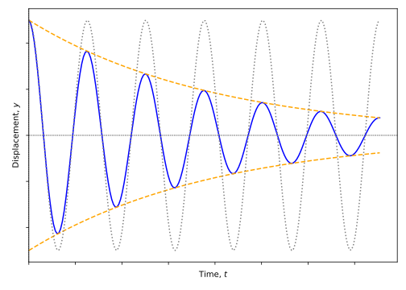
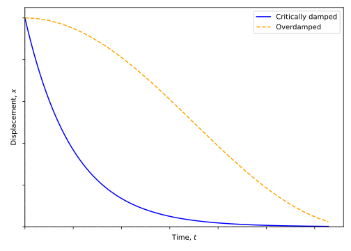

# Damped oscillations {#sec:ch4-dampedoscillations}

*Textbook link* 

The oscillations we have looked at so far make the assumption that the oscillation will continue indefinitely and that no energy is gained or lost by the system.  Such perpetually oscillating systems are extremely unusual, and almost every oscillation you encounter in the real world will lose energy to its surroundings, either requiring constant input of energy to maintain the oscillation or it will eventually dissipate all of its energy and the oscillation will stop. The energy is dissipated through a process known as 'damping'.

```{r echo=FALSE, ch4-dampedoscillation1, out.width='70%', fig.show='hold', fig.align="center", auto_pdf=TRUE, fig.cap="The amplitude of a damped oscillation decays exponentially with time.  The observed position of the oscillation is shown in blue, while the maximum possible amplitude (related to energy stored in the system) is illustrated by the orange dotted line.  The undamped oscillation is shown in grey for comparison."}

```

The change in amplitude of a damped oscillation is illustrated in Figure \@ref(fig:ch4-dampedoscillation1).  Both amplitude and energy decrease by a **constant percentage** in each cycle; this is an **exponential decrease**.

## The general case of damping {#sec:ch4-generalcasedamping}

For a simply damped system, the damping force is proportional to the velocity of the oscillating mass and **opposes** the direction of motion (Equation \@ref(eq:ch4-velocitydamp1)):

\begin{equation}
F = -bv \equiv -b \frac{\mathrm{d}x}{\mathrm{d} t}
(\#eq:ch4-velocitydamp1)
\end{equation}

This expression for the damping force can then be included with the equation for the force from the spring (Equation \@ref(eq:hookeslaw1)) to consider the overall acceleration of a mass undergoing damped harmonic motion. (Equation \@ref(eq:ch4-velocitydamp2)).

\begin{equation}
\begin{array}{rcl}
F = -kx - bv &=& -kx -b \dfrac{\mathrm{d}x}{\mathrm{d}t} = ma \\
m \dfrac{\mathrm{d}^2 x}{\mathrm{d}t^2} &=& -kx -b \dfrac{\mathrm{d}x}{\mathrm{d}t}
\end{array}
(\#eq:ch4-velocitydamp2)
\end{equation}

This can be written as a differential equation for **damped SHM** as shown in Equation \@ref(eq:ch4-velocitydamp3):

\begin{equation}
m \frac{\mathrm{d}^2 x}{\mathrm{d}t^2} + b \frac{\mathrm{d}x}{\mathrm{d}t}+ kx =0
(\#eq:ch4-velocitydamp3)
\end{equation}

Let's now try to find a solution for this differential equation.  Firstly, let's make a couple of assumptions:

1. The amplitude of the damped oscillation is subject to an exponential decay over a timescale of $2\tau$ (don't worry about the factor of 2 for now), and
2. The damped oscillation has a frequency $mega^\prime$ which may be different from the natural frequency of the undamped oscillator, $\omega_0$.

Our exponential decay factor then becomes $\mathrm{e}^{-\frac{t}{2\tau}}$, and the exponential form of the wave equation becomes $\mathrm{e}^{\mathrm{i}(\omega^\prime t + \delta)}$ (combination of Equations \@ref(eq:shm-general-positionx1) and \@ref(eq:ch3-demoivreoscillation1)). When these are combined we obtain a form of the solution shown in Equation \@ref(eq:ch4-velocitydamp4)

\begin{equation}
x = A_0 \mathrm{e}^{-\frac{t}{2\tau}} \mathrm{e}^{\mathrm{i}(\omega^\prime t + \delta)}
(\#eq:ch4-velocitydamp4)
\end{equation}

We can now find the first and second derivatives (make sure you are able to do this; you will need the product rule for differentiation) of this expression to substitute into the differential equation (Equation \@ref(eq:ch4-velocitydamp3)):

\begin{equation}
\begin{array}{rcl}
\dfrac{\mathrm{d}x}{\mathrm{d}t} &=& \left( -\dfrac{1}{2\tau} + \mathrm{i}\omega^\prime \right) x\\
\dfrac{\mathrm{d}^2x}{\mathrm{d}t^2} &=& \left( -\dfrac{1}{2\tau} + \mathrm{i}\omega^\prime \right)^2 x
\end{array}
(\#eq:ch4-velocitydamp5)
\end{equation}

We can now take our derivatives shown in Equation \@ref(eq:ch4-velocitydamp5) and substitute into the differential equation (Equation \@ref(eq:ch4-velocitydamp3)):

\begin{equation}
\begin{array}{rcl}
m \dfrac{\mathrm{d}^2 x}{\mathrm{d}t^2} + b \dfrac{\mathrm{d}x}{\mathrm{d}t}+ kx &=&0\\
m \left( -\dfrac{1}{2\tau} + \mathrm{i}\omega^\prime \right)^2 x + b \left( -\dfrac{1}{2\tau} + \mathrm{i}\omega^\prime \right) x + kx &=& 0 \\
\end{array}
(\#eq:ch4-velocitydamp6)
\end{equation}

Multiplying this expression out, we obtain:

\begin{equation}
m \left( -\frac{1}{4\tau^2} - \frac{\mathrm{i}\omega^\prime}{\tau} - \omega ^{\prime 2} \right) x + b \left( -\frac{1}{2\tau} + \mathrm{i}\omega^\prime \right) x + kx = 0
\end{equation}

...and we can now combine the **Real** and **Imaginary** components:

* **Imaginary**:  

\begin{equation}
-\frac{\omega^\prime m}{\tau} + \omega^\prime b = 0
\end{equation}

\begin{equation}
\tau = \frac{m}{b}
(\#eq:ch4-velocitydampimagin1)
\end{equation}

* **Real**:  

\begin{equation}
\left( \frac{1}{4 \tau^2} - \omega^{\prime 2} \right) m - \frac{b}{2\tau} + k = 0
\end{equation}

Therefore (using result from Equation \@ref(eq:ch4-velocitydampimagin1):

\begin{equation}
\omega^{\prime 2} = \frac{k}{m} - \left( \frac{b}{2m} \right)^2
\end{equation}

However, we already know that $\frac{k}{m} = \omega_0^2$ (equation \@ref(eq:shm-general-omega1)), so:

\begin{equation}
\omega^{\prime 2} = \omega_0^2 - \left( \frac{b}{2m} \right)^2
(\#eq:ch4-veolocitydampreal1)
\end{equation}

Having found this result, we can now say that a general solution to damped SHM is as shown in Equation \@ref(eq:ch4-velocitydamp4), or in trigonometric notation as shown in Equation \@ref(eq:ch4-velocitydamp7):

\begin{equation}
x = A_0 \mathrm{e}^{-\frac{t}{2\tau}} \cos(\omega^\prime t + \delta)
 (\#eq:ch4-velocitydamp7)
\end{equation}

...where

* $A_0$ = initial (maximum) amplitude
* $\tau = \frac{m}{b}$ is the characteristic decay time or time constant
* $\omega^\prime = \sqrt{\omega_0^2 - \left(\frac{b}{2m}\right)^2}$, where $\omega_0$ is the frequency of the undamped oscillator ( $\omega_0^2 = \frac{k}{m}$ for a mass on a spring)

Having derived and defined a general expression for damped oscillations, we will now turn to look at different modes of damping.

## Light Damping {#sec:ch4-lightdamping}

In a system which is lightly damped, we can make a number of assumptions:

1. That the frequency of the damped oscillator ($\omega ^\prime$) is approximately equal to that of the undamped oscillator; $\omega ^\prime \approx \omega_0$
2. That the damping factor, $\frac{b}{2m\omega_0}$ is significantly less than one; *i.e.* $\frac{b}{2m\omega_0} \ll 1$

When we apply these assumptions to Equation \@ref(eq:ch4-velocitydamp4) we obtain the "standard" SHM oscillation (tending towards $\mathrm{e}^{\mathrm{i}(\omega^\prime t + \delta)}$ as $\omega ^\prime$ tends to $\omega_0$) with an exponential decay on its amplitude (Equation \@ref(eq:ch4-ampexpdecay1)):

\begin{equation}
A = A_0 \mathrm{e}^{-\frac{t}{2\tau}}
(\#eq:ch4-ampexpdecay1)
\end{equation}

The effect of this light damping is that if $b$ (the damping coefficient on the velocity, Equation \@ref(eq:ch4-velocitydamp1)) increases, the damped frequency $\omega^\prime$ will decrease, and the characeteristic decay time, $\tau$ will also decrease.

## Critical damping {#sec:ch4-criticaldamping}

In a critically damped system, the **system does not oscillate**; rather, it returns to equilibrium in the shortest possible time.  This can be imagined as the damping required to **exactly stop** the vibration and no more.  The damped oscillation frequency $\omega^\prime$ then, by definition, is equal to zero ($\omega^\prime = 0$) and, by placing this condition into Equation \@ref(eq:ch4-dampfrequency1), we obtain the result for the damping coefficient, $b$ (Equation \@ref(eq:ch4-criticaldamp1))

\begin{equation}
\omega^\prime = \sqrt{\omega_0^2 - \left(\frac{b}{2m}\right)^2}
(\#eq:ch4-dampfrequency1)
\end{equation}

\begin{equation}
b = b_c = 2m\omega_0
(\#eq:ch4-criticaldamp1)
\end{equation}

## Overdamping {#sec:ch4-overdamping}

An overdamped system is one which has so much damping applied that the system returns to equilibrium *even more slowly* than in the critically damped case (Section \@ref(sec:ch4-criticaldamping)).  This could be imagined as a mass on a spring which is allowed to return to equilibrium within an extremely viscous medium (honey, or treacle!) and takes a considerable time to slowly return to equilibrium. A comparison of the displacement/time curve between a critically damped system and an overdamped system is shown in Figure \@ref(fig:ch4-critvsoverdamped1).

```{r echo=FALSE, ch4-critvsoverdamped1, out.width='70%', fig.show='hold', fig.align="center", auto_pdf=TRUE, fig.cap="A critically damped system returns to its equilbrium position in the shortest possible time, while an overdamped system works against an overbearing damping force slowly returning it to its equilibrium position."}

```


In the overdamped case, the damping coefficient, $b$ is greater than the critical damping coefficient, $b_c$:

\begin{equation}
b > b_c
\end{equation}


## Quality factor and energy in damped SHM {#sec:ch4-qualityfactor}

Recall that we determined energies within SHM in Equations \@ref(eq:ch1-potentialfromforce4) and \@ref(eq:ch1-potentialfromforce5); remembering that $\omega^2 = \frac{k}{m}$, we can write the overall energy of the system as in Equation \@ref(eq:ch4-qualityfactorenergy1):

\begin{equation}
E = \frac{1}{2}m\omega^2 A^2
(\#eq:ch4-qualityfactorenergy1)
\end{equation}

Within the damped regimes we have established the equations for damping, in particular how to calculate the damped amplitude at a given time, $A$ (Equation \@ref(eq:ch4-ampexpdecay1)). By combining this with Equation \@ref(eq:ch4-qualityfactorenergy1) we can obtain an expression for the damped energy, $E$, as a proportion of the initial energy of the system, $E_0$ (Equation \@ref(eq:ch4-qualityfactorenergy2)):

\begin{equation}
\begin{array}{rcl}
E &=& \frac{1}{2}m\omega^2 \left( A_0 \mathrm{e}^{-\frac{t}{2\tau}} \right)^2\\
 &=& E_0 \mathrm{e}^{-\frac{t}{\tau}}
\end{array}
(\#eq:ch4-qualityfactorenergy2)
\end{equation}

The decay time $\tau$ can now be considered the time taken for the energy to decrease to $\frac{1}{\mathrm{e}}$ of its original value (see? There was a reason we considered the timescale $2\tau$ in Section \@ref(sec:ch4-generalcasedamping)).

A useful measure of the **persistence** of an oscillation is the **quality factor**, $Q$.  This is defined as shown in Equation \@ref(eq:ch4-qualityfactor1):

\begin{equation}
Q = \omega_0 \tau = \frac{\omega_0 m}{b}
(\#eq:ch4-qualityfactor1)
\end{equation}

Generally:

* Large $Q$ represents lighter damping, persistent oscillation. (think **high quality oscillation**)
* Small $Q$ represents heavier damping, oscillation stops rapidly. (think **low quality oscillation**)

$Q$ can relate to the energy loss per cycle of oscillation; firstly define the rate of change of energy (Equation \@ref(eq:ch4-qualityfactor2), from Equation \@ref(eq:ch4-qualityfactorenergy1)):

\begin{equation}
\frac{\mathrm{d}E}{\mathrm{d} t} = -\frac{E_0}{\tau} \mathrm{e}^{-\frac{t}{\tau}} = -\frac{E}{\tau}
(\#eq:ch4-qualityfactor2)
\end{equation}

If we are considering finite changes, we can adapt our calculus to allow $\Delta E \approx \mathrm{d}E$ and $\Delta t \approx \mathrm{d}t = T$.  Applying this to Equation \@ref(eq:ch4-qualityfactor2) and rearranging gives:

\begin{equation}
\frac{|\Delta E|}{E} = \frac{T}{\tau} = \frac{2 \pi}{\omega_0 \tau} = \frac{2 \pi}{Q}
\end{equation}

This gives us the result for $Q$ shown in Equation \@ref(eq:ch4-qualityfactor3):

\begin{equation}
Q = \frac{2 \pi}{\left( \frac{|\Delta E|}{E} \right)_{\mathrm{cycle}}}
(\#eq:ch4-qualityfactor3)
\end{equation}

This gives us one more way to consider the quality factor: it is inversely proportional to the fractional energy loss per cycle of the oscillation. A low $Q$ therefore corresponds to a higher fractional energy loss per cycle than a high $Q$ factor.
