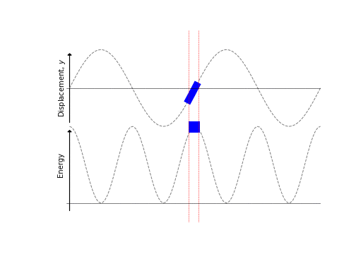

# Harmonic Waves {#sec:ch7-harmonicwaves}

*Textbook link: Tipler and Mosca, Section 15.2*

A *harmonic wave* is a general term for a wave which, at some instant of time, can be described by a sinusoidal function (*i.e.* it is a sine or a cosine function).  They are the simplest of waves to consider, and we will devote this chapter to exploring their properties.

## Transverse sine and cosine waves {#sec:ch7-sinecosine}

If we consider a string which is excited by a tuning fork or other object undergoing simple harmonic motion (SHM), we can imagine the shape of the save on the string at some instant of time appearing as a sine or a cosine wave (depending on our choice of origin) (Figure \@ref(fig:ch7-transversesine1)):

```{r echo=FALSE, ch7-transversesine1, out.width='70%', fig.show='hold', fig.align="center", auto_pdf=TRUE, fig.cap="A sine wave in a string created by an oscillating particle.  The wavelength $\\lambda$ is shown for one complete cycle, while the amplitude $A$ is defined as the maximum deviation from the origin point."}
knitr::include_graphics("visualisations/ch7-transversesine1.gif")
```

This sinusoidal appearance is known as a **harmonic wave**.  Each point on the string oscillates up and down with the same frequency as the driving frequency.  During the period $T$, the wave moves through distance $\lambda$:

\begin{equation}
v = \frac{\lambda}{T} = f\lambda
(\#eq:ch7-tranversesine1)
\end{equation}

...where $v$ is the phase velocity of the wave and $f$ is the frequency in hertz (Hz), and  $\lambda$ defined as the **wavelength** *i.e.* the spacial repeat distance of the wave.

A harmonic wave has a unique frequency and wavelength, and other waves (*e.g.* wave pulses) may be regarded as a superposition of many harmonic waves of different frequencies (we will discuss the Fourier analysis of this later).

At any instant in time, the wave can be described by the relation in Equation \@ref(eq:ch7-tranversesine2):

\begin{equation}
y = A \sin(kx + \delta)
(\#eq:tranversesine2)
\end{equation}

...where $A$ is the amplitude of the wave and $\delta$ is the phase constant.  Let's now choose the origin so that $\delta$ is equal to zero (*i.e.* there is no phase constant).  Now we can show the periodic condition in Equation \@ref(eq:ch7-tranversesine3):

\begin{equation}
\sin kx = \sin k(x+\lambda)
(\#eq:ch7-tranversesine3)
\end{equation}

Here we specify the periodic condition; the amplitude (and phase!) at position $x$ is equal to the amplitude (and phase!) at position $x$ **plus one wavelength**.  Because this is a sine function, we know that, in order to achieve this condition, the value $k\lambda$ must be equal to $2\pi$:

\begin{equation}
\begin{array}{rcl}
\sin \theta &=& \sin \left( \theta + 2\pi \right)\\
\sin kx &=& \sin \left( kx + k\lambda\right) = \sin \left( kx + 2\pi \right) \\
k\lambda &=& 2\pi
\end{array}
(\#eq:ch7-tranvsersesine3b)
\end{equation}

This allows us to give a value for $k$ (Equation \@ref(eq:ch7-tranversesine4)):

\begin{equation}
k = \frac{2\pi}{\lambda}
(\#eq:ch7-tranversesine4)
\end{equation}

The parameter $k$ is defined as the **wave number** of the wave, in units radians per metre (rad m^-1^).

## Travelling waves {#sec:ch7-travellingwaves}

The wave we showed in Section \@ref(sec:ch7-sinecosine) was a snapshot in time, so the wave was, in effect, static.  We instead wish to consider a travelling wave. To do this, instead of writing $x$ as in Equation \@ref(eq:tranversesine2) with $x - vt$ (see Section \@ref(sec:ch6-wavepulses)).  Equation \@ref(eq:tranversesine2) then becomes Equation \@ref(eq:tranversesine5):

\begin{equation}
y = A \sin k(x - vt) = A \sin (kx - kvt)
(\#eq:tranversesine5)
\end{equation}

As we have described, $T$ is the period of the wave, so any point on the wave will oscillate up and down also with period $T$.  This means that, for the wave position at time $t$, it will return to the same state at time $(t+T)$.  We can therefore write Equation \@ref(eq:tranversesine5) in terms of this period:

\begin{equation}
\begin{array}{rcl}
y = A \sin \left( kx - kvt \right) &=& A \sin \left( kx - kv(t+T) \right) \\
&=& A \sin \left( kx - kvt - kvT \right)
\end{array}
(\#eq:ch7-travelling2)
\end{equation}

Applying the same reasoning as shown in Equation scheme \@ref(eq:ch7-tranvsersesine3b), we are led to the result:

\begin{equation}
kvT = 2\pi
\end{equation}

If we revisit our discussions on SHM (Chapter \@ref(sec:shm-freq-angularfreq)) we defined the relationship between $T$ and $2\pi$ (Equation \@ref(eq:ch1-definingomega1)) as $T = \frac{2\pi}{\omega}$ (and also $\omega = 2\pi f$).  This allows us to define a number of factors as follows:

* **Phase velocity**:

\begin{equation}
v = \frac{2\pi}{kT} = \frac{\omega}{k}
(\#eq:ch7-phasevel1)
\end{equation}

* **Travelling wave to the right**:

\begin{equation}
y = A \sin \left( kx - kvt \right) = A \sin \left( kx - \omega t \right)
(\#eq:ch7-travellingtoright1)
\end{equation}

* **Travelling wave to the left**:

\begin{equation}
y = A \sin \left( kx + kvt \right) = A \sin \left( kx + \omega t \right)
(\#eq:ch7-travellingtoleft1)
\end{equation}

It is worth noting for each of these factors:

1. The sign of $\omega$:
    * negative for waves travelling to right;
    * positive for waves travelling to left
1. The wave expressions can be shown to satisfy the wave equation by substitution.

## Complex representation of waves {#sec:ch7-complexrep}

We introduced complex numbers for descriptions of oscillations; we can use the same treatment for our wave equations.  Just as $\sin(kx - \omega t)$ and $\cos(kx-\omega t)$ satisfy the wave equation, so too will $\mathrm{e}^{\mathrm{i}(kx-\omega t)}$.  It is often convenient to write the wave expression in a complex form as shown in Equation \@ref(eq:ch7-wavecomplex1):

\begin{equation}
y = A \mathrm{e}^{\mathrm{i}(kx-\omega t)}
(\#eq:ch7-wavecomplex1)
\end{equation}

In this expression, the sine wave is given by the 'imaginary' component of $y$, while the cosine part is given by the 'real' component.

## Energy carried by waves on a string {#sec:ch7-energywavesstring}

Suppose we now have a string attached to an oscillating driver at one end.  As the driver oscillates, it imparts energy to the string at $x=0$ by:

1. Stretching the string to give it potential energy, and
1. imparting transverse speed to the string to increase its kinetic energy.

As the waves move along the string, so the energy is transported along the string.

### Potential energy of string segment {#sec:ch7-peofstringsegment}

We now consider the same string segment as we showed in Figure \@ref(fig:ch6-waveeqnderiv1), but now we consider it stretched (Figure \@ref(fig:ch7-stretchedsegment1)). We can picture this as the string is "relaxed" in its 'horizontal' orientation (length of segment is $\Delta x$), but when a wave passes along it, the string elongates to accommodate the curve of the wave form. This means our segment now takes on a new length $\Delta l$.

```{r echo=FALSE, ch7-stretchedsegment1, out.width='70%', fig.show='hold', fig.align="center", auto_pdf=TRUE, fig.cap="As the wave passes along a stretched string, we can consider it to be 'stretched'; considering a string element of lencth $\\Delta x$, it is stretched to new length $\\Delta l$ as the wave passes by."}

```

The work done (\Delta U) in stretching the segment $\Delta x$ can be expressed as:

\begin{equation}
\Delta u = F(\Delta l - \Delta x)
(\#eq:ch7-workdonestring1)
\end{equation}

...where $F$ is the tension in the string and the extension is given by $(\Delta l - \Delta x)$.  We can apply Pythagoras to relate $\Delta x$ and $\Delta l$:

\begin{equation}
\begin{array}{rcl}
\Delta l^2 &=& \Delta x^2 + \Delta y^2 \\
&=& \Delta x^2 \left[ 1 + \left( \dfrac{\Delta y}{\Delta x}\right)^2 \right]
\end{array}
\end{equation}

Therefore we can isolate $\Delta l$:

\begin{equation}
\Delta l = \Delta x \left[ 1 + \left( \dfrac{\Delta y}{\Delta x}\right)^2 \right]^{\frac{1}{2}}
\end{equation}

We can approximate this expression by using the Taylor series expansion for $\sqrt{1+n}$, where $n = \left( \dfrac{\Delta y}{\Delta x}\right)^2$; assuming that the fraction is significantly less than one we can write this as an approximation and disregard terms past the first two terms:^[The Taylor expansion for this expression is $\sqrt{1+n} = 1+ \frac{n}{2} - \frac{n^2}{8} + \frac{n^3}{16} - \cdots$]

\begin{equation}
\Delta l \approx \delta x \left[ 1 + \frac{1}{2}\left( \dfrac{\Delta y}{\Delta x}\right)^2 + \cdots \right]
\end{equation}

Rearranging this expression to obtain the expression for the extension of the string $\Delta l - \Delta x$:

\begin{equation}
\Delta l - \delta x \approx   + \frac{\delta x}{2} \left( \dfrac{\Delta y}{\Delta x}\right)^2 + \cdots
\end{equation}

This now allows us to obtain an expression for the work done in stretching the spring solely in terms of the $x$ and $y$ displacement (from Equation \@ref(eq:ch7-workdonestring1))

\begin{equation}
\Delta u = \frac{F\Delta x}{2} \left( \dfrac{\Delta y}{\Delta x}\right)^2
\end{equation}


As we have an expression for $y$ in terms of $x$ (Equation \@ref(eq:tranversesine2)), we can differentiate this with respect to $x$ to approximate $\frac{\Delta y}{\Delta x}$:

\begin{equation}
\frac{\Delta y}{\Delta x} \simeq \frac{\mathrm{d} y}{\mathrm{d} x} = kA \cos (kx - \omega t)
\end{equation}

We also know that $v^2 = \frac{F}{\mu}$ (from the wave equation), and that $v = \frac{\omega}{k}$ (Equation \@ref(eq:ch7-phasevel1)), therefore:

\begin{equation}
\Delta U = \frac{1}{2} \left( \frac{\mu \omega^2}{k^2} \right) \Delta x \left( kA \cos (kx - \omega t) \right)^2
\end{equation}

Tidying up and cancelling, we obtain the expresion for the potential energy stored in an element of string of length $\Delta x$ (Equation \@ref(eq:ch7-pestoredstring1)):

\begin{equation}
\Delta U = \frac{1}{2} \mu \omega^2 A^2 \Delta x \cos^2(kx-\omega t)
(\#eq:ch7-pestoredstring1)
\end{equation}

### Kinetic energy of string segment {#sec:ch7-keofstringsegment}

We will again consider the segment of string discussed in Section \@ref(sec:ch7-peofstringsegment); an element $\Delta x$ of the string, of mass $\Delta m$ (Figure \@ref(fig:ch7-kestringsegment)).

```{r echo=FALSE, ch7-kestringsegment, out.width='70%', fig.show='hold', fig.align="center", auto_pdf=TRUE, fig.cap="Similar to the situation shown above, the same string segment will have a kinetic energy associated with its velocity $v_y$."}
knitr::include_graphics("visualisations/LaTeX/ch7-keofstringsegment.svg")
```

<!-- Figure \\@ref(ch7-stretchedsegment1) -->

As before, the segment is stretched to new length $\Delta l$, but the mass is still given by:

\begin{equation}
\Delta m = \mu \Delta x
\end{equation}

...where $\mu$ is the mass per unit length.  We now use the **transverse velocity** of the segment (*i.e.* **not** the wave velocity) to determine the kinetic energy of the segment:

\begin{equation}
\Delta KE = \frac{1}{2} \Delta m v_y^2 = \frac{1}{2} \mu \Delta x \left( \frac{\mathrm{d}y}{\mathrm{d}t} \right)^2
\end{equation}

Again, we know the expression for the vertical displacement $y$ in terms of $x$ and $t$ (Equation \@ref(eq:tranversesine2)), so we now differentiate with respect to $t$:

* $y = A \sin(kx - \omega t)$
* $v_y = \frac{\mathrm{d}y}{\mathrm{d}t} = -\omega A \cos(kx - \omega t)$

Therefore our expression for the kinetic energy becomes:

\begin{equation}
\Delta KE =  \frac{1}{2} \mu \omega^2  A^2 \Delta x  \cos^2(kx - \omega t)
(\#eq:ch7-kestoredstring1)
\end{equation}

A quick comparison of Equations \@ref(eq:ch7-pestoredstring1) and \@ref(eq:ch7-kestoredstring1) shows that these expressions are identical; *i.e.* the KE stored in the string is the **same** as the PE stored in the spring.

### Total energy of wave on a string {#sec:ch7-totenergystringsegment}

We can therefore find the total energy of the string segment carrying a harmonic wave as the total of the kinetic and potential energies:

\begin{equation}
\Delta E = \Delta KE + \Delta U
\end{equation}

*i.e.*:

\begin{equation}
\Delta E = \mu \omega^2  A^2 \Delta x  \cos^2(kx - \omega t)
(\#eq:ch7-totalenergywavestring1)
\end{equation}

Note that the energy of the segment varies with time with twice the frequency of the wave (since $\cos^2 \theta = \frac{1}{2}(1+ \cos 2\theta)$).  

We can also define the average energy at any point (Equation \@ref(eq:ch7-averageenergystring1)) using the time-average definition $\left< \cos^2 \theta \right> = \frac{1}{2}$:

\begin{equation}
\Delta E_{\mathrm{av}} = \frac{1}{2}\mu \omega^2 A^2 \Delta x
(\#eq:ch7-averageenergystring1)
\end{equation}

...and we can define the average *energy density* (per unit length) as:

\begin{equation}
\varepsilon = \frac{\Delta E_{\mathrm{av}}}{\Delta x} = \frac{1}{2} \mu \omega^2 A^2
\end{equation}

There are several things to note from this derivation:

* KE is at a maximum when displacement is zero
* At this point the string is most stretched, so PE is at a maximum also
<!-- WHY??? Surely at zero displacement the string flatlines, so ∆l = ∆x, no stretching?? -->
<!-- No - stretching is proportional to gradient; gradient steepest at zero displacement. -->
* PE and KE are **in phase** (unlike in a pendulum)

These points are illustrated in Figure \@ref(fig:ch7-kepestringplot1).

```{r echo=FALSE, ch7-kepestringplot1, out.width='70%', fig.show='hold', fig.align="center", auto_pdf=TRUE, fig.cap="The kinetic energy and potential energy of a displaced string element have maxima and minima at the same points in the oscillation; as the element passes through the origin (top plot), it is at its most stretched (PE maximum), and it is traveling at its fastest (KE maximum)."}

```

### Transport of energy and power {#sec:ch7-transportenergypower}

As the wave propagates along the string, energy is transported by the moving wavefront at speed $v$.  The average energy passing a point on the string in time $\Delta t$ is the average energy in the segment of length $\Delta x = v\Delta t$. This means we can rewrite Equation \@ref(eq:ch7-averageenergystring1):

\begin{equation}
\Delta E_{\mathrm{av}} = \frac{1}{2}\mu \omega^2 A^2 v \Delta t
(\#eq:ch7-averageenergystring2)
\end{equation}

Since the power transmitted is a *rate of change of energy*, *i.e.* $\frac{\Delta E}{\Delta t}$, we can obtain an expression for the average power transmitted:

\begin{equation}
\Delta P_{\mathrm{av}} = \frac{\mathrm{d} E_{\mathrm{av}}}{\mathrm{d}t} \approx \frac{\Delta E_{\mathrm{av}}}{\Delta t} = \frac{1}{2}\mu \omega^2 A^2 v
(\#eq:ch7-averagepowerstring1)
\end{equation}

From this result, we can see that both the average energy and average power transmitted are both proportional to $A^2$; a similar observation as in SHM (Chapter \@ref(sec:shm)).

## Summary {#sec:ch7-summary}

We have covered a large amount of derivations in this chapter, however the takehome points are the following:

When describing sine waves travelling through a medium, the following statements apply:

* For a wave travelling to the **right**: $y = A\sin(kx-\omega t)$
* For a wave travelling to the **left**: $y = A\sin(kx+\omega t)$
* The **phase velocity**: $v = \frac{\omega}{k}$ m s^-1^

...where:

* $k$ = wavenumber = $\frac{2\pi}{\lambda}$
* $\lambda$ = wavelength /m
* $\omega$ = angular frequency = $2\pi f$ /rad m^-1^
* $f$ = frequency /Hz = $\frac{1}{T}$
* $T$ = period /s
* $A$ = amplitude /m

The average energy carried by a wave (per unit length) is given by:

\begin{equation}
\varepsilon = \frac{\Delta E_{\mathrm{av}}}{\Delta x} = \frac{1}{2} \mu \omega^2 A^2
\end{equation}

...and the average power transmitted by the wave is given by:

\begin{equation}
\Delta P_{\mathrm{av}} = \frac{\Delta E_{\mathrm{av}}}{\Delta t} = \frac{1}{2}\mu \omega^2 A^2 v
\end{equation}
