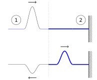
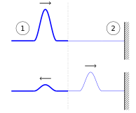
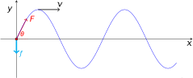

# Reflection and Transmission at boundaries {#sec:ch8-reflectiontrans}

We now turn our attention to what happens to waves and wave pulses when they encounter boundaries.  We define a boundary as the dividing line between regions with different phase velocity.  In the context of imagining our waves moving along strings, a boundary can exist either between the string and a rigid anchoring point, or at a point where the two strings join, each with a different mass density (*i.e.* a thick string joining to a thin string).

**Any** wave incident on such a boundary between regions with different phase velocities will be partly reflected back from the boundary and partly transmitted through the boundary.  

In the case of a boundary between a thick string and a thin string, the phase velocity $v$ is related to the tension $F$ and the mass density $\mu$ *via* $v^2 = \frac{F}{\mu}$; *i.e.* heavier strings will have a lower phase velocity.

Considering reflection/transmission across such a boundary in a purely qualitative manner:

1. A wave propagating along a thin string towards a boundary with a thicker string will be reflected from the boundary **with inversion**, as well as a proportion of the energy transmitted as a wave into the thicker string.
1. A wave propagating along a thick string towards a boundary with a thinner string will be reflected from the boundary **without inversion**, as well as a proportion of the energy transmitted as a wave into the thinner string.

This qualitative outcome is illustrated in Figures \@ref(fig:ch8-thickthininversion1) and \@ref(fig:ch8-thickthininversion1b).

```{r echo=FALSE, ch8-thickthininversion1, out.width='70%', fig.show='hold', fig.align="center", auto_pdf=TRUE, fig.cap="When a wavepulse originates in string 1 (where $\\mu_1 \\ll \\mu_2$), the wave will be both reflected with inversion and partially transmitted into string 2 of greater $\\mu$"}

```

```{r echo=FALSE, ch8-thickthininversion1b, out.width='70%', fig.show='hold', fig.align="center", auto_pdf=TRUE, fig.cap="If we reverse the situation with the wavepulse originating in the string with greater $\\mu$ (now $\\mu_1 \\gg \\mu_2$), the wave is still partially transmitted into string 2, but the reflection within string 1 is no longer inverted."}

```


If instead we fix a uniform string to an immovable anchor rather than another, thicker, string, we will get complete reflection of the wave pulse with inversion. This is akin to saying the anchor has an infinite mass density, $\mu$.  

To quantitatively assess these outcomes, we can obtain the reflected and transmitted amplitudes for harmonic waves by considering the power transmitted through the string as the wave propagates.

## Power transmitted and reflected at a boundary {#sec:ch8-powertransmittedreflected}

The principles of energy conversion state that, as a wave encounters a boundary, the energy in the incident wave must equal the total energy of the reflected and transmitted waves. This principle therefore also applies to the total power of the system, *i.e.*:

\begin{equation}
P_i = P_r + P_t
(\#eq:ch8-powerconservation1)
\end{equation}

We can therefore use Equation \@ref(eq:ch7-averagepowerstring1) to derive an expression for the power before and the powers after the wave encounters the boundary (Equation \@ref(eq:ch8-powerconservation2)):

\begin{equation}
\frac{1}{2}\mu_1 \omega^2 A_i^2 v_1 = \frac{1}{2}\mu_1 \omega^2 A_r^2 v_1 + \frac{1}{2}\mu_2 \omega^2 A_t^2 v_2
(\#eq:ch8-powerconservation2)
\end{equation}

...or, since $\omega = v_n k_n$ and $F = \mu_n v_n^2$ (rearrangments of equations seen previously):

\begin{equation}
\frac{1}{2} F k_1 \omega A_i^2  = \frac{1}{2}F k_1 \omega A_r^2 + \frac{1}{2}F k_2 \omega A_t^2
(\#eq:ch8-powerconservation3)
\end{equation}

Note that:
* $A_i$, $A_r$ and $A_t$ are the amplitudes of the incident, reflected and transmitted waves respectively;
* $\mu_1$, $v_1$, $\mu_2$, $v_2$ refer to the mass per unit length and the phase velocities for strings 1 and 2 respectively;
* $k_1$ and $k_2$ are the wavenumbers for each of the two strings;
* $\omega$ is the **same** for all waves - this depends only on the source;
* $\lambda$ will be **different** on each string; since $\lambda = \frac{v}{f} = \frac{2\pi v}{\omega}$, *i.e.* $\lambda$ will be smaller on the heavier string;
* Conversely $k = \frac{2\pi}{\lambda}$ will be larger on the heavier string;
* $\mu = \frac{F}{v^2}$; the tension $F$ will be the same in both strings.

When we compare the proportion of the incident power which is reflected, we can show that:

\begin{equation}
\frac{\textrm{Reflected power}}{\textrm{Incident power}} = \frac{k_1 A_r^2}{k_1 A_i^2} = \left( \frac{k_1 - k_2}{k_1 + k_2} \right)^2
(\#eq:ch8-powerratio1)
\end{equation}

We can also show the proportion of the incident power which is transmitted:

\begin{equation}
\frac{\textrm{Transmitted power}}{\textrm{Incident power}} = \frac{k_2 A_t^2}{k_1 A_i^2} =  \frac{4k_1 k_2}{\left( k_1 + k_2\right)^2}
(\#eq:ch8-powerratio2)
\end{equation}

**Note** These results **only** hold for waves on strings where the tension, $F$, is the same in both strings. We will discuss a more general result in the next section.

### Proof of power ratios {-}

From our expression of the conservation of powers (Equation \@ref(eq:ch8-powerconservation3)), we can cancel the common terms:

\begin{equation}
k_1  A_i^2  =  k_1  A_r^2 +  k_2  A_t^2
(\#eq:ch8-powerratio1b)
\end{equation}

However, at the interface, the wave must be continuous on both sides; therefore the amplitude on each side must be the same:

\begin{equation}
A_i + A_r  =  A_t
(\#eq:ch8-powerratio1c)
\end{equation}

We now substitute Equation \@ref(eq:ch8-powerratio1c) into \@ref(eq:ch8-powerratio1b) to eliminate $A_r$:

\begin{equation}
k_1  A_i^2  =  k_1  (A_t - A_i)^2 +  k_2  A_t^2
(\#eq:ch8-powerratio1d)
\end{equation}

We can then expand and rearrange this:

\begin{equation}
\begin{array}{rcl}
k_1  A_i^2  &=&  k_1  (A_t - A_i)^2 +  k_2  A_t^2\\
            &=& k_1 (A_t^2 - 2A_t A_i + A_i^2) + k_2  A_t^2 \\
    0       &=& k_1 A_t^2 - 2 k_1 A_t A_i + k_2  A_t^2 \\
            &=& k_1\dfrac{A_t^2}{A_i^2} - 2 k_1 \dfrac{A_t}{A_i} + k_2 \dfrac{A_t^2}{A_i^2} \\
    0       &=& \left(\dfrac{A_t}{A_i} \right)^2 (k_1 + k_2) - 2 k_1 \dfrac{A_t}{A_i} \\
\end{array}
(\#eq:ch8-powerratio1e)
\end{equation}

This is a quadratic equation, and we can then say the following; either:

\begin{equation}
\frac{A_t}{A_i} = 0
\end{equation}

...which represents total reflection (zero transmission), and not what we would expect to have with two joined strings, or:

\begin{equation}
\left(\frac{A_t}{A_i}\right) = \frac{2k_1}{k_1 + k_2}
\end{equation}

...from which we obtain:

\begin{equation}
\frac{k_2}{k_1} \left(\frac{A_t}{A_i}\right)^2 = \frac{4k_1 k_2}{(k_1 + k_2)^2}
\end{equation}

...as required in Equation \@ref(eq:ch8-powerratio2) for the ratio of transmitted to incident power.  

We can obtain the result for Equation \@ref(eq:ch8-powerratio1) for ratio of reflected to incident power in a similar manner by substitution of Equation \@ref(eq:ch8-powerratio1c) into \@ref(eq:ch8-powerratio1b) to instead eliminate $A_t$.

## Example of reflection and transmission {#sec:ch8-examplereflectiontransmission}

Consider a wave travelling from a light string to a heavy string, where $\mu_2 = 4\mu_1$.

Remember that:
\begin{equation}
\mu = \frac{F}{v^2} = F\frac{k^2}{\omega^2}
\end{equation}

*i.e.*
\begin{equation}
k \propto \sqrt{\mu}
\end{equation}

We can therefore determine:

* $k_2 = 2 k_1$ via the square-root relationship
* The fraction of power reflected will be:
\begin{equation}
\frac{A_r^2}{A_i^2} = \left( \frac{1-2}{1+2}\right)^2 = \frac{1}{9}
\end{equation}
* The fraction of power transmitted:
\begin{equation}
\frac{k_2 A_t^2}{k_1 A_i^2} = \left( \frac{4 \times 2 \times 1}{(1+2)^2}\right) = \frac{8}{9}
\end{equation}


## The impedance of a piece of string {#sec:ch8-stringimpedeance}

The examples we considered in Secion \@ref(sec:ch8-powertransmittedreflected) were a particular result under constant tension.  We can generalise the result by considering the impedances of the media on either side of the boundary.

We discussed the concept of impedance (both electrical and mechanical) in Section \@ref(sec:ch5-impedance); however the salient points are:

* "Impedance" describes teh property of a system which resists motion, either mechanical or motion of charge;
* Any material through which waves propagate presents impedance to those waves;
* In general, impedance depends on inertia and elasticity;
* For a string, we define impedance as:
\begin{equation}
Z = \frac{\textrm{transverse force}}{\textrm{transverse velocity}}
\end{equation}
*i.e.* for a given force, a large $Z$ implies a small velocity and *vice versa*;
* Similar definitions can be written for longitudinal waves.

We now consider a string which is driven by an oscillating force (Figure \@ref(fig:ch8-impedencestring1))

```{r echo=FALSE, ch8-impedencestring1, out.width='70%', fig.show='hold', fig.align="center", auto_pdf=TRUE, fig.cap="When a wave is driven by an oscillating force at its origin ($f$), the element of the string indicated by the dot experiences the tension within the string, $F$, at angle $\\theta$ from the direction of propagation."}

```


The driving force on this string is given by the relationship:

\begin{equation}
f = -f_0 \cos \omega t = -f_0 \mathrm{e}^{\mathrm{i}\omega t}
\end{equation}

This driving force is negative because $f$ points downwards at time $t = 0$.

As this is a wave, the vertical displacement at any point is given by the relationship:

\begin{equation}
y = A \mathrm{e}^{\mathrm{i}(kx - \omega t)}
\end{equation}

We now consider the tension in the string, $F$, and resolve this in the transverse direction. At $x = 0$, we assume small angle of $\theta$:

\begin{equation}
\begin{array}{rcll}
f &=& -F\sin \theta \\
  &\simeq &  -F \tan \theta & \textsf{for small angles}\\
  &=& -F \dfrac{\partial y}{\partial x}
\end{array}
\end{equation}

We can now use the definition of impedance given above ($Z = \frac{\textsf{force}}{\textsf{velocity}}$) and the expressions for the force and velocity:

\begin{equation}
\begin{array}{rcl}
Z &=& \dfrac{f}{v_y} \\
 &=& -F\dfrac{\partial y}{\partial x} \div \dfrac{\partial y}{\partial t}
\end{array}
\end{equation}

We already have expressions for $\frac{\partial y}{\partial x}$ and $\frac{\partial y}{\partial t}$ by differentiating the wave equation $y = A \mathrm{e}^{\mathrm{i}(kx - \omega t)}$:

\begin{equation}
\frac{\partial y}{\partial x} = ik A \mathrm{e}^{\mathrm{i}(kx - \omega t)}
\end{equation}

\begin{equation}
\frac{\partial y}{\partial t} = -i \omega A \mathrm{e}^{\mathrm{i}(kx - \omega t)}
\end{equation}

Therefore:

\begin{equation}
\begin{array}{rcl}
Z &=& \dfrac{-F \times ik A \mathrm{e}^{\mathrm{i}(kx - \omega t)}}{-i \omega A \mathrm{e}^{\mathrm{i}(kx - \omega t)}}\\
  &=& \dfrac{Fk}{\omega}
\end{array}
\end{equation}

Remember also that the phase velocity $v = \frac{\omega}{k}$, so we can also express the impedance as $Z = \frac{F}{v}$ and $Z = \mu v$ (because $v^2 = \frac{F}{\mu}$), where $\mu$ is the mass per unit length of the string and $F$ is the tension within the string.

## Reflection and transmission revisited {#sec:ch8-reflecttrans2}

We can now express our previous result of the reflection and transmission coefficients (derived in Equation \@ref(eq:ch8-powerratio1e)) more generally:

Reflection coefficient:

\begin{equation}
\frac{A_r}{A_i} = \frac{Z_1 - Z_2}{Z_1 + Z_2}
(\#eq:ch8-reflectioncoeff1)
\end{equation}

Transmission coefficient:

\begin{equation}
\frac{A_t}{A_i} = \frac{2 Z_1 }{Z_1 + Z_2}
(\#eq:ch8-transmissioncoeff1)
\end{equation}

Writing these in terms of the power (the approach used in Section \@ref(sec:ch8-powertransmittedreflected)), we obtain the following expressions:

\begin{equation}
\frac{\textsf{Reflected power}}{\textsf{Incident power}} = \frac{Z_1 A_r^2}{ Z_1 A_i^2} = \left(\frac{Z_1 - Z_2}{Z_1 + Z_2}\right)^2
(\#eq:ch8-reflectioncoeff2)
\end{equation}

and:

\begin{equation}
\frac{\textsf{Transmitted power}}{\textsf{Incident power}} = \frac{Z_2 A_t^2}{ Z_1 A_i^2} = \frac{4 Z_1 Z_2}{(Z_1 + Z_2)^2}
(\#eq:ch8-transmissioncoeff2)
\end{equation}


These are general expressions which apply in mechanical, electrical and optical systems.  From them, we can see that:

* If $Z_2 > Z_1$, the reflected wave is inverted;
    * From Equation \@ref(eq:ch8-reflectioncoeff1), the term $Z_1 - Z_2$ is negative under these conditions, leading to a negative amplitude
* If the second string is a "wall" (*i.e.* immovable, infinite $\mu$)
    * $Z_2 \rightarrow \infty$;
    * $A_r = - A_i$ (by energy conservation);
    * $A_t = 0$;
    * Therefore the wave is fully reflected and inverted.
* If $Z_2 = Z_1$ we have:
    * Impedance matching;
    * No reflection;
    * Maximum power transfer.


## Impedance - Miscellaneous cases {#sec:ch8-impedancemisccases}

For **longitudinal (sound) waves**, generally we expect the impedance $Z$ to be described by $Z = \rho_0 v_p$, where:

* $\rho$ is the mean density of the medium
* $v_p$ is the phase velocity of the wave

Example values for longitudinal sound waves are:
* Air: ~ $400$ kg m^-2^ s^-1^
* Water: $1.45 \times 10^6$ kg m^-2^ s^-1^
* Steel: $3.9 \times 10^7$ kg m^-2^ s^-1^

For **transverse waves on a string**, the impedance $Z$ is described by $Z = \mu v_p$, where:

* $\mu$ is the mass per unit length
* $v_p$ is the phase velocity of the wave

For **electromagnetic waves**, the impedance depends on the medium under consideration:

* In a dielectric medium:
\begin{equation}
Z = \sqrt{\frac{\mu \mu_0}{\epsilon \epsilon_0}}
\end{equation}
where in this case $\mu$ and $\epsilon$ are the permittivity and the permeability of the medium.

* In free space:
\begin{equation}
Z = \sqrt{\frac{ \mu_0}{ \epsilon_0}} = 376.6 \Omega
\end{equation}

* For a light wave in a dielectric medium:
\begin{equation}
Z = \frac{1}{n}
\end{equation}
where $n$ is the refractive index of the medium (see later).


<!-- end -->
