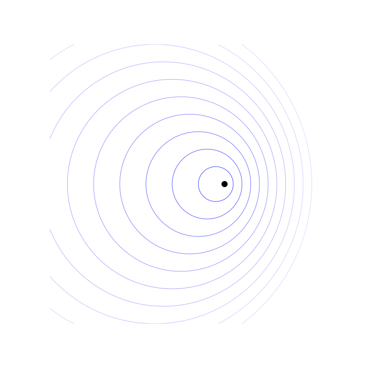
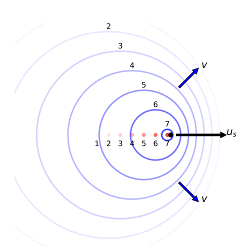

# Sound waves and the Doppler effect {#sec:ch9-sounddoppler}

*Textbook link: Tipler and Mosca, Section 15.2-4*
 As has been mentioned already, sound waves are a longitudinal wave propagated by the localised displacement of air molecules in the direction of propagation.  This displacement of air molecules within sound waves can be described by the function shown in Equation\@ref(eq:ch9-soundwaveeq1).

\begin{equation}
s(x,t) = s_0 \sin (kx - \omega t)
(\#eq:ch9-soundwaveeq1)
\end{equation}

In contrast to the transverse waves previously discussed, there are now only two dimensions to this function; while we considered the transverse displacement $y$ of an element of the medium carrying the transverse wave, in this longitudinal wave the longitudinal displacement $s$ is in the $x$ direction, *i.e.* the same direction as the propagation of the wave.

This displacement of the molecules leads to changes in both the density ($\rho$) and the pressure ($p$) of the medium.  It is worth recognising that both $p$ and $\rho$ are out of phase with the displacement (when the displacement is at a maximum, the pressure and density are at a minimum):

\begin{equation}
p = p_0 \sin (kx - \omega t - \frac{\pi}{2})
(\#eq:ch9-soundwaveeq2)
\end{equation}

... where the initial pressure $p_0 = \rho \omega v s_0$ and $v$ is the phase velocity.

## Energy of sound waves {#sec:ch9-energysoundwaves}

When considering the energy of sound waves, we can examine the expression we already have for transverse waves and adapt this for our longitudinal waves.

Recall that the expression for the energy within a transverse wave is given in Equation \@ref(eq:ch7-averageenergystring1):

\begin{equation}
\Delta E_{\mathrm{av}} = \frac{1}{2}\mu \omega^2 A^2 \Delta x
\end{equation}

To adapt this for longitudinal sound waves, we perform the following substiutions:

* We replace the linear mass density $\mu$ (units kg m^-1^) with the density of the medium, $\rho$ (units kg m^-3^)
* We replace our transverse amplitude $A$ with the longitudinal displacement $s_0$
* To keep units congruent, we replace the change in segment length caused by the wave $\Delta x$ with the change in segment volume caused by the wave $\Delta V$

Our result is therefore:

\begin{equation}
\Delta E_{\mathrm{av}} = \frac{1}{2}\rho \omega^2 s_0^2 \Delta V
(\#eq:ch9-averageenergysound1)
\end{equation}

## Wave intensity {#sec:ch9-waveintensity}

We have mentioned that with sound waves we are now considering a three-dimensional volume.  This means we need to consider the effect of this on the energy of the wave at a distance $r$ from its origin. The energy at a given distance will be spready uniformly over a spherical surface; therefore we need to consider the power per unit area of this surface. This is the **intensity** of the wave.

\begin{equation}
I = \frac{P_\text{av}}{4\pi r^2}
(\#eq:ch9-waveintensity1)
\end{equation}

We already know that the average power is defined as the rate of change of the average energy:

\begin{equation}
P_\text{av} = \frac{\Delta E_\text{av}}{\Delta t}
\end{equation}

We can therefore rewrite Equation \@ref(eq:ch9-waveintensity1) taking this into account.

\begin{equation}
\begin{array}{rcl}
I & = &  \dfrac{\Delta E_\text{av}}{4\pi r^2 \Delta r} \dfrac{\Delta r}{\Delta t} \\
 &=& \dfrac{\Delta E_\text{av}}{\Delta V} v
\end{array}
(\#eq:ch9-waveintensity2)
\end{equation}

In Equation \@ref(eq:ch9-waveintensity2) we idenitfy the term $\frac{\Delta r}{\Delta t}$; this is the speed at which the wave travels from the centre of the sphere, so is the phase velocity $v$. We can also say that the term $4 \pi r^2 \Delta r$ is the rate of change of volume, $\Delta V$.  We now use our expression for the average energy (Equation \@ref(eq:ch9-averageenergysound1)) to simplify this expression:


\begin{equation}
I = \frac{1}{2}\rho \omega^2 s_0^2 v = \frac{p_0^2}{2\rho v}
(\#eq:ch9-waveintensity3)
\end{equation}

In other words, the intensity of the sound wave travelling at constant speed $v$ through a medium of constant density $\rho$ at a point in space is proportional to the square of the amplitude of the wave, $p_0$.

## Levels of intensity {#sec:ch9-intensitylevels}

The human ear perceives sounds according to the logarithm of their intensity - not the absolute value of the intensity.^[When you encounter electronics you will find potentiometers labelled "audio taper"; this describes their use in audio applications in which the resistance is a logarithmic response to accommodate our logarithmic perception of sound. ] To represent an **intensity level** we use the term **decibel** (dB).  This intensity level, $\beta$ is represented in Equation \@ref(eq:ch9-decibel1) as follows:

\begin{equation}
\beta = 10 \log_{10}\left(\frac{I}{I_0}\right)
(\#eq:ch9-decibel1)
\end{equation}

The term $I_0$ is the absolute intensity considered to be at the absolute limit of human hearing, where $I_0 = 10^{-12}$ W m^-2^. A description of approximate intensity levels is shown in Table \@ref(tab:ch9-decibeldescription1).

Table: (\#tab:ch9-decibeldescription1) A description of the approximate decibel level of particular sounds.

| $\beta$ /dB  |  Description |
|:-|:-|
| 0  | Hearing threshold  |
|  40 | Library  |
|  70 |  Busy traffic |
| 120  | Pain threshold  |

## The Doppler Effect (non-relativistic)  {#sec:ch9-dopplereffect1}

You have already met the Doppler effect for light in the context of the Special Relativity course; here we will briefly revisit it in the context of non-relativistic cases.

The general principles of the Doppler effect are unchanged, namely:

* If the source and observer move relative to each other, the observed frequency is different from the emitted frequency;
* When the source and observer move towards each other, $f_{\textsf{obs}} >  f_{\textsf{source}}$;
* When the source and observer move away from each other, $f_{\textsf{obs}} <  f_{\textsf{source}}$;
* The frequency change, $\Delta f$, depends on whether the source or observer move relative to each other.

Consider a source moving relative to its surrounding medium at a speed of $u_s$. We can visualise this as a moving 'dipper' in a pool of water (Figure \@ref(fig:ch9-dopplerdipper1))

```{r echo=FALSE, ch9-dopplerdipper1, out.width='70%', fig.show='hold', fig.align="center", auto_pdf=TRUE, fig.cap="When a dipper (marked by the black dot) moves relative to the water, we see that the wavefronts 'bunch' in the direction of motion and diverge behind the motion of the dipper."}

```

```{r echo=FALSE, ch9-dopplerdipper2, out.width='70%', fig.show='hold', fig.align="center", auto_pdf=TRUE, fig.cap="We can look at this in more detail by showing where the dipper was for each of the spreading wavefronts. Here the dipper is moving forward at speed $u_r$, while the wavefronts spread out from their point of origin at speed $v$."}

```


This is a visual representation of a number of key statements:

* The speed of waves $v$ in the medium is independent of the movement of the source;
* The source produces waves at a frequency $f_0$;
* In a given time frame, $\Delta t$, the source will emit $N_s$ wavefronts, where:
\begin{equation}
N_s = f_0 \Delta t
\end{equation}

From these statements, we can calculate the observed wavelength, $\lambda^\prime$, by considering the relative distance travelled by the wave in a given timeframe and the number of waves produced by the source in that timeframe (Equation \@ref(eq:ch9-dopplereffect2)):

\begin{equation}
\lambda' = \frac{\textsf{relative distance}}{\textsf{no. of waves}} = \frac{(v\pm u_{s})\Delta t}{f_{0}\Delta t}
(\#eq:ch9-dopplereffect2)
\end{equation}

We can now consider two extremes; the observed wavelength in front of the source (to the right in the diagram), and the observed wavelength behind the source (to the left in the diagram):

\begin{equation}
\begin{array}{rcl}
\lambda^\prime_{\textsf{behind}} = \dfrac{v+u_{s}}{f_{0}} && \lambda^\prime_{\textsf{in front}} = \dfrac{v-u_{s}}{f_{0}}
\end{array}
(\#eq:ch9-dopplereffect3)
\end{equation}

We can now determine the frequency observed by using these expressions for the wavelength. Firstly, we determine the number of wavefronts passing the observer in the timeframe $\Delta t$:


\begin{equation}
N_{\textsf{obs}} = \frac{v_{\textsf{obs}}\Delta t}{\lambda'}
(\#eq:ch9-dopplereffect4)
\end{equation}

...where $v_{\textsf{obs}}$ is the speed of the waves relative to the observer; i.e. $v_{\textsf{obs}} = v \pm u_{\textsf{obs}}$ ; where $u_{\textsf{obs}}$ corresponds to the observer moving to the right in the diagram (as this reduces the relative velocity bewteen the observer and the wave).  We can now rewrite the expression in Equation \@ref(eq:ch9-dopplereffect4) in terms of the phase velocity $v$ and the relative speed of the observer, $u_{\textsf{obs}}$:

\begin{equation}
N_{\textsf{obs}} = \frac{v \pm u_{\textsf{obs}}\Delta t}{\lambda'}
(\#eq:ch9-dopplereffect5)
\end{equation}

...and finally we have the observed frequency $f^\prime$ of a source in motion:

\begin{equation}
f^\prime = \frac{N_{\textsf{obs}}}{\Delta t} = \frac{v\pm u_{\textsf{obs}}}{\lambda'}
(\#eq:ch9-dopplereffect6)
\end{equation}

When we combine this with the equation for $\lambda^\prime$, we obtain the general result (Equation \@ref{eq:ch9-dopplereffect7})

\begin{equation}
f' = \left(\frac{v\pm u_{\textsf{obs}}}{v\pm u_{s}}\right)f_{0}\quad\textsf{or}\quad f' = \left(\frac{1\pm \frac{u_{\textsf{obs}}}{v}}{1\pm \frac{u_{s}}{v}}\right)f_{0}
(\#eq:ch9-dopplereffect7)
\end{equation}

It is important to pay attention to the signs when using the above equations; it can be easy to confuse the positive directions.  The sign convention can help with this:

* The direction from the observer towards the source is positive

You can check your results using the principles:

* The observed frequency $f'$ **increases** when the source and observer approach each other;
* The observed frequency $f'$ **decreases** when the source and observer move apart.

<!-- \begin{equation}

(\#)
\end{equation} -->


<!-- \begin{equation}

(\#)
\end{equation} -->


<!-- \begin{equation}

(\#)
\end{equation} -->


<!-- \begin{equation}

(\#)
\end{equation} -->


<!-- \begin{equation}

(\#)
\end{equation} -->


<!-- \begin{equation}

(\#)
\end{equation} -->


<!-- \begin{equation}

(\#)
\end{equation} -->


<!-- \begin{equation}

(\#)
\end{equation} -->


 <!-- end -->
