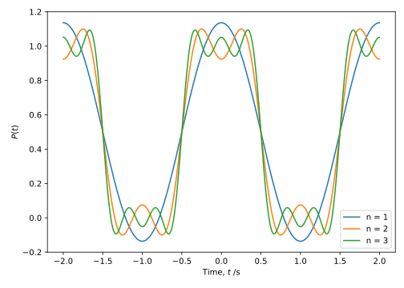
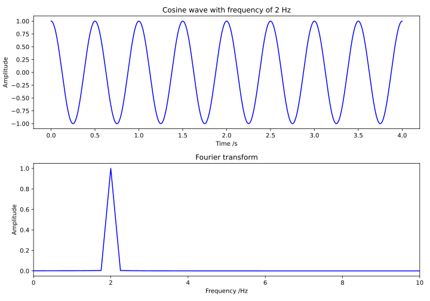
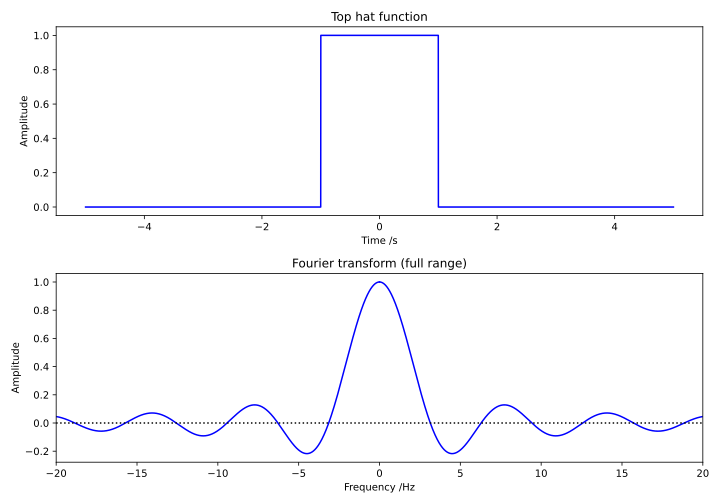
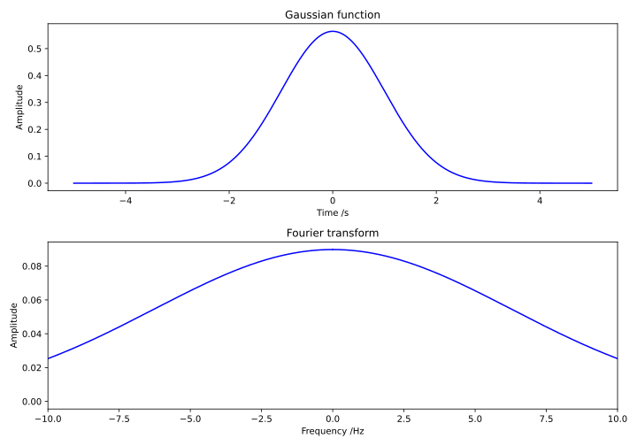

# Fourier analysis {#sec:ch11-fourieranalysis}

Any vibrating string such as those in stringed musical instruments contain a range of different harmonics all drawn from the harmonic series.  The exact combination of harmonics will vary depending on the way the string is set in motion; *e.g.* a violin string is bowed, while a piano string is struck.  The resulting sound wave will be a complicated periodic function, and not obviously a sine wave.  The fundamental theorem of Fourier analysis is that **any** periodic function can be constructed by a linear superposition of sine and cosine waves.  A corollary to this is that any periodic waveform can therefore be *constructed* using a linear superposition of sine and cosine waves.  The set of sines and cosines used to represent a function in Fourier analysis is referred to as a *Fourier series*, and the set of constants in the series are known as *Fourier coefficients*.

The standard form for a Fourier series representation of a function $P(t)$ with period $T$ is:

\begin{equation}
\begin{array}{rclcl}
P(t) = \dfrac{1}{2}a_0 & +& a_1 \cos \omega t &+& b_1 \sin \omega t \\
                      & + &a_2 \cos 2\omega t &+& b_2 \sin 2\omega t \\
                      & +& a_3 \cos 3\omega t &+& b_3 \sin 3\omega t \\
\end{array}
\end{equation}

...or, to express as a summation:

\begin{equation}
P(t) = \frac{1}{2}a_{0} + \sum_{n=1}^{\infty}\left(a_{n}\cos n\omega t + b_{n}\sin n\omega t\right)
\end{equation}

...where $\omega = \frac{2\pi}{T}$

The presence of both sine and cosine terms allows the relative phase of each component to be controlled:

* If $P(t)$ is an **even function**, only **cosine** terms are required;
* Similarly, only **sine** terms are required if the function is **odd**

The Fourier coefficients $a_0$, $a_1$, $a_2$ etc. are given by:

\begin{equation}
a_n = \frac{2}{T} \int_{-\frac{T}{2}}^{\frac{T}{2}} P(t) \cos n \omega t ~\mathrm{d}t \quad n = 0,1,2,3 \dots
\end{equation}

\begin{equation}
b_n = \frac{2}{T} \int_{-\frac{T}{2}}^{\frac{T}{2}} P(t) \sin n \omega t ~\mathrm{d}t \quad n = 1,2,3 \dots
\end{equation}

It can be seen that $\frac{a_0}{2}$ is equal to the averave value of $P(t)$ over one cycle.

## Example: the square wave {#sec:ch11-squarewave}

Consider a square wave defined on the interval $\left[-1,1 \right]$ by:

\begin{equation}
P(t) = \left\{ \begin{array}{rl} 1 & -\frac{1}{2} \leq t \leq \frac{1}{2} \\ 0 & \textsf{elsewhere} \end{array} \right.
\end{equation}

```{r echo=FALSE, ch11-squarewave1, out.width='70%', fig.show='hold', fig.align="center", auto_pdf=TRUE, fig.cap="The form of a square wave; often termed a 'top hat' function. This is interpreted in electronics as a digital signal which is either on or off."}
knitr::include_graphics("visualisations/ch11-squarewave1.svg")
```

The period of this function is 2 s, so that $\omega = \pi$.

Since $P(t)$ is an even function (*i.e.* it has symmetry about the $y$ axis), it follows from symmetry that $b_1 = b_2 = b_3 = \dots = 0$.  On the other hand, the cosine coefficients are given by:

\begin{equation}
\begin{array}{rcl}
a_0 &=& \displaystyle{\int_{-1}^{1}} P(t) \cos 0 \mathrm{d}t = \displaystyle{\int_{-\frac{1}{2}}^{\frac{1}{2}}} \mathrm{d}t = 1 \\
a_n &=& \displaystyle{\int_{-1}^{1}} P(t) \cos n \pi t \mathrm{d}t \\
    &=& \displaystyle{\int_{-\frac{1}{2}}^{\frac{1}{2}}} P(t) \cos n \pi t \mathrm{d}t \\
    &=& \dfrac{2}{n\pi} \sin \left( \frac{n\pi}{2} \right) \quad n = 1, 2, 3, \dots
\end{array}
\end{equation}

Thus, we find the following: 

* $a_0 = 1$
* $a_1 = \frac{2}{\pi}$
* $a_2 = 0$
* $a_3 = -\frac{2}{3\pi}$
* $a_4 = 0$
* $a_5 = \frac{2}{5\pi}$
* $a_6 = 0$
* $\dots$

...and the Fourier series is given by:

\begin{equation}
P(t) = \frac{1}{2} + \frac{2}{\pi}\left(\cos\pi t - \frac{\cos3\pi t}{3} + \frac{\cos5\pi t}{5} -\ldots\right)
\end{equation}

As we increase the number of terms in the series, we see out wave comes closer and closer to the square wave we sketched earlier.

```{r echo=FALSE, ch11-fouriersum5, out.width='70%', fig.show='hold', fig.align="center", auto_pdf=TRUE, fig.cap="As we add increasing numbers of terms to the Fourier summation, our collection of sinusoidal waves converges on the form of the 'top hat' function."}


```
A square wave can be thought of as the most extreme deviation from a sinusoidal function; yet we have demonstrated that we can reconstruct a square wave from a linear superposition of sinusoidal wave forms.  Using these principles, we can build any waveform from a linear superposition of sinusoidal waves.

## The harmonic makeup of any wave {#sec:ch11-harmonicwavemakeup1}

We have shown using the example of the square wave that any wave can be made of the sum of harmonic sinusoidal components, each with a characteristic amplitude. Once again, let's consider the example of musical instruments. When two different wind instruments play the same note, (concert A, 440 Hz), they naturally sound different; the oboe sounds distinctly different to a clarinet, however they are, ostensibly, playing a note with the same frequency.  The reason they sound different is because the wave which comes out of each has a fundamentally differnet form; the **tone quality**.

The wave-forms for the oboe and clarinet are shown in Figure \@ref(fig:ch11-oboeclarinetwaveform1), where, despite having the same fundamental frequency, the waveform is considerably more complex than that of a tuning fork (a 'nearly pure' wave form with no additional harmonics).


```{r echo=FALSE, ch11-oboeclarinetwaveform1, out.width='70%', fig.show='hold', fig.align="center", auto_pdf=TRUE, fig.cap="We have an illusration of the waveforms for an oboe (top) and clarinet(bottom); these are both playing the same frequency, but we see a very different harmonic makeup."}
knitr::include_graphics("visualisations/slides-harmonicsum_oboe.svg")
knitr::include_graphics("visualisations/slides-harmonicsum_clar.svg")
```

These waveforms can be analysed in terms of the relative contributions from each of the harmonics in the harmonic series, and we can see in Figure \@ref(fig:ch11-oboeclarinetharmonics) that the contributions from each of the harmonics in the harmonic series is quite different between the two.  The shapes of the tubes for each of the instruments leads to different contributions from the harmonics in each instrument, and this shapes the distinctive sound we hear.  The real trick of course is identifying what this harmonic makeup is from the presented waveform.  This is the essence of Fourier analysis; identifying the harmonic makeup of a given waveform, and has applications way beyond musical instruments!

## Fourier Transforms {#sec:ch11-fouriertransforms}

A Fourier transform is a mathematical tool which allows for the identification of the component frequencies and corresponding amplitude of a given waveform. It is a tool which is used in almost area of instrumental analysis, and its importance cannot be understated.  The principles of the Fourier transform are as follows:

* If a period of oscillation is allowed to become infinite (*i.e.* the wave becomes non-periodic), we can calculate the spectral density (the amplitude of each contributing harmonic wave) of any non-periodic function *e.g.* a wave pulse.
* In this limit the Fourier coefficients become continuous functions *i.e.* all frequencies are allowed;
* The (infinite) array of Fourier coefficients is referred to as the **Fourier Transform** of the function
* Thus, we can show that **any** arbitrary wave pulse can be produced from a superposition of harmonic waves, which is why we attach such importance to understanding their behaviour.

## Some important Fourier transforms {#sec:ch11-importantfouriertransforms}

### A cosine wave {#sec:ch11-ftcosine}

```{r echo=FALSE, ch11-ftcosinefunction1, out.width='70%', fig.show='hold', fig.align="center", auto_pdf=TRUE, fig.cap="A periodic cosine function (top) made up of a single frequency gives a single 'spike' in the Fourier transform (bottom) at the appropriate frequency. Note that this Fourier transform has finite width because it is a genuine 'fast Fourier transform' performed in Python using data from a cosine plot; so is not the idealised 'infinitesimally narrow delta function' which it would otherwise be."}

```

A pure cosine wave has a single frequency; the Fourier transform yields a single spike (a single Fourier coefficient) at this frequency.  Strictly, there is also a spike at $-\omega_0$ because the transform is symmetric.

### The 'top hat' function {#sec:ch11-fttophat}

```{r echo=FALSE, ch11-fttophat1, out.width='70%', fig.show='hold', fig.align="center", auto_pdf=TRUE, fig.cap="A non-periodic 'top hat' function is made up of an infinite Fourier series, involving all frequencies. We see this reflected in the Fourier transform (bottom) where the tranform function extends to infinity."}

```

A top-hat function is a wavepulse for a square wave, defined as a pulse width of $\tau$. The Fourier transform yields a continuous series of Fourier coefficients, with defined positions along the frequency axis.

### A Gaussian function {#sec:ch11-ftgaussian}

```{r echo=FALSE, ch11-ftgaussian1, out.width='70%', fig.show='hold', fig.align="center", auto_pdf=TRUE, fig.cap="The Fourier tranform of a finite Gaussian function is another Gaussian function, but the width is a reciprical of the original function."}

```

For a Gaussian function with full-width at half-maximum (FWHM) $\tau$, its Fourier transform yields another Gaussian function, with FWHM = $\frac{2\pi}{\tau}$. A Gaussian function is a good approximation to a laser pulse; the shorter the laser pulse, the more frequencies are required to generate it. This has ramifications on the colour of the pulse! (this is a subject for another course!)

## The Bandwidth Theorem {#sec:ch11-bandwidththeorem}
*Tipler and Mosca, 16.3*

The relationship between the widths of the two Gaussian functions shown in Section \@ref(sec:ch11-ftgaussian) is important and has far-reaching consequences.  If the Gaussian function represents a wave pulse with width (in time) $\Delta t$, the Fourier transform tells us it contains a spread of frequencies, $\Delta \omega$.  However, the product $\Delta t \Delta \omega$ is a constant:

\begin{equation}
\Delta t \Delta \omega = 2\pi
\end{equation}

This is known as the "Bandwidth theorem" and, if we examine the spatial width of the pulse ($\Delta x$ rather than $\Delta t$) we see a similar relationship:

\begin{equation}
\Delta x \Delta k = 2\pi
\end{equation}

For a more general pulse shape, the determination of the width of the pulse becomes more arbitrary, and so the bandwidth theorem becomes:

\begin{equation}
\Delta t \Delta \omega \approx 2\pi \quad \textsf{and} \quad \Delta x \Delta k \approx 2\pi
\end{equation}

There are a number of implications of the bandwidth theorem:

* A **narrow** wave pulse will contain a **wide** range of frequencies;
* A **broad** wave pulse will contain a **narrow** range of frequencies'
* $\Delta \omega = 0$ implies that $\Delta t = \infty$; *i.e.* an infinite sine wave with a single frequency - a perfect wave;
* Similarly, $\Delta k = 0$ implies $\Delta x = \infty$.
