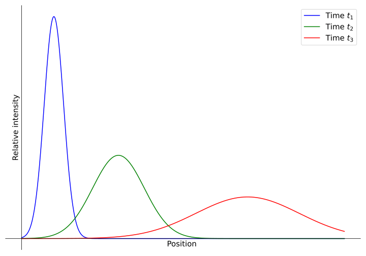
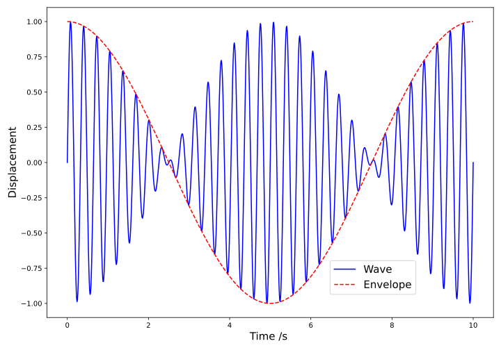
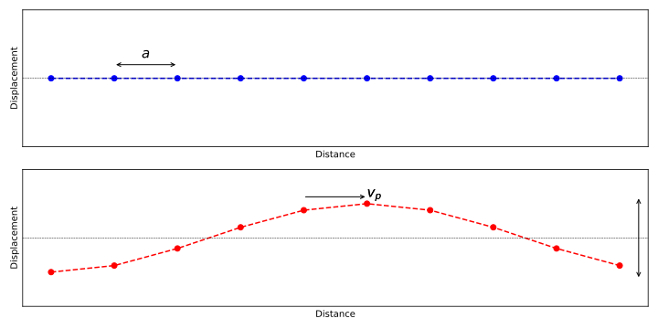
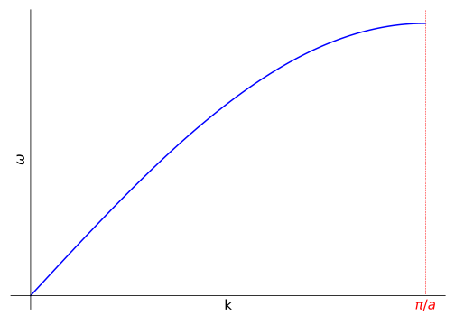
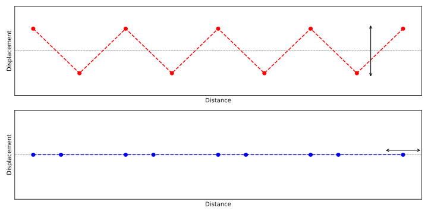

# Wave packets and Dispersion {#sec:ch12-wavepackets}

*Textbook link: Tipler and Mosca, Section 16.3*

A **wave packet** is exactly what it sounds like; a "parcel" containing a group of waves all of different frequencies.  How these wave packets travel will vary depending on the properties of the medium through which they travel.  If all the frequency components of the wave packet (or wave pulse) travel with the same phase velocity, $v_p$, the resulting disturbance propagates without changing shape and the medium is known as a **non-dispersive medium**.  If, however, frequency components travel at different speeds through the medium, we have a **dispersive** medium. You will have likely observed the effects of a dispersive medium; if you have ever stood at a quiet railway platform (usually underground), you can hear the tell-tale sound of an approaching train from the "pinging" sound in the rails long before you hear the actual vehicle itself as the high-frequencies travel faster through the rail than the lower frequencies.

The velocity of propagation of the packet is known as the **group velocity** $v_g$, the velocity at which energy is carried through the medium.  In a non-dispersive medium, this is equal to the phase velocity $v_p$.  If the medium is **dispersive** however, different frequencies travel with different values of $v_p$, and the wavepacket spreads as it travels; this is the origin of the 'pinging' sound we hear in railway tracks.

```{r echo=FALSE, ch12-dispersionillustration1, out.width='70%', fig.show='hold', fig.align="center", auto_pdf=TRUE, fig.cap="As a wave packet travels through a dispersive medium in which higher frequencies travel faster than lower frequencies, the wave packet 'spreads out' in space."}

```


## Two waves, same amplitude, different frequency (Beats) {#sec:ch12-twowavesbeats1}

Let's consider two waves with the same amplitude but differing in frequency (*i.e.* amplitude $y_0$ is common to both, each has independent frequency $\omega_1$ and $\omega 2$). For convenience we will assume that the phase difference between the two is zero at time $t=0$, and we will then consider their displacements at an arbitrary $x$ coordinate (*e.g.* $x=0$).

Firstly, let's lay out the mathematical description of each wave:

\begin{equation}
y_{1} = y_{0} \sin \omega_{1} t \quad \textsf{and} \quad y_{2} = y_{0} \sin \omega_{2} t
(\#eq:ch12-addtwowavebeats1)
\end{equation}

We can now obtain an expression for the overall observed amplitude, $y = y_1 + y_2$, and use the standard trigonometric identities^[Here we use the sum-to-product identity $\sin A + \sin B = 2\cos \left(\frac{A-B}{2}\right) \sin\left(\frac{A+B}{2}\right)$] to combine the two equations:

\begin{equation}
\begin{array}{rcl}
y &=& y_1 + y_2 \\
 &=& y_{0} \sin \omega_{1} t +  y_{0} \sin \omega_{2} t \\
 &=& 2y_{0}\cos\left(\dfrac{\omega_{1}-\omega_{2}}{2}t\right)\sin\left(\dfrac{\omega_{1}+\omega_{2}}{2}t\right)
\end{array}
(\#eq:ch12-addtwowavebeats2)
\end{equation}

As an aside, we can achieve the same result by using complex exponentials where the sum of the two waves is given in Equation \@ref(eq:ch12-addtwowavebeats1), where we are interested in the imaginary component since we started with sine waves:

\begin{equation}
y = y_0 \mathrm{e}^{\mathrm{i}\omega_1 t} + y_0\mathrm{e}^{\mathrm{i}\omega_2 t}
(\#eq:ch12-addtwowavebeats3)
\end{equation}

These can be added on an Argand diagram to show the result in Equation \@ref(eq:ch12-addtwowavebeats4)

\begin{equation}
y = y_0 r\mathrm{e}^{\mathrm{i}\theta}
(\#eq:ch12-addtwowavebeats4)
\end{equation}

...where:

\begin{equation}
r = 2 \cos\left(\frac{\omega_1t - \omega_2t}{2}\right) \quad \textsf{and} \quad \theta = \frac{\omega_1 t + \omega_2 t}{2}
\end{equation}

Our end result if we expand this complex representation is:

\begin{equation}
y = 2 y_0 \cos \left( \frac{\omega_1t - \omega_2t}{2} \right) \mathrm{e}^{\mathrm{i}\left(\frac{\omega_1 t + \omega_2t}{2} \right)}
\end{equation}

As we said above, we are interested in the 'imaginary' (sine) component, and we end up with the same result as shown in Equation \@ref(eq:ch12-addtwowavebeats2).  We can simplify the expression as in Equation \@ref(eq:ch12-addtwowavebeats5).

\begin{equation}
y = \underbrace{ 2y_{0} \cos \left( \frac{\Delta \omega}{2}t \right)}_{\textsf{slowly varying amplitude}} \underbrace{ \sin \omega_{av}t}_{\textsf{wave with average frequency}}
\end{equation}

...where $\Delta \omega = \omega_1 - \omega_2$.

The frequency fo the resulting wave is the average of the two input waves, while the amplitude oscillates with frequency $\frac{\Delta \omega}{2}$. This is known as **beating**.  The actual frequency of the beats themselves is twice this, as shown in Figure \@ref(fig:ch12-oscillationbeats1).

```{r echo=FALSE, ch12-oscillationbeats1, out.width='70%', fig.show='hold', fig.align="center", auto_pdf=TRUE, fig.cap="As two waves interfere with each other ($f_1 = 3.0$ Hz; $f_2 = 3.2$ Hz), we see the interference structure as a waveform of frequency 3.1 Hz with a slowly varying amplitude at frequency 0.1 Hz (the 'envelope'). This visualises the 'beats' in the interference structure."}

```


Therefore, if the frequency of the slowly varying amplitude is $\frac{\Delta \omega}{2}$, the observed frequency of the 'beats' will be twice this; *i.e.* the difference in frequency between the two sources.

Repeating the analysis above but with the full expressions for the two sine waves (*i.e.* $y_n = y_0 \sin(kx - \omega t)$), we obtain the expession in Equation \@ref(eq:ch12-addtwowavessine1)


\begin{equation}
y= 2 y_{0} \cos \left (\frac{\Delta kx - \Delta\omega t}{2}\right) \cdot \sin(k_\textsf{av}x - \omega_\textsf{av}t )
(\#eq:ch12-addtwowavessine1)
\end{equation}

From Equation \@ref(eq:ch12-addtwowavessine1) we find there are two velocities to consider; the phase velocity of the "average" wave, and the phase velocity of the "envelope" (the waveform which describes the amplitude; see Figure \@ref(fig:ch12-oscillationbeats1)).  These are laid out below:

The phase velocity of the "average" wave:

\begin{equation}
v_{av} = \frac{\omega_{av}}{k_{av}}
\end{equation}

The phase velocity of the envelope:

\begin{equation}
v_{env} = \frac{\Delta\omega}{\Delta k}
\end{equation}

In a *non-dispersive* medium (*i.e.* all frequencies travel with the same phase velocity), it can be shown that $v_{\textsf{av}} = v_{\textsf{env}} = \frac{\omega_1}{k_1} = \frac{\omega_2}{k_2} =$ the phase velocity of the medium.

However, in a dispersive medium, the velocities are not equal, *i.e.* $v_av \neq v_env$, and the "envelope" propagates at a different speed to the individual components.  We associate $v_env$ with the group velocity $v_g$ and in this case would be represented as:

\begin{equation}
v_{g} = \frac{\Delta\omega}{\Delta k}
\end{equation}

## Dispersion {#sec:ch12-dispersion}

As has already been mentioned, in a **dispersive** medium, $v_p$ is different for every frequency component, and the group velocity is not equal to the initial phase velocity $v_p$; *i.e.* $v_g \neq v_p$.  For any dispersive medium, we can write a relationship between $\omega$ and $k$ so that $\omega$ varies as a function of $k$; *i.e.* $\omega = \omega(k)$.  This is called the **dispersion relation** and depends on the physics of the particular wave phenomena being observed.

In the general case, the group velocity is given by the derivative of the dispersion relation (Equation \@ref(eq:ch12-dispersion1)).  The proof of this relation is available in some advanced textbooks, but it is not necessary for this course.

\begin{equation}
v_g \equiv \frac{\partial w(k)}{\partial k}
(\#eq:ch12-dispersion1)
\end{equation}

For a non-dispersive medium, $\omega$ is directly proportional to $k$ (Equation \@ref(eq:ch12-dispersion2))

\begin{equation}
w(k) = v_p k \quad \textsf{with} \quad v_p = \textsf{constant}
(\#eq:ch12-dispersion2)
\end{equation}

The consequence of this is that, when the function is differentiated according to the principle in Equation \@ref(eq:ch12-dispersion1), we find that $v_g = v_p$ (Equation \@ref(eq:ch12-dispersion2b)) as has been mentioned previously.

\begin{equation}
v_g \equiv \frac{\partial w(k)}{\partial k} = \frac{\mathrm{d} (v_p k)}{\mathrm{d}k} = v_p
(\#eq:ch12-dispersion2b)
\end{equation}

For a dispersive medium however, $v_p$ becomes a function of $k$.  If we consider a simple case where $\omega$ has a linear dependence on k (Equation \@ref(eq:ch12-dispersion3)) with constant terms $a$ and $b$:

\begin{equation}
\omega = ak + b
(\#eq:ch12-dispersion3)
\end{equation}

As before, the phase velocity is still defined as $v_p = \frac{\omega}{k} = a + \frac{b}{k}$, while the group velocity is found by differentiation (Equation \@ref(eq:ch12-dispersion4)):

\begin{equation}
v_g = \frac{\partial w(k)}{\partial k} = a
(\#eq:ch12-dispersion4)
\end{equation}

We wee that these expressions for the phase velocity $v_p = a + \frac{b}{k}$ and the group velocity $v_g = a$ are different; therefore the envelope of the wave packet will move at a different speed from the phase velocity of the wave.  However, the group velocity is still the same for all wavenumbers $k$.

When $\omega$ is a more general function of $k$, the group and phase velocities will each depend differently on $k$.  The dependence of the group velocity on $k$ means that envelope doesn't move at a single velocity and its components of different wavenumber (or wavelength) have different velocities, distorting the envelope.

So-called *normal dispersion* occurs when the group velocity is lower than the phase velocity ($v_g < v_p$); this is the most common situation, however it is possible to have *anomalous dispersion* in which the group velocity, and hence the energy, travels faster than the individual waves.

Examples of dispersion include:

* Splitting of light by prism
* Formation of a rainbow
* Phonons propagating through a crystalline solid
* Spreading of light pulses in fibre-optic cables. The dispersion limits the maximum length of cable before signal reconditioning is needed.

## Water waves {#sec:ch12-waterwaves}

The dispersion relation for water is given in Equation \@ref(eq:ch12-waterdispersion1), which includes the acceleration due to gravity ($g$) and the depth of the water ($h$):

\begin{equation}
\omega^2 = gk\tanh(kh)
(\#eq:ch12-waterdispersion1)
\end{equation}

For shallow water and/or long wavelengths, $kh \ll 1$ and $tanh(kh) \simeq kh$. This allows Equation \@ref(eq:ch12-waterdispersion1) to be simpified to:

\begin{equation}
\omega^2 \simeq gk \cdot kh \quad \textsf{and} \quad \omega \simeq k \sqrt{gh}
\end{equation}

We can then detemrine the phase velocity $\v_p$ in this situation as:

\begin{equation}
v_p = \frac{\omega}{k} = \sqrt{gh}
\end{equation}

...and there is **no dispersion** (the phase velocity has no variable dependences).  This applies in the case of the tsunami, where the water depth is small compared to the wavelength, even when crossing oceans.  This means that these waves are able to propagate over global distances without significantly changing shape.

For intermiediate depths, we might use the expansion of $\tanh(x)$ to write this term as:

\begin{equation}
\tanh(kh) = kh - \frac{(kh)^3}{3} + \cdots
\end{equation}

...from which we obtain:

\begin{equation}
\omega^2 \simeq gk \cdot \left(kh - \frac{(kh)^3}{3} \right)
\end{equation}

We can now use this to determine the phase velocity of the wavepacket in water (Equation \@ref(eq:ch12-waterdispersion2)):

\begin{equation}
v_p = \frac{\omega}{k} = \frac{\sqrt{gh}}{\sqrt{1+\frac{(kh)^2}{3}}}
(\#eq:ch12-waterdispersion2)
\end{equation}

Equation \@ref(eq:ch12-waterdispersion2)) tells us that the dispersion of the wave increases with increasing water depth relative to the wavelength.

## Sound waves in a crystal (phonons) {#sec:ch12-phonondispersion}

When we consider sound-waves in a crystal, we can consider both longitudinal sound waves as well as transverse sound waves (as we are not in a fluid, a transverse wave is now possible due to the intermolecular forces within the crystal).

We will first consider the one-dimensional case, as the three dimensional case can be derived from the principles laid out here.  Firstly, let's consider what a wave might look like when propagating along a one-dimensional crystal.  We imagine our one-dimensional lattice to be a line of molecules, all connected by a "spring" (to model the molecular bond).  In this model, we can either have a longitudinal wave, where the springs are stretched and compressed as the molecules oscillate in the direction of the crystal axis, or we can have a transverse wave, in which the 1-D line of molecules behaves as a string.  These are illustrated in Figure \@ref(fig:ch12-phononvibration1).

```{r echo=FALSE, ch12-phononvibration1, out.width='70%', fig.show='hold', fig.align="center", auto_pdf=TRUE, fig.cap="A 1 dimensional lattice can carry sound waves (phonons, also known as lattice vibrations) via both transverse and longitudinal vibrational modes. "}

```


From this model, it can be shown that the phase velocity can be given by the relationship shown in Equation \@ref(eq:ch12-phononvibration1), relating the tension in the 1-D lattice ($F$), the linear density of the 1-D lattice ($\mu$) and the periodicity of the lattice, $a$.

\begin{equation}
v_{p} = \frac{\omega}{k} = \frac{F}{\mu}\frac{\sin \left(\frac{ka}{2}\right)}{\frac{ka}{2}}
(\#eq:ch12-phononvibration1)
\end{equation}

In the long-wavelength limit, $k \rightarrow 0$ and $v_p \rightarrow \frac{F}{\mu}$.

Additionally, we can rewrite Equation \@ref(eq:ch12-phononvibration1) to gain an expression for $\omega$:

\begin{equation}
\omega = \frac{kF}{\mu}\frac{\sin \left(\frac{ka}{2}\right)}{\frac{ka}{2}} = \frac{2F}{a\mu}\sin \left(\frac{ka}{2}\right)
(\#eq:ch12-phononvibration2)
\end{equation}

If we plot the angular frequency $\omega$ against the wavenumber $k$, we obtain the **dispersion curve**, shown in Figure \@ref(fig:ch12-dispersioncurve1).


```{r echo=FALSE, ch12-dispersioncurve1, out.width='70%', fig.show='hold', fig.align="center", auto_pdf=TRUE, fig.cap="The variation in angular frequency $\\omega$ with wavenumber $k$ in a dispersive medium. There is an upper limit to the wavenumber which the medium can sustain, namely $\\pi / a$"}

```


From Equation \@ref(eq:ch12-phononvibration2), we can find the group velocity $v_g$ by differentiation:

\begin{equation}
v_g = \frac{\mathrm{d}\omega}{\mathrm{d}k} = \frac{F}{\mu} \cos \left(\frac{ka}{2}\right)
(\#eq:ch12-phononvibration3)
\end{equation}

Once again, examination of Equation \@ref(eq:ch12-phononvibration3) shows:

* The group velocity, $v_g$ tends to $\frac{F}{\mu}$ as $k \rightarrow 0$; and:
* The group velocity also drops to zero when $k = \frac{\pi}{a}$

At the point when $k = \frac{\pi}{a}$, alternate atoms move in exact anti-phase, and we have the appearance of a standing wave (Figure \@ref(fig:ch12-dispersionlattice1)). Therefore there is an effective cut-off at $k = \frac{\\pi}{a}$; waves with a greater wave number than this (shorter wavelength, higher frequency) cannot be supported by the lattice.^[This is a similar effect to the aliasing obserfved in sample signals in Experiment S]

```{r echo=FALSE, ch12-dispersionlattice1, out.width='70%', fig.show='hold', fig.align="center", auto_pdf=TRUE, fig.cap="When the wavenumber $k = \\pi / a$, the atoms move in perfect anti-phase and the movement appears as a standing wave. The lattice can no longer support a higher wavenumber than this."}

```

Note that the periodicity of the lattice, $a$ (also known as the molecular spacing) is typically around $10^{-9} - 10^{-10}$ m, so this effect will only be observed for **very** high frequencies.
