# Interference and Diffraction {#sec:ch13-interference}

## Conditions for interference {#sec:ch13-conditionsinterference}

In Section \@ref(sec:ch10-identicalwaves1), we discussed the principle of superposition of two waves with the same frequency and wavelength in the context of forming a standing wave. Specifically, we found that the resultant wave has an amplitude which depends on the phase difference.

Mathematically, for two waves described by $y_1$ and $y_2$, we obtain the result shown below (from Equation \@ref(eq:ch10-superposition5b)):

\begin{equation}
y_1 = A_0 \sin(k r - \omega t) \quad \textsf{and} \quad y_2 = A_0 \sin(k r - \omega t + \delta)
\end{equation}

\begin{equation}
y = \underbrace{2 A_0 \cos \left( \frac{\delta}{2} \right)}_{\textsf{New amplitude}} \underbrace{\sin \left( kr - \omega t + \frac{\delta}{2} \right)}_{\textsf{Travelling wave}}
\end{equation}

Therefore the amplitude $A$ of the resultant wave may be described by:

\begin{equation}
A = 2 A_0 \cos \left( \frac{\delta}{2} \right)
(\#eq:ch13-amplitudeinterfere1)
\end{equation}

This amplitude $A$ is a maximum when the waves are *in phase* ($\delta = 2m\pi$), and at a minimum when the waves are *out of phase* ($\delta = (2m+1)\pi$).  

Typically, a phase difference between identical waves results from a path difference; for example two light waves travelling by different routes. For such a path difference, $\Delta r$, the phase difference is given by $\delta = \frac{2 \pi \Delta r}{\lambda}$.  In the case of **constructive** interference, $\delta = 2m\pi$ and $\Delta r = m\lambda$, while for **destructive** interference $\delta = (2m+1)\pi$ and $\Delta r = \left(m+\frac{1}{2}\right)\lambda$.

For any two waves to interfere, they must be **coherent**; *i.e.* there must be a fixed phase relationship between the two sources. This is usually achieved by splitting a single light source.  Light sources such as tungsten filament bulbs are **not** coherent; the emission results from thermal excitation and the different componetns of the bulb radiate independently of one another.  A LASER on the other hand **is coherent**; the beam is produced by stimulated emission, a process which only occurs if all photons are in phase.

## Propagation of Light - Huygens's Principle {#sec:ch13-lightpropagation}

Huygens' Principle is summarised as follows:

> Each point on a primary wavefront serves as a source of spherical secondary wavelets, which advance with a speed and frequency equal to those of the primary wave.  The primary wavefront at some later time is the envelope of these wavelets.

While the propagation of light is in fact goverened by Maxwell's equations, Huygens' construction provides an extremely valuable way of analysing diffraction problems.  An illustration of Huygens' principle is shown in Figure \@ref(fig:ch13-huygenswavelets1); we only consider the *forward moving* portion of the wavelet, not the whole spherical wavelet.


```{r echo=FALSE, ch13-huygenswavelets1, out.width='70%', fig.show='hold', fig.align="center", auto_pdf=TRUE, fig.cap="The Huygens' wavelet construction. A wavefront is considered to be a source of secondary wavelets; each subsequent wavefront is the envelope of the forward moving component of the wavelets."}
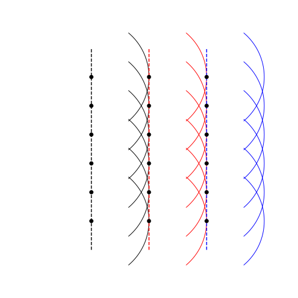
```


## The two-slit interference pattern {#sec:ch13-twoslitinterference}

*Tipler and Mosca, 33.3*

Consider a double slit experiment, where uniform coherent waves approach a pair of slits in a barrier (Figure \@ref(fig:ch13-doubleslit1)).  According to Huygens' Principle, each slit then becomes a source of wavelets, which then radiate outwards from this point and, since the wavelets from each source are coheret, they then interfere.


```{r echo=FALSE, ch13-doubleslit1, out.width='70%', fig.show='hold', fig.align="center", auto_pdf=TRUE, fig.cap="The configuration of the double slit experiment. Two narrow slits are separated at distance $d$, each of which becomes a source of secondary wavelets which can then create the interference pattern."}
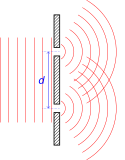
```


If we examine the path of waves travelling in an arbitrary direction from each slit which converge on the observation screen (Figure \#ref(fig:ch13-doubleslit2)), we can start to consider the behaviour of our wavelets.

```{r echo=FALSE, ch13-doubleslit2, out.width='70%', fig.show='hold', fig.align="center", auto_pdf=TRUE, fig.cap="Looking at the whole double slit experiment, we can determine the angles within the experiment and define the observation position $X$ on the screen as a function of these angles. Under the Fraunhofer condition (long field interference), the rays can be considered parallel, allowing the path difference and hence phase offset to be determined."}
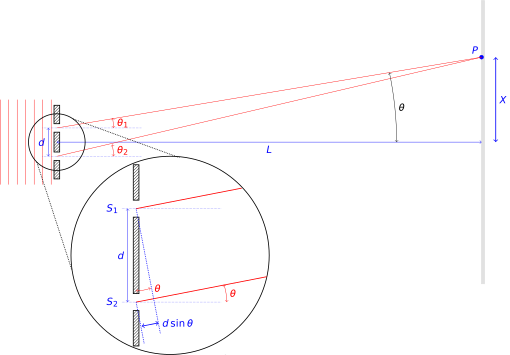
```


If we assume that the distance to the screen $L$ is considerably larger than the distance between the slits $d$ then, since $L \gg d$, then we can say that the angles $\theta_1$, $\theta_2$ and $\theta$ are approxiamtely equal (*i.e.* $\theta_1 \approx \theta_2 \approx \theta$); the Fraunhofer diffraction condition.

Note that when $L \simeq d$, this approximation no longer applies and the diffraction becomes very complex, and is termed **Fresnel conditions**.  For the purposes of this discussion we will only consider the Fraunhofer case (*i.e.* $L \gg d$).

We can obtain an expression for the path difference between the waves; if we are assuming that the distance to the screen is so large the rays may be considered parallel, then the path difference may be determined from Figure \@ref(fig:ch13-doubleslit2):

\begin{equation}
\begin{array}{rclrcll}
d\sin\theta &=& m\lambda \quad; & m &=& 0,1,2, \dots &\textsf{for maxima} \\
d\sin\theta &=& \left(m + \frac{1}{2}\right) \lambda \quad; & m &=& 0,1,2, \dots &\textsf{for minima}
\end{array}
\end{equation}

At point $P$ on the observation screen we can then determine the phase difference, $\delta$:

\begin{equation}
\delta = \frac{2\pi}{\lambda}d\sin\theta
\end{equation}

However, remember that, as $L \gg d$, then $\sin \theta \approx \tan \theta = \frac{X}{L}$ for small $\theta$.  Therefore, at points where interference maxima are observed (*i.e.* $d\sin\theta = m\lambda$):

\begin{equation}
d\sin\theta = \frac{d X_m}{L}= m\lambda \quad \textsf{and} \quad X_m = \frac{m\lambda L}{d}
(\#eq:ch13-fraunhoferderiv1)
\end{equation}

Equation \@ref(eq:ch13-fraunhoferderiv1) tells us that the distance of the "$m$"th maximum from the midpoint of the diffraction pattern scales only with the value of $m$; all other values being constant for the particular experimental setup; *i.e.* the maxima will be **equally spaced**.

We can also consider the intensity of the fringes; from our work in Section \@ref(sec:ch7-transportenergypower), the intensity (the transmitted power) is proportional to the square of the amplitude.  Using the result shown in Equation \@ref(eq:ch13-amplitudeinterfere1), we can derive the expression in Equation \@ref(eq:ch13-amplitudeinterfere2):

\begin{equation}
I = A^2 = 4 A_0^2 \cos^2 \left(\frac{\delta}{2}\right)
(\#eq:ch13-amplitudeinterfere2)
\end{equation}

However, since we have the expression $\delta = \frac{2\pi d}{\lambda}\sin\theta \approx \frac{2\pi d X}{\lambda L}$ the phase difference $\delta$ is proportional to the distance of the fringe from the midpoint of the interference pattern, $X$. Therefore, since $\delta \propto X$, we expect to see fringes following the intensity of a $\cos^2$ function (Figure \@ref(fig:ch13-cos2fringes)).


```{r echo=FALSE, ch13-cos2fringes, out.width='70%', fig.show='hold', fig.align="center", auto_pdf=TRUE, fig.cap="The interference pattern from two narrow slits gives an intensity pattern proportional to a $\\cos^2$ function."}
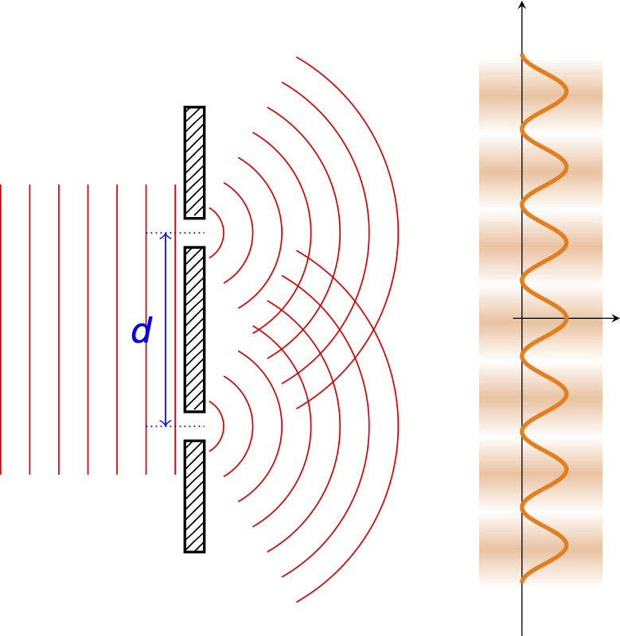
```

## Diffraction from a single wide slit {#sec:ch13-singlewideslit}

Let's now turn to the effect of coherent plane wavefronts incident on a single wide slit (Figure \@ref(fig:ch13-singlewideslit1)).

```{r echo=FALSE, ch13-singlewideslit1, out.width='70%', fig.show='hold', fig.align="center", auto_pdf=TRUE, fig.cap="A single wide slit of width $d$ can be thought of as a source of many different wavelets; here we have shown three rays to give an indication of the complexity of the interference pattern."}
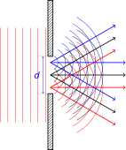
```


In this situation, we imagine dividing the aperture into a set of secondary sources and use the Huygens' construction to consider secondary wavelets.  These 'diffracted waves' will appear to spread.  To find the diffracted intensity in a particualr direction, we add to gether the secondary waves travelling in that direction, taking into account the path (and hence phase) differences.

We will conduct our analysis in two stages:

1. We consider the superposition of waves from two secondary sources, symmetrically disposed about the centre of the slit, similar to the "two narrow slit" example above;
1. We then add together the contributions from all pairs of sources across the wide slit.

The workthrough for this example is slightly involved, so is shown elsewhere, however we show the elements of the solution here and, as for the two narrow slits example above,  use it to determine the amplitude of the superposition as a function of $X$, the distance on screen.

```{r echo=FALSE, ch13-singlewideslit2, out.width='70%', fig.show='hold', fig.align="center", auto_pdf=TRUE, fig.cap="Construction of the diffraction pattern from a single wide slit involves looking at pairs of wavelets $\\Delta x$; through quantifying the phase difference between these two wavelets and summing over the slit we can reconstruct the diffraction pattern."}
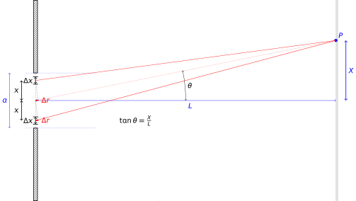
```


The result of the derivation is that the superposition observed as a function of $X$ is a travelling wave with amplitude as:

\begin{equation}
A \propto \mathrm{sinc}\left(\frac{\pi a X}{\lambda L}\right)
\end{equation}

...where $\mathrm{sinc}(x) = \frac{\sin (x)}{x}$.^[The "sinc" function is used often in signal processing, and its name comes from its name the 'sine cardinal' function, and is widely used in Fourier transforms.]  Therefore the intensity ($\propto A^2$) observed on the screen is given by:

\begin{equation}
I \propto A^2 \propto \mathrm{sinc}^2 \left(\frac{\pi a X}{\lambda L}\right)
(\#eq:ch13-singlewideslit1)
\end{equation}

The positions of the dark fringes can then be determined by setting this equal to zero:

\begin{equation}
\begin{array}{rrcl}
&\mathrm{sinc}^2 \left(\frac{\pi a X}{\lambda L}\right) &=& 0 \\
\equiv & \dfrac{\sin^2 \left(\frac{\pi a X}{\lambda L}\right)}{x^2 }&=& 0 \\
& \sin^2 \left(\frac{\pi a X}{\lambda L}\right) &=& 0 \\
& \frac{\pi a X}{\lambda L} &=& \pi, 2\pi, 3\pi, \dots \equiv m \pi \\
& \frac{ a X}{\lambda L} &=& m , \textsf{where } m \neq 0
\end{array}
(\#eq:ch13-singlewideslit2)
\end{equation}

From Equation \@ref(eq:ch13-singlewideslit2), we can determine that our dark fringes occur when the output of the sinc function in Equation \@ref(eq:ch13-singlewideslit1) is equal to zero; *i.e.* dark fringes occur at $X_m = \frac{m\lambda L}{a}$ where $m = 1, 2, 3, \dots$, but $m \neq 0$. Therefore the separation of the dark fringes, $X_m$ is inversely proportional to the slit width $a$, *i.e* $X_m \propto \frac{1}{a}$.

## Diffraction from two wide slits {#sec:ch13-difftwowideslits}

Once again, we have a series of coherent planar wavefronts approaching the barrier, this time with two wide slits present (Figure \@ref(fig:ch13-twowideslits1)).


```{r echo=FALSE, ch13-twowideslits1, out.width='70%', fig.show='hold', fig.align="center", auto_pdf=TRUE, fig.cap="The configuration for two wide slits of width $a$ at separation $b$ appears similar to the construction for narrow slits, except now each slit is a source of a number of wavelets, rather than a single wavelet. This has profound implications on the diffraction pattern observed."}
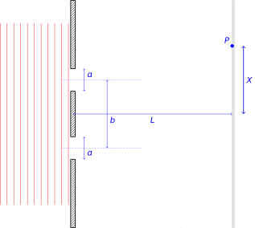
```

We can use the same method as was used previously, but with different limits of integration, and we obtain a travelling wave with amplitude as given in Equation \@ref(eq:ch13-twowideslits1):

\begin{equation}
A = a A_0 \cos \left( \frac{\pi b X}{\lambda L} \right) \mathrm{sinc}\left( \frac{\pi a X}{\lambda L} \right)
(\#eq:ch13-twowideslits1)
\end{equation}

The corresponding intensity observed of the fringes observed on the screen is then as shown in Equation \@ref(eq:ch13-twowideslits2):

\begin{equation}
I \propto A^2 = a^2 A_0^2 \cos^2 \left( \frac{\pi b X}{\lambda L} \right) \mathrm{sinc}^2 \left( \frac{\pi a X}{\lambda L}\right)
(\#eq:ch13-twowideslits2)
\end{equation}

In other words, the intensity is the product of the diffraction pattern from the two "narrow" slits with that from the single wide slit:

\begin{equation}
I \propto A^2 = \underbrace{a^2 A_0^2}_{\textsf{Constant scaling factors}} 
\underbrace{\cos^2 \left( \frac{\pi b X}{\lambda L} \right)}_{\textsf{Double slit intensity}} \underbrace{\mathrm{sinc}^2 \left( \frac{\pi a X}{\lambda L}\right)}_{\textsf{Wide slit intensity}}
(\#eq:ch13-twowideslits3)
\end{equation}

WHen we have two functions combined in this manner, we say that one is the 'envelope' of the other - it effectively "contains" and controls the intensity of the other.  In general, the lower frequency function is the 'envelope', so here the $\mathrm{sinc}^2$ function is the envelope of the $\cos^2$ function. The intensities of this combined function are shown in Figure \@ref(fig:ch13-twowideslits2)


```{r echo=FALSE, ch13-twowideslits2, out.width='70%', fig.show='hold', fig.align="center", auto_pdf=TRUE, fig.cap="The diffraction pattern from two wide slits is a combination of the result of a single wide slit and that of two narrow slits. The sinc$^{2}$ function becomes the envelope shaping the intensities of the peaks from the narrow slit solution."}
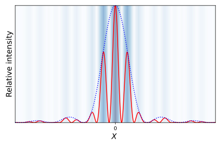
```


## Multiple slits with equal spacing {#sec:ch13-diffmultipleslits}

Over the past few sections we have laid out the principles of diffraction and interference of light from a pair of narrow slits, a single wide slit, and a pair of wide slits.  We have shown how the relative intensity functions are combined and how this gives us our intensity patterns for the combination of the two more simple examples.  We can apply these principles to determine the expected interference patterns we would observe for multiple slit systems.

## Fourier transforms in diffraction {#sec:ch13-ftindiffraction}

The method we have used to determine the intensities of fringes in diffraction/interference patterns may be generalised for any aperture by introducing a general aperture function $f(x)$ which describes the shape of the apterture (*e.g.* if we have two narrow slits, we use two delta functions to describe them).  We can then sum the phase components from all elements $\Delta x$ across this aperture.  The amplitude of the constant wave is then given by Equation \@ref(eq:ch13-ftindiffraction1)

\begin{equation}
A = \sum_{\textsf{aperture}} f(x) \mathrm{e}^{\mathrm{i}\delta(x)} \Delta x
(\#eq:ch13-ftindiffraction1)
\end{equation}

Equation \@ref(eq:ch13-ftindiffraction1) is telling us that we can scale our wave (described by the complex representation) originating from aperture element $\Delta x$ by the aperture function $f(x)$, and find out the overall result by summing up all these components.

If we substitute $\delta(x) = 2\pi \left(\frac{x}{\lambda}\right) \sin \theta$ and let $\Delta x \rightarrow \mathrm{d}x$, we can then replace the summation with the integral shown in Equation \@ref(eq:ch13-ftindiffraction2):

\begin{equation}
A = \int_{-\infty}^{\infty} f(x) \mathrm{e}^{\mathrm{i}2\pi \left(\frac{x}{\lambda}\right) \sin \theta} \Delta x
(\#eq:ch13-ftindiffraction2)
\end{equation}

This integral is an example of a Fourier transform *i.e.* the *amplitude* of a (far-field, Fraunhofer) diffraction pattern is given by the Fourier transform of the aperture.  The diffracted intensity is then given by the square of this Fourier transform.

**Example** In Section \@ref(sec:ch11-fttophat) we demonstrated a 'top-hat' function, which could represent a broad slit. The Fourier tranform of this gave us the diffracted amplitude which, when squared, gives us the expected intensity pattern derived above.


## Resolution limit of optical instruments {#sec:ch13-resolutionlimit}

*Textbook link Tipler and Mosca, 33.7*

Light from a point source will be diffracted by a circular aperture (*e.g. the objective lens of a telescope, microscope or even your eye) to give a pattern similar to that of a single wide slit, but with circular symmetry. This is illustrated in Figure \@ref(fig:ch13-circulardiffraction1).


```{r echo=FALSE, ch13-circulardiffraction1, out.width='70%', fig.show='hold', fig.align="center", auto_pdf=TRUE, fig.cap="A simulation of the diffraction pattern of a point source through an aperture. The defined disc in the center is known as the Airy disc image. The intensity across the diffraction pattern is as we have seen for the one dimensional slit, derived from the sinc function."}
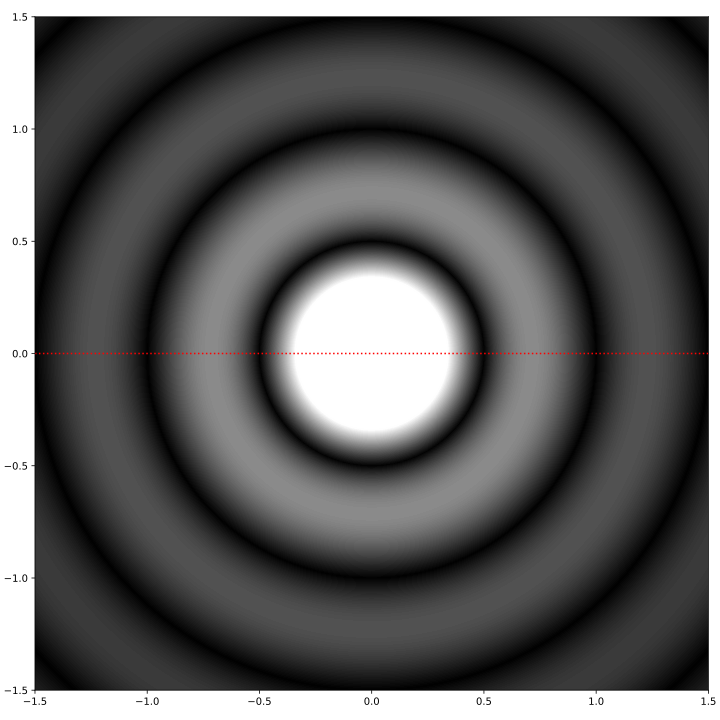
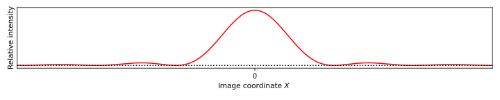

```

Knowing that this intensity is based on the $\mathrm{sinc}^2$ function described in Equation \@ref(eq:ch13-singlewideslit1), we can determine the angular position of the first dark fringe (first zero point) is given by the angular position:

\begin{equation}
\sin \theta = \frac{1.22 \lambda}{D}
\end{equation}

...where $D$ is the diameter of the aperture.
<!-- Where has 1.22 come from? I can see where $\sin \theta = \frac{ \lambda}{D}$ comes from... -->

This is the end result for a single incoherent source passing through an aperture; however what happens if we consider more than one incoherent source? At what point is it impossible to determine the number of sources? It is this which determines the limit of optical resolution.

Let's now consider two incoherent point sources with an angular separation $\alpha$ at the aperture. 

<!-- This is illustrated in Figure \@ref(fig:ch13-opticalreslimit1) below. -->

<!-- **Figure to show interference with two point sources** -->
<!-- (\#fig:ch13-opticalreslimit1) -->

The sources are at the limit of resolution ("just resolved") if the maximum of the diffraction pattern of one point source (caused by the aperture) correponds to the first minimum of the diffraction pattern of the other; in other words; we see a 'bright spot' where we would expect to see darkness.  In terms of the angular separation $\alpha$, the two sources are just resolved if:

\begin{equation}
\alpha = \frac{1.22 \lambda}{D}
\end{equation}

(note the use of the small angle approximation here)

This is simulated in the intensity profile shown in Figure \@ref(fig:ch13-opticalreslimit1).

```{r echo=FALSE, ch13-opticalreslimit1, out.width='70%', fig.show='hold', fig.align="center", auto_pdf=TRUE, fig.cap="The limit of optical resolution occurs if the maximum of one source aligns with the minimum of the second; this creates a 'dip' between the observed signal intensity allowing the sources to be separately resolved. Any closer however and these will merge into a single bright peak in the middle."}
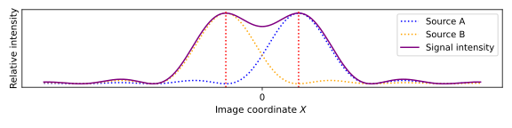
```

Figure \@ref(fig:ch13-opticalreslimit2) shows two point sources which are clearly resolved ($\alpha > \frac{1.22 \lambda}{D}$), while Figure \@ref(fig:ch13-opticalreslimit3) shows two point sources which are just at the limit of resolution ($\alpha = \frac{1.22 \lambda}{D}$)


```{r echo=FALSE, ch13-opticalreslimit2, out.width='70%', fig.show='hold', fig.align="center", auto_pdf=TRUE, fig.cap="Sources can be clearly defined up to a certain limit; but diffraction patterns cause interference around the image plane, but each source still has its defined Airy disc."}
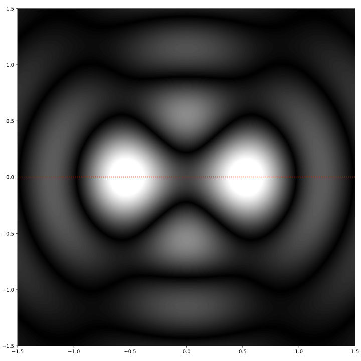
```


```{r echo=FALSE, ch13-opticalreslimit3, out.width='70%', fig.show='hold', fig.align="center", auto_pdf=TRUE, fig.cap="At the resolution limit, a 'dimming' can still be perceived between the sources. At closer separation however, the two Airy discs will blend into one bright source."}
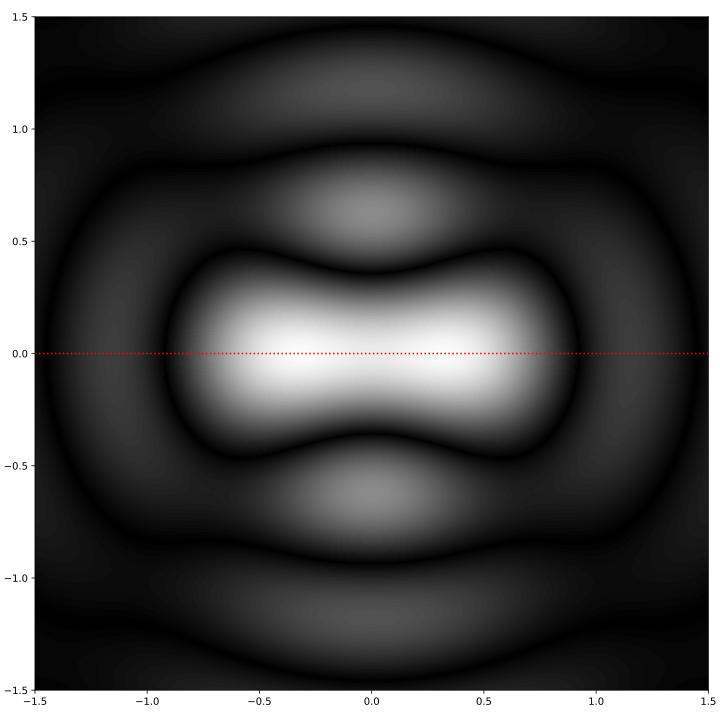
```


It is easier to visualise this limit by plotting a graph of the expected intensities. We can resolve the two sources provided there is a clear "dip" in intensity of the resulting intensity sum between the peaks of the two interference patterns, however if they are close enough together such that the result has no dip in the middle we can no longer resolve the sources.
