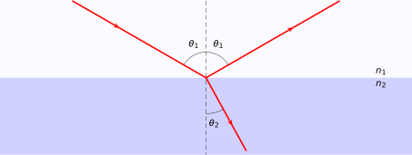
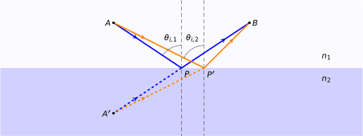

# Properties of Light {#sec:ch14-propertieslight}

The consideration of the wave nature of light offers a way to explain part of its behaviour; it is worth therefore giving this some consideration.

## Reflection and Refraction {#sec:ch14-reflectionrefraction}

Refraction is a phenomenon arising from the differing speeds at which light travels in different media.  The refractive index $n$ of a material is a way to describe this variation and may be determined by the ratio of the speed of light in a vacuum ($c$) to its speed $v$ in the medium concerned:

\begin{equation}
n = \frac{c}{v}
\end{equation}

Refractive indices are however approximate; different wavelengths of light travel at different speeds in a given material - we covered this phenomenon in Section \@ref(sec:ch12-dispersion). Refractive indices do not account for these differences, so values reported are usually at a standardised wavelength (usually that of sodium d-line emission, $\lambda = 589$ nm). 

Table: (\#tab:ch14-refractiveindices) A list of refractive indices of common materials

| Material | $n_{589 \textsf{nm}}$ | 
| :-- | --: | 
| vacuum | 1 | 
| air | 1.003 | 
| water | 1.33| 
| common glass | 1.52| 
| diamond | 2.42 | 

It is worth noting that the **frequency** of light remains unchanged while passing through different media; rather it is the **wavelength** which varies:

\begin{equation}
\lambda_n = \frac{\lambda}{n}
\end{equation}

When a beam of light encounters an interface between two transparent media of different refractive indices, part of the light is reflected from the interface, and part of the beam is refracted through the interface (Figure \@ref(fig:ch14-reflectionrefraction)).

```{r echo=FALSE, ch14-reflectionrefraction, out.width='70%', fig.show='hold', fig.align="center", auto_pdf=TRUE, fig.cap="The path of a light ray passing into a medium of higher refractive index $n_2$. The angles of incidence and reflection are equal($\\theta_1$), while the angle of refraction ($\\theta_2$) is determined from the ratio of the refractive indices via Snell's law."}

```

From Figure \@ref(fig:ch14-reflectionrefraction), we note the following:

* The reflected beam has an angle of reflection equal to the angle of incidence
* The angle of incidence $\theta_1$ is the angle between the incident beam and the normal to the surface
* The angle of reflection $\theta_1'$ is the angle between the reflected beam and the normal to the surface
* The angle of refractin $\theta_2$ is the angle between the refracted beam and the same normal.

The paths that the light rays take through either reflection or refraction are described by **Fermat's principle**, namely that the light travels along the path of least time; however due to the variation of the speed of light, this path is not necessarily the shortest path between the two points. Let's first consider the case of reflection (Figure \@ref(fig:ch14-fermatsprinciple)).

```{r echo=FALSE, ch14-fermatsprinciple, out.width='70%', fig.show='hold', fig.align="center", auto_pdf=TRUE, fig.cap="Fermat's principle states that a light ray takes the route (whether refraction or reflection) which is the shortest time. When the light ray remains in the same medium through reflection, the shortest path APB is one where the line A'PB is straight; *i.e.* the angle of reflection is equal to the angle of incidence."}

```

**Figure showing Fermat's principle**
(\#fig:ch14-fermatsprinciple)

Consider a light ray travelling from $A$ to $B$ by reflection from the interface at point $P$. The distance $APB$ is at a minimum when the angles $\theta_1$ and $\theta_1'$ are equal, where the light ray reflects at point $P_{\textsf{min}}$.

For a light ray travelling from $A$ to $C$ by refraction through the interface at point $P$, a similar principle may be used. Since the light travels more slowly in the bottom material, there is a balance to be found in minimising the time taken to travel from $A$ to $C$. This is akin to a lifeguard racing to save a swimmer in difficulty; the lifeguard can run faster over sand than swimming through the sea, but the quickest path to the swimmer is not a direct line.

Through following Fermat's principle, we arrive at **Snell's law of refraction** (Equation \@ref(eq:ch14-snellslaw1)), allowing us to calculate the angles of reflection and refraction of a light ray passing from one material into another.

\begin{equation}
n_1 \sin \theta_1 = n_2 \sin \theta_2
(\#eq:ch14-snellslaw1)
\end{equation}

We can also consider the intensity of light reflected from an interface; this depends on:

1. the angle of incidence of the light ray;
1. the polarisation of the light; and
1. the refractive indices of the two media.

When light is perpendicular to the interface (as is often the case for optical instruments), the reflectivity $R$ is defined as the ration between the intensities of the reflected light $I$ and the incident light $I_0$:

\begin{equation}
R = \frac{I}{I_0} \quad \textsf{or} \quad I = R I_0
\end{equation}

...where:

\begin{equation}
R = \left( \frac{n_1 - n_2}{n_1 + n_2} \right)^2
\end{equation}

Similarly, there is also a **transmission coefficient**, defined as $T = 1-R$, which defines the proportion of light transmitted through the interface.  Complete reflection/transmission behaviour is described by Fresnel's equations.


## Total internal reflection {#sec:ch14-internalreflection}

When a beam of light passes through an interface from a larger to a smaller refractive index ($n_1 > n_2$), the angle of refraction $\theta_2$ is larger than the angle of incidence $\theta_1$.  As $\theta_1$ reaches a particular value (the 'critical angle', $\theta_c$), $\theta_2 = 90^\circ$, and the refracted beam disappears.  At this point the beam is reflected from the interface back into the first medium.

The conditions for the critical angle are found from Snell's law (Equation \@ref(eq:ch14-snellslaw1)), setting $\theta_1 = \theta_c$ and $\theta_2 = 90^\circ$:

\begin{equation}
\sin \theta_c = \frac{n_2}{n_1}\sin(90^\circ) = \frac{n_2}{n_1}
\end{equation}

### Evanescence {#sec:ch14-evanescence}

A full solution of the wave equations for light undergoing total internal reflection reveals a solution within the low refractive index region. This is a consequence of the continuity equations *i.e.* the wave amplitude must be continuous across the interface.

The solution to these equations is a decaying exponential, known as an **evanescent "wave"** (Figure \@ref(fig:ch14-evanescentwave1))

**Figure to show evanescent "wave"**
(\#fig:ch14-evanescentwave1)

The decay length of this evanescent "wave" is approximately equal to the wavelength of the incident beam, $\lambda$.  The reason for terming this a "wave" is that it does not propagate - *i.e.* it is not a travelling wave.  The evanescent "wave" stores energy and, if a second glass block is placed "close" to the first (*i.e.* within one micron), the energy may be taken from the evanescent wave and a travelling wave produced in the second block (albeit with a smaller amplitude to the incident wave).

**Figure to show evanescent wave extractin**
(\#fig:ch14-evanescentwave2)

This example of extracting enerby from an evanescent wave (Figure \@ref(fig:ch14-evanescentwave2)) is known as 'frustrated total internal reflection'; the photons have 'tunneled' across the air gap.^[We often use the term "tunneling" to describe quantum phenomena passing through a barrier; you will meet the term frequently!]

### Applications of total internal reflection {#sec:ch14-tirapplications}

Total internal reflection has many applications; we mention some here, however the list is not exhaustive!

**Optical fibres**: A light beam which is coupled to a very thin glass fibre is almost parallel to the axis of the fibre. In this condition light will hit the fibre walls with an angle larger than the critical angle resulting in total internal reflection and very high transmission.

**Touch screen technology and fingerprint acquisition**: Light is coupled into a thin glass screen. As a fingertip touches the screen it scatters the evanescent wave above the screen and can be detected.

