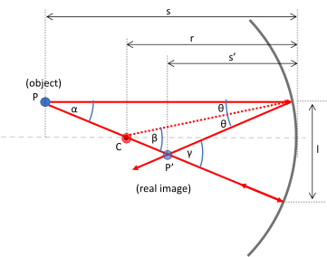

# Mirrors {#sec:ch15-mirrors}

We have introduced the properties of light as it interacts with different materials. In the next two sections we will now use this to show how simple optical elements work and how to determine factors describing how light rays behave when interacting with these simple optical elements.  IN this chapter, we discuss **mirrors**.

## Plane mirror: object and image {#sec:ch15-planemirror1}

Consider an object placed at point $P$, shown in Figure \@ref(fig:ch15-planemirror1); light rays coming from this object are reflected by a mirror to reach the observer.

```{r echo=FALSE, ch15-planemirror1, out.width='70%', fig.show='hold', fig.align="center", auto_pdf=TRUE, fig.cap="Reflection from a plane mirror occurs when the angle of incidence from $P$ is equal to the angle of reflection to the observer.To the observer, the light appears to come from point $P'$ behind the mirror; a *virtual image* which cannot be projected onto a screen."}

```


As shown in Figure \@ref(fig:ch15-planemirror1) the observer perceives the light rays as though they are coming from point $P'$; we call this point the **image** of the object $P$.  This image is called a **virtual** image because the rays coming from the object do not converge onto $P'$, When rays from the object converge on the image, the image is called **real**.  A real image can be observed on a screen or recorded on a film/CCD sensor without the use of lenses.

### Construction of a ray diagram for a plane mirror {#sec:ch15-planemirror2}

To locate the the image of an object produced by a plane mirror, we follow a series of steps to draw the ray diagram:

1. From a point on the object, trace a ray perpendicular to the mirror. This ray will be reflected along the same direction;
1. Trace a second ray from the same point on the object and forming an angle θ with the normal to the mirror;
1. Extend these two rays behind the mirror;
1. They will meet in one point that is the virtual image of the object point.

## A spherical mirror {#sec:ch15-sphericalmirror1}

We follow a similar process as we did for the plane mirror (Section \@ref(sec:ch15-planemirror1)) in considering the nature of the image.  Once again, we place an object at point $P$ and consider how the light rays from this object are reflected from a concave mirror (Figure \@ref(fig:ch15-sphericalconcave1)).  
```{r echo=FALSE, ch15-sphericalconcave1, out.width='70%', fig.show='hold', fig.align="center", auto_pdf=TRUE, fig.cap="Rays coming from point $P$ are focussed at point $P'$ provided they do not deviate too much from the optical axis (paraxial rays); Wide deviations result in imperfect image formation (spherical aberrations)."}

```


This time, rays coming from point $P$, located on the optical axis of the concave mirror, are refleced by the mirror and focussed to a point $P'$ (a 'real' image, as the rays converge).  Any rays which are far from the optical axis (non-paraxial) are not focussed on $P'$; a term known as *spherical aberration*.

### The Mirror equation {#sec:ch15-mirrorequ}

The 'mirror equation' is a tool to calculate the position of an image of a spherical concave mirror relative to the object position and the centre point of the mirror.  Figure \@ref(fig:ch15-concavesphericalmirroreq1) shows all the relevant distances and angles which are needed for considering the mirror equation.


```{r echo=FALSE, ch15-concavesphericalmirroreq1, out.width='70%', fig.show='hold', fig.align="center", auto_pdf=TRUE, fig.cap="Building the mirror equation requires the measurements $s$, $s'$, $r$ and $l$, as well as the angles $\\alpha$, $\\beta$, $\\gamma$ and $\\theta$."}

```


We can use geometric relations in Figure \@ref(fig:ch15-concavesphericalmirroreq1) to determine relationships between the labelled angles:

\begin{equation}
\begin{array}{rcl}
\beta &=& \alpha + \theta \\
\gamma &=& \alpha + 2\theta \\
\alpha + \gamma &=& 2\beta
\end{array}
\end{equation}

We are now going to make a few assumptions regarding the angles.  Assuming that all rays are paraxial and that the object is sufficiently far away that the condition $\sin X \approx X$:

\begin{equation}
\alpha \approx \frac{l}{s} \quad \beta \approx \frac{l}{r} \quad \gamma \approx \frac{l}{s'}
\end{equation}

Substituting these approimxations into the expression $\alpha + \gamma = 2\beta$, we get the **mirror equation**:

\begin{equation}
\frac{1}{s} + \frac{1}{s'} = \frac{2}{r}
\end{equation}

...and, as $s \rightarrow \infty$ (*i.e.* we have paraxkal rays), then:

\begin{equation}
s' = \frac{r}{2} = f
\end{equation}

...where $f$ is the focal length of the mirror.  This is the distance of the focal point $F$ from the optical surface of the mirror along the optical axis.  Light from distant objects forms an image at $s' = f$; *i.e.* the image of a distant field is formed in the focal plane, perpendicular to teh optical axis and intersects it at $F$.

An alternate representation of the mirror equation therefore becomes:

\begin{equation}
\frac{1}{s} + \frac{1}{s'} = \frac{1}{f}
(\#eq:ch15-mirrorequation1)
\end{equation}

### Constructing a ray diagram for a spherical  mirror {#sec:ch15-raydiagramconcavesphericalmirror}

As before with the plane mirror,  there is a procedure to construct a ray diagram for a spherical mirror:

1. A ray from the object at $P$ parallel to the mirror axis will be reflected towards the focal point of the mirror, $F$;
1. The focal point $F$ is on the mirror axis, half-way between the centre of the mirror and the mirror surface;
1. The ray from the object at $P$ and passing through the mirror centre will be reflected back on itself;
1. The point at which the reflected rays intersect will define the position of the image of an object at point $P$.

When we follow these steps, we find differing results depending on where point $P$ is relative to the mirror itself:

1. When $P$ is beyond the centre of the mirror, $C$, the image formed is **real**, **inverted** and **smaller* than the object;
1. When $P$ lies between $C$ and $F$, the image is **real**, **inverted** and **larger** than the object;
1.  When $P$ is between $F$ and the optical surface of the mirror, the image is **virtual**, **erect** and **larger** than the object.


### Considering a convex spherical mirror

All of the principles we introduced for a concave spherical mirror apply for a convex mirror, only now the rays need to be projected back through the optical surface to the focal point and centre of the mirror.  This time however, now that the object at point $P$ lies past the optical surface, the rays appear to diverge from a point behind the mirror, forming a virtual image.  We use the same rays as before to find the image as **virtual**, **erect** and **smaller** than the object.

### Lateral magnification {#sec:ch15-lateralmagnificatin}

Spherical mirrors can be considered to have magnification properties; anyone seeing personal vanity mirrors (these used to be known as 'shaving' or 'makeup' mirrors); or even a spoon - will have seen the magnification effect of such mirrors. This magnification ratio is found from the ratio of the distance of the image from the optical axis and the object from the optical axis:

\begin{equation}
m = \frac{y'}{y} = - \frac{s'}{s}
\end{equation}

If the image is inverted, then the magnification is negative.

It is useful to consider the **sign conventions** when using these equations:

1. $s$ is:
    * **positive** when the object (real) is in front of the mirror;
    * **negative** when the object (virtual) is behind the mirror;
1. $s'$ is: 
    * **positive** when the image (real) is in front of the mirror;
    * **negative** when the image (virtual) is behind the mirror;
1. $r$, $f$ are:
    * **positive** when the centre/focus are in front of the mirror (concave);
    * **negative** when the centre/focus is behind the mirror (convex).
