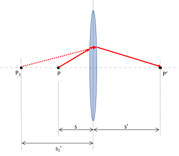

# Lenses {#sec:ch16-lenses}

*Textbook link: Tipler and Mosca, Section 15.1*

Having examined the principles of reflection in respect of curved mirrors, we now look at the case of a curved interface between two optically transparent materials. We introduced the principle of refraction in Section \@ref(sec:ch14-reflectionrefraction), where a light ray will slow down on entering a more optically dense medium (higher refractive index) and its path will change as described by Snell's law of refraction (Equation \@ref(eq:ch14-snellslaw1)). With a plane interface, the behaviour is straightforward, however now that we have a curved surface, the angle of incidence (and hence the angle of refraction) will vary depending on which part of the surface a parallel light ray interacts with.  The theory introduced here describes how lenses are used to manipulate light rays.

## Refraction at a spherical surface {#sec:ch16-sphericalsurface1}

We will first consider how a light ray refracts when encountering a single curved interface between two media. In the example shown in Figure \@ref(fig:ch16-sphericalsurface1), the image is shown inside the more optically dense medium.

```{r echo=FALSE, ch16-sphericalsurface1, out.width='70%', fig.show='hold', fig.align="center", auto_pdf=TRUE, fig.cap="Refraction at a spherical surface involves the focussing of the rays to a real image. Note that this is not (yet) a lens as only a single refraction is considered. Rays through the center of curvature $C$ are perpendicular to the surface and are not refracted, while rays which are not perpendicular to the surface are subject to Snell's law and refract as expected. These rays converge with the central rays to create an image at $P'$."}

```


Examining the rays in Figure \@ref(fig:ch16-sphericalsurface1), we can use Snell's law and geometry to establish the relationships between the refractive indices and the image properties.

Firstly, via Snell's law:

\begin{equation}
\begin{array}{rcll}
n_1 \sin \theta_1 &=& n_2 \sin \theta_2 &\\
n_1 \theta_1 &\approx& n_2 \theta_2 & \textsf{(for small angles)}
\end{array}
(\#eq:ch16-lensequation1)
\end{equation}

We use the equivalency that, at small angles (in radians), $\sin \theta \approx \theta$. This allows us to study the geometry and establish relationships between the angles:^[It is worth ensuring you can follow through the geometric arguments which lead to these results.]

\begin{equation}
\begin{array}{rcl}
\beta &=& \theta_2 + \gamma = \dfrac{n_1}{n_2}\theta_1 + \gamma \\
\theta_1 &=& \alpha + \beta
\end{array}
(\#eq:ch16-lensequation2)
\end{equation}

We can then substitute our expression for $\theta_1$ to eliminate this from the first expression and rearrange:

\begin{equation}
\begin{array}{rcl}
\beta &=& \dfrac{n_1}{n_2}(\alpha + \beta) + \gamma \\
(n_2 -n_1)\beta &=& n_1 \alpha + n_2 \gamma
\end{array}
(\#eq:ch16-lensequation3)
\end{equation}

As we are assuming small angles, we are also assuming that the rays are paraxial, we can then establish relations for the angles in relation to Figure \@ref(fig:ch16-sphericalsurface2):


```{r echo=FALSE, ch16-sphericalsurface2, out.width='70%', fig.show='hold', fig.align="center", auto_pdf=TRUE, fig.cap="We can determine the position of the image at $s'$ from the refractive indices and the object position $s$ through determining the angles and assuming small values."}

```


Assuming paraxial rays, then:

\begin{equation}
\alpha \approx \sin \alpha = \frac{l}{s} \quad \beta \approx \sin \beta = \frac{r}{l} \quad \gamma \approx \frac{l}{s'}
(\#eq:ch16-lensequation4)
\end{equation}

We can now combine the results in Equation \@ref(eq:ch16-lensequation4) with that of Equation \@ref(eq:ch16-lensequation3) to obtain the general equation for a curved interface (Equation \@ref(eq:ch16-lensequation5)), relating the image position to the refractive indices of the two materials and the radius of curvature, $r$:

\begin{equation}
\frac{n_1}{s} + \frac{n_2}{s'} = \frac{(n_2 - n_1)}{r}
(\#eq:ch16-lensequation5)
\end{equation}

### Sign conventions {#sec:ch16-signconventioncurvedsurface1}

As with the mirror, there are a number of sign conventions to be aware of for a reflecting surface:


1. $s$ is:
    * **positive** when the object (real) is in front of the surface (incident side);
    * **negative** when the object (virtual) is behind the surface (transmission side) *e.g.* formed by another lens or mirror;
1. $s'$ is: 
    * **positive** when the image (real) is behind the surface (transmission side);
    * **negative** when the image (virtual) is in front of the surface (incident side);
1. $r$, $f$ are:
    * **positive** when the centre/focus are behind the surface (transmission side)
    * **negative** when the centre/focus are in front of the surface (incident side);
    
**Note that these conventions are different to the mirror conventions.**

### Magnification {#sec:ch16-magnificationcurvedsurface1}

As for the spherical mirror, the curved interface can be considered to have magnification properties.  We can consider these in terms of the angles of incidence and refraction along the optical axis of the surface (Figure \@ref(fig:ch16-sphericalsurfacemag1)).

```{r echo=FALSE, ch16-sphericalsurfacemag1, out.width='70%', fig.show='hold', fig.align="center", auto_pdf=TRUE, fig.cap="The magnification ratio between the object and image size is related to the angles $\\theta_1$ and $\\theta_2$."}

```


In this construction, we have defined two triangles, each of which give us expressions for the angles of incidence and refraction; the angle of incidence can be determined by the height of the object ($y$) and its distance from the surface ($s$), while the angle of refraction is defined by the height of the image ($y'$) and its distance behind the surface ($s'$).

This allows us to then define the relationships between these angles:

\begin{equation}
\begin{array}{rclcrcll}
\tan \theta_1 &=& \dfrac{y}{s} & & \theta_1 &\approx& \dfrac{y}{s} & (\textsf{at small angles}) \\
\tan \theta_2 &=& \dfrac{y'}{s'} & & \theta_2 &\approx& \dfrac{y'}{s'} & (\textsf{at small angles}) \\
\end{array}
(\#eq:ch16-sphericalsurfacemag1)
\end{equation}

Once again, we define the magnification as the ratio between the image size ($y'$) and the object size ($y$); therefore using Snell's law ($n_1 \theta_1 \approx n_2 \theta_2$ for small angles) we can now relate these statements of $y$ and $s$ to find the magnification, $m$:

\begin{equation}
m = \frac{y'}{y} = -\frac{n_1 s'}{n_2 s}
(\#eq:ch16-sphericalsurfacemag2)
\end{equation}

The significance of the negative sign in Equation \@ref(eq:ch16-sphericalsurfacemag2) is in indicating the inverted image (see Figure \@ref(fig:ch16-sphericalsurfacemag1))

## Refraction through a thin lens {#sec:ch16-thinlens1}

We now consider a thin lens.  The term "thin" is a way of describing the lens such that it is sufficiently thin that an image of an object is not able to form inside the more dense medium as described in Section \@ref(sec:ch16-sphericalsurface1). Rather, light rays refract once passing into the more dense medium, and then are refracted again back into the less dense medium before an image is formed.

Refraction occurs at two surfaces of radius $r_1$ and $r_2$ respectively.  Generally we assume the lens is in air, so the refractive index of the material is $n$ and we assume the refractive index of air to be $\sim 1$. We consider the refraction at each surface separately in order to build the overall picture of the light path shown in Figure \@ref(fig:ch16-thinlens1).


```{r echo=FALSE, ch16-thinlens1, out.width='70%', fig.show='hold', fig.align="center", auto_pdf=TRUE, fig.cap="A thin lens now has two refracting surfaces (some lenses are flat on one side; they still have refraction at these surfaces!). The first refraction from the object at point $P$ creates an apparent virtual object at $P'$ for the second refraction."}

```


The best way to understand what is happening in Figure \@ref(fig:ch16-thinlens1) is to look at each interface in turn:

* At the first surface, we have the same process as we encountered in Section \@ref(sec:ch16-sphericalsurface1) with the light refracting from the air into the lens material.  This creates a light path within the lens appearing to originate from a virtual object image at $P_1$. We can determine its position by adapting Equation \@ref(eq:ch16-lensequation5) by replacing our values of $n_1 = 1$ and $n_2 = n$ (Equation \@ref(eq:ch16-thinlensequation1)).

\begin{equation}
\frac{1}{s} + \frac{n}{s_1'} = \frac{(n - 1)}{r_1}
(\#eq:ch16-thinlensequation1)
\end{equation}

This virtual object formed at $P_1$ now becomes the object image for refraction at teb second surface, and lies at a distance $s_1'$ from the lens.  Note that:

* $s_1'$ is **negative** in the first refraction as $P_1$ is a virtual image for refraction at the first surface (image on same side as the object);
* $s_1'$ is **positive** for the second refraction as the "object image" at $P_1$ is on the incident side for the second surface.

We can now again adapt Equation \@ref(eq:ch16-lensequation5) for the second refraction, again adapting our values of $n_1 = n$ and $n_2 = 1$:^[Note that $n_1$ and $n_2$ are now reversed because we are now moving from the more dense material into the less dense material.]

\begin{equation}
-\frac{n}{s_1'} + \frac{1}{s'} = \frac{(1 - n)}{r_2}
(\#eq:ch16-thinlensequation2)
\end{equation}

We combine Equations \@ref(eq:ch16-thinlensequation1) and \@ref(eq:ch16-thinlensequation2) to eliminate the position of the virtual object at $P_1$ to obtain the overall equation for a light ray from an object refracting through a thin lens (Equation \@ref(eq:ch16-thinlensequation3))

\begin{equation}
\frac{1}{s} + \frac{1}{s'} = (n-1)\left( \frac{1}{r_1} - \frac{1}{r_2}\right)
(\#eq:ch16-thinlensequation3)
\end{equation}

The consequence of this is that, if we take the object distance $s = \infty$ (*i.e.* parallel rays), then $s' = f$, the focal length of the lens; therefore we can find the focal length of the lens via Equation \@ref(eq:ch16-thinlensequation4):

\begin{equation}
\frac{1}{f} = (n-1) \left(  \frac{1}{r_1} - \frac{1}{r_2} \right)
(\#eq:ch16-thinlensequation4)
\end{equation}

Equation \@ref(eq:ch16-thinlensequation4) is known as the *lens maker's equation*, allowing the creation of a given focal length $f$ by shaping the radii of curvature on either side.  Additionally, by equating Equations \@ref(eq:ch16-thinlensequation3) and \@ref(eq:ch16-thinlensequation4), we obtain the *thin lens equation*, Equation \@ref(eq:ch16-thinlensequation5):

\begin{equation}
\frac{1}{s} + \frac{1}{s'} = \frac{1}{f}
(\#eq:ch16-thinlensequation5)
\end{equation}

Note that this is the same form as the mirror equation (Equation \@ref(eq:ch15-mirrorequation1)), but using the differing sign conventions, reflecting the position of the image.

## Types of lens

Having derived the lens equation, we now look at the different forms which lenses can take.

### The converging lens {#sec:ch16-converginglens1}

  Any lens (with material of $n$ greater than that of the surrounding medium) which is **thicker** in the middle than at the edges will be a **converging lens** *i.e.* parallel rays from any direction are brought to a focus on the focal plane (Figure \@ref(fig:ch16-converginglens1)).

```{r echo=FALSE, ch16-converginglens1, out.width='70%', fig.show='hold', fig.align="center", auto_pdf=TRUE, fig.cap="A converging lens is shown to be thicker in the middle than at the edges. This causes light rays to converge(!), creating a real image. In this example,rays from infinity (parallel rays) are focussed onto the focal point $F$. Any rays from 'infinity' at any angle will be focussed onto this focal plane."}

```

$F$ and $F'$ are the first and second focal points respectively, each at a distance $f$ from the lens.

### The diverging lens {#sec:ch16-diverginglens1}

In contrast to the converging lens (Section \@ref(sec:ch16-converginglens1)), a **diverging lens** will be any lens (where $n$ is greater than the surrounding medium) which is **thinner** in the middle than at the edges.  In this case, parallel rays from any direction are diverged as though originating *from* the focual point $F$ on the incident side of the lends (Figure \@ref(fig:ch16-diverginglens1)) 

```{r echo=FALSE, ch16-diverginglens1, out.width='70%', fig.show='hold', fig.align="center", auto_pdf=TRUE, fig.cap="A diverging lens is shown to be thinner in the middle than at the edges. This causes light rays to diverge(!), however the rays do not converge to form an image. Instead, rays are projected backwards to the point at which they would converge (where the light rays appear to come from); this is a virtual image. "}

```


## Ray diagrams {#sec:ch16-raydiagrams1}

We now need to set a series of rules for constructing ray diagrams. This allows us to understand how lenses form their images, where those images lie, and allow us to ensure we use the correct sign conventions within the lens equations.

We consider three principal rays:

1. Parallel ray - drawn parallel to the lens axis, which is bent by the lens to pass through the focus (converging lens) or is bent to appear as though it comes *from* the focus (diverging lens);
1. Central ray - this passes through the centre of the lens and is undeviated by the lens;^[Actually, the central ray will be slightly affected, but the emerging ray is parallel to the incident ray, and the offset is negligible in most circumstances.]
1. Focal ray - this is a ray originating from the focal point of a converging lens, and the emerging ray will be parallel to the lens axis. Generally this ray is not needed as the other two rays are usually sufficient to identify the location of the image.

### Ray diagram for a converging lens {#sec:ch16-rayconverge1}


```{r echo=FALSE, ch16-rayconverge1, out.width='70%', fig.show='hold', fig.align="center", auto_pdf=TRUE, fig.cap="The rays in a converging lens shown in this example converge to create a real image. The distances $s$, $s'$ can be used to determine the magnification ratio $y'/y$ for the image."}
knitr::include_graphics("visualisations/LaTeX/ch16-converginglens1.svg")
```

Using Figure \@ref(fig:ch16-rayconverge1) we can see that, for an object between $\infty$ and $F$, the image is **real** and **inverted**.  We can then determine the magnification by using geometry:

Since:

\begin{equation}
\tan \theta = \frac{y}{s} = \frac{-y'}{s'}
\end{equation}

(remember that since the image is inverted, $y'$ is negative).  We can then determine the magnification $m$ by finding the ratio of the object and image height:

\begin{equation}
m = \frac{y'}{y} = -\frac{s'}{s}
\end{equation}

The negative term in the magnification tells us that the image is inverted.


### Ray diagram for a diverging lens {#sec:ch16-raydiverge1}

```{r echo=FALSE, ch16-raydiverge1, out.width='70%', fig.show='hold', fig.align="center", auto_pdf=TRUE, fig.cap="The rays in a diverging lens shown in this example do not converge; instead we look at the point where rays appear to come from to create a virtual image. The distances $s$, $s'$ can again be used to determine the magnification ratio $y'/y$ for the image."}

```


Using Figure \@ref(fig:ch16-raydiverge1) we can see that, for an object between $\infty$ and $F$, the image is **virtual** and **erect**.  We can then determine the magnification $m$ by using geometry as before:

\begin{equation}
m = \frac{y'}{y} = -\frac{s'}{s}
\end{equation}

## Combining lenses {#sec:ch16-lenscombination1}

When two lenses are put together, the image formed by the first lens becomes the object for the second lens; this then becomes the basis for constructing a ray diagram.  We can use these diagrams to determine the effective focal length of the combined lens system.

### Lenses side-by-side, zero distance {#sec:ch16-2lenszerodistance}

In this example we imagine the two lenses sitting exactly next to each other along the principal axis such that there is no distance between them.  Firstly, we write the thin lens equation for lens 1 (derived from Equtation \@ref(eq:ch16-thinlensequation5)), remembering that $s_1$ is the distance of the object from the lens, $s_1'$ is the distance of the image from the lens, and $f_1$ is the focal length of the lens.

\begin{equation}
\frac{1}{s_1} + \frac{1}{s'_1} = \frac{1}{f_1}
(\#eq:ch16-lenscombination1)
\end{equation}

We can now write the thin-lens equation for lens 2 - this time, remember that the *image* formed by lens 1 becomes the *object* for lens 2; *i.e.* the distance of "object 2" (the image from lens 1) from lens 2 is $s_2 \equiv - s_1'$ (since this new "object" is a virtual object on the transmission side of the lens):

\begin{equation}
\frac{1}{s_2} + \frac{1}{s'_2} = -\frac{1}{s_1'} + \frac{1}{s'_2}= \frac{1}{f_2}
(\#eq:ch16-lenscombination2)
\end{equation}

We can now add together Equations \@ref(eq:ch16-lenscombination1) and \@ref(eq:ch16-lenscombination2) to gain an expression for the effective focal length of the two-lens system, $f_{\textsf{eff}}$:

\begin{equation}
\begin{array}{rcl}
\dfrac{1}{f_{\textsf{eff}}} &=& \dfrac{1}{f_1} + \dfrac{1}{f_2} \\
  &=& \dfrac{1}{s_1} + \dfrac{1}{s'_1} -\dfrac{1}{s_1'} + \dfrac{1}{s'_2}\\
  &=& \dfrac{1}{s_1}  + \dfrac{1}{s'_2}
\end{array}
(\#eq:ch16-lenscombination3)
\end{equation}

### Lenses adjacent, but separated {#sec:ch16-2lensseparated}

We can carry out the same analysis as in Section \@ref(sec:ch16-2lenszerodistance) and obtain the same result, however it will be more instructive this time to look at ray diagrams as this will help to explain what is happening, particularly in respect of the "virtual object" phenomenon.

**Step One: consider the first lens** (Figure \@ref(fig:ch16-convergingset1a))

```{r echo=FALSE, ch16-convergingset1a, out.width='70%', fig.show='hold', fig.align="center", auto_pdf=TRUE, fig.cap="For a pair of converging lenses, the image from the first lens creates the object for the second. In this example, the second lens blocks formation of the otherwise 'real' image from the first lens."}

```

We draw the ray diagram for the first lens, following the conventions for ray paths as laid out in Section \@ref(sec:ch16-raydiagrams1); we can see that the image formed by the first lens in this example lies past the second lens.

**Step Two: consider the second lens** (Figure \@ref(fig:ch16-convergingset2a))

```{r echo=FALSE, ch16-convergingset2a, out.width='70%', fig.show='hold', fig.align="center", auto_pdf=TRUE, fig.cap="The now virtual image from the first lens creates a virtual object for the second lens; rays are projected backwards to imagine where they come from in order to set up the refractions for the second lens and create the final object."}

```


As the "object" which the second lens focuses is a "virtual object" (*i.e.* it lies on the transmission side of the lens), we need to treat the ray diagram for this second lens slightly differently; we need to project the rays *backwards* through the lens to the focal point and lens centre:

1. The Parallel ray is projected back from the virtual object, parallel to the principal axis. As this ray existed in the first ray diagram, it is parallel to the principal axis before it encounters Lens 2; therefore this needs to be refracted to pass through the focal point of lens 2, $F'_2$;
1. The central ray is projected back from the virtual object and passes through the centre of lens 2. Where this intersects with the refracted parallel ray we define the position of the final image.
1. The focal ray is projected back from the virtual object to pass through $F_2$; in contrast to the parallel ray, it is refracted to be parallel to the principal axis, once again intersecting with the first two rays to form the final image.

This two-lens system ultimately yields a final image which is **real** (on the transmission side of the lens system), **inverted** and, for this example, smaller than the object.

Compound lens systems such as this are the basis of *optical trains* in instrumentation; a series of optical elements carrying and shaping a light beam through an instrument.

### The Astronomical Telescope {#sec:ch16-astronomicaltelescope}

A basic telescope consists of two optical elements; for example two lenses, two mirrors, or one lens and one mirror.  The aim of using a telescope is to produce an image of a distant object which appears "close" to the eye.  A consequence of this is that the image is much smaller than the object, but is closer to the observer and therefore appears larger. However, the lateral magnification is small.  For this reason, we tend to think of telescopes in terms of **angular magnification** - the increase in angle subtended by the image at the eye.  The larger this angle, the larger the apparent magnification of the object.

We can determine the angular magnification of a telescope through construction of an appropriate ray diagram.  A telescope is constructed by placing the lenses so that the image of the objective lens is formed at the focal plane of the objective lens, with the eyepiece lens being placed so that the image *also* lies on its focal plane.  This way the appearance of the light-rays coming from infinity (parallel rays) is preserved for the observer.

```{r echo=FALSE, ch16-telescopeoptics1, out.width='70%', fig.show='hold', fig.align="center", auto_pdf=TRUE, fig.cap="The two lenses in an astronomical telescope are positioned so their focal points are coincident. This means that parallel rays from infinity come into the telescope and parallel rays come from the eyepiece. This allows the observer to focus on an image which is much smaller than the object but, because it is closer to the observer, it has a large angular magnification."}

```


The angular magnification is defined in a similar way to the linear magnification described in Section \@ref(sec:ch16-magnificationcurvedsurface1); namely the ratio of the eyepiece observation angle ($\theta_{\textsf{e}}$) and the objective observation angle (\theta_{\textsf{o}}), *i.e.*:

\begin{equation}
M = \frac{\theta_{\textsf{e}}}{\theta_{\textsf{o}}}
\end{equation}

Via trigonometry on Figure \@ref(fig:ch16-telescopeoptics1), we can determine expressions for the angles in terms of the distances within the telescope, namely:

\begin{equation}
\tan \theta_{\textsf{o}} = -\frac{y'}{f_{\textsf{o}}} \approx \theta_{\textsf{o}} \quad \textsf{and} \quad \tan \theta_{\textsf{e}} = \frac{y'}{f_{\textsf{e}}} \approx \theta_{\textsf{e}}
\end{equation}

Remember that the image height $y'$ is negative as the image is inverted relative to the source.  We can then write the magnification as:

\begin{equation}
M = \frac{\theta_{\textsf{e}}}{\theta_{\textsf{o}}} = -\frac{f_{\textsf{o}}}{f_{\textsf{e}}}
\end{equation}

This expression for the magnification is negative telling us that the final image we observe through the eyepiece is inverted relative to the source.
