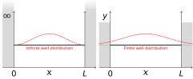

# The Schr&ouml;dinger Equation {#sec:ch18-schrodinger}

*Textbook link: Tipler and Mosca, Section 35.1*

The *time dependent* Schr&ouml;dinger equation in one dimension is given in Equation \@ref(eq:ch18-schrodingertd1):

\begin{equation}
-\frac{\hbar^2}{2m} \frac{\partial^2 \psi(x,t)}{\partial x^2} + U \psi(x,t) = \mathrm{i}\hbar \frac{\partial \psi(x,t)}{\partial t}
(\#eq:ch18-schrodingertd1)
\end{equation}

...where $U$ is the potential energy function which might vary with position and time.  Note the facter $\mathrm{i}$ and that the right-hand side only has a first derivative with respect to time.  Additionally, the wavefunction itself may be complex, so we modify our expression for the probability of finding a particle in a region of space $\mathrm{d}x$ to:

\begin{equation}
P(x,t) \mathrm{d}x = |\psi(x,t)|^2 \mathrm{d}x= \psi^*\psi \mathrm{d}x
\end{equation}

...where $\psi^*$ is the complex conjugate of $\psi$.  

If $U$ is independent of time, we can separate out the time-dependence of the wavefunction *i.e.* the oscillatory time-dependent amplitude of the standing wave as follows:

\begin{equation}
\psi(x,t) = \psi(x) \mathrm{e}^{-\mathrm{i}\omega t}
(\#eq:ch18-schrodingerti1)
\end{equation}

The probability distribution for this wavefunction is then given by:

\begin{equation}
P(x,t) = \psi^* \psi = \psi^*(x) \mathrm{e}^{+\mathrm{i}\omega t} \times \psi(x) \mathrm{e}^{-\mathrm{i}\omega t}
\end{equation}

The exponential terms cancel, giving the result:

\begin{equation}
P(x,t) = |\psi(x)|^2
\end{equation}

...in other words, the probability distribution is static with time.  If we take the time-independent expression for the wavefunction in Equation \@ref(eq:ch18-schrodingerti1) and substitute this into Equation \@ref(eq:ch18-schrodingertd1), differentiating and cancelling through by a factor of $\mathrm{e}^{-\mathrm{i}\omega t}$, we get the *time-independent* form of the equation, Equation \@ref(eq:ch18-schrodingerti2):

\begin{equation}
-\frac{\hbar^2}{2m} \frac{\partial^2 \psi(x)}{\partial x^2} + U(x) \psi(x) =  E \psi(x)
(\#eq:ch18-schrodingerti2)
\end{equation}

...where $E = \hbar \omega$ is the energy of the particle.

Since we are only working in the non-relativistic case, the rest-mass energy is not included in $E$ here (*i.e.* we are discussing energies in addition to the rest-mass energy). As discussed in the last chapter (\@ref(sec:ch17-waveparticle)), this is fine as it simply offsets all energies by a constant amount without changing any of the physics. In this case, $E$ in the time-independent Schr&ouml;dinger equation is again just the sum of the kinetic and potential energies.

The time-independent Schr&ouml;dinger equation may be solved for a variety of systems, provided that the resultant wavefunction, $\psi(x)$ satisfies any boundary conditions, as well as satisfying the normalisation condition:

\begin{equation}
\int_{-\infty}^{\infty} |\psi^2| \mathrm{d}x = 1
\end{equation}

...which implies also that we must have:

\begin{equation}
\psi(x) \rightarrow 0 \quad \textsf{as} \quad x \rightarrow \pm \infty
\end{equation}


## Particle in a square potential well {#sec:ch18-partsquarewell1}

### The infinite potential well

We have already introduced an example of this; the particle in a box problem (Section \@ref(sec:ch17-particlebox)), and the formal solutions for a particle in a square potential well were deduced there. There are parallels with electrons in an atom, however going from a one dimensional "box" to a three dimensional spherical surface is slightly involved.^[The wavefunctions which fit onto the surface of a sphere describe the shapes of atomic orbitals, a collection of waveforms known as *spherical harmonics*. These same waveforms are widely used in other applications, including (among other things) acoustic engineering.]

The general principal with the infinte well is that the particle cannot ever escape the box; inside the box the potential energy $U$ is equal to zero, and the time-independent equation reduces to the form shown in Equation \@ref(eq:ch18-infinitewell1) (for one dimension):

\begin{equation}
\frac{\mathrm{d}^2 \psi(x)}{\mathrm{d}x^2} = -k^2 \psi(x)
(\#eq:ch18-infinitewell1)
\end{equation}

...where:

\begin{equation}
k^2 = \frac{2mE}{\hbar} = \frac{p^2}{\hbar^2} \quad \textsf{as expected}
\end{equation}

This equation should look very familiar to us; it looks like a simple harmonic oscillator with the oscillation instead being in space rather than in time (see Section \@ref(sec:ch1-simpleshmexample)).  The solutions to this equation then are any sine or cosine wave, leading to the expected standing wave solutions when the boundaries are taken into account.

### The finite potential well

We now adapt the inifinte well to a finite well; the potential inside the well is still zero, however we now have a finite energy barrier at the edges.

In a classical consideration, if the energy $E$ of the particle is less than the depth of the well ($U_0$), then the particle is trapped inside the well.  For a quantum particle however the picture is rather different.  When we examine the Schr&ouml;dinger equation we now have to consider what happens with the potential energy term.  Recall that the general form of the time-independent Schr&ouml;dinger equation is as follows:

\begin{equation}
-\frac{\hbar^2}{2m} \frac{\partial^2 \psi(x)}{\partial x^2} + U(x) \psi(x) =  E \psi(x)
\end{equation}

Inside the well, $U = 0$, so we would expect to have the same sinusoidal functions as the infinite well, however outside the well we need to consider the fact that $U$ has a finite value (even if $E<U_0$).  We rearrange the Schr&ouml;dinger equation as follows:


\begin{equation}
\begin{array}{rcl}
-\dfrac{\hbar^2}{2m} \dfrac{\partial^2 \psi(x)}{\partial x^2} + U(x) \psi(x) &=&  E \psi(x)\\
\dfrac{\partial^2 \psi(x)}{\partial x^2} &=& \dfrac{2m (U_0 - E)}{\hbar^2} \psi(x)
\end{array}
(\#eq:ch18-finitewell1)
\end{equation}

It can be shown that a simple sinusoidal function such as $\psi = \sin(kx)$ will not be a solution to this equation; however an exponential  will work as a solution in the form $\psi = \mathrm{e}^{\pm \kappa x}$, where $\kappa$ is given by:

\begin{equation}
\kappa = \frac{\sqrt{2m(U_0 - E)}}{\hbar}
\end{equation}

The $\pm$ solutions are exponential increase at $x<0$ and decrease at $x>L$ (*i.e.* there is an exponential 'tail-off' at either boundary of the box).  If the energy of the particle is less than $U_0$, the particle will be bound by the potential well, as expected, **however**, the wavefunctions will actually 'spill over' the edges of the box.  This implies that the particle will spend some of its time **outside the well**, contrary to classical expectations!

```{r echo=FALSE, ch18-finitewell1, out.width='70%', fig.show='hold', fig.align="center", auto_pdf=TRUE, fig.cap="In a finite potential well, there is an exponential 'tail off' in the probability of finding the particle at the edges of the box. In these circumstances, the wavefunction decays exponentially outside the boundaries, but there is a finite probability of finding the particle at these locations."}



```


## Reflection and transmission of particle waves {#sec:ch18-reflectionparticlewaves}

Let's now consider what happens as a particle of energy $E$ travels towards a potential energy step function of height $U_0$ (Figure \@ref(fig:ch18-reflectionparticlewave1)).


```{r echo=FALSE, ch18-reflectionparticlewave1, out.width='70%', fig.show='hold', fig.align="center", auto_pdf=TRUE, fig.cap="A potential energy step function such as that which might bound a finite well is shown here; a sudden step up in potential from one region of space to another. If the wavefunction does not have sufficient energy to pass the step, it will tunnel into the step and decay exponentially (lower diagram)."}
knitr::include_graphics("visualisations/LaTeX/ch18-pestep1.svg")
knitr::include_graphics("visualisations/LaTeX/ch18-pestep2.svg")
```


In a classical situation, we can consider the following situations:

* If $E<U_0$, the particle would be completely reflected
* If $E>U_0$, th eparticle would be completely transmitted, but with a reduction in velocity corresponding to the loss of kinetic energy in overcoming the potential barrier.

In a quantum mechanical situation however things are rather different:

* If $E<U_0$, the wavefunction penetrates a short distance beyond the step, into the classically forbidden region; however the particle is totally reflected.
* If $E>U_0$, the particle is sometimes reflected, sometimes transmitted.

Whether the particle is transmitted or reflected is a probabilistic process; the probability of reflection is given by:

\begin{equation}
R = \frac{(k_1 - k_2)^2}{(k_1 + k_2)^2}
\end{equation}

...where $k_1$ and $k_2$ are the wavenumbers in each of the two regions.  This result should, again, be familiar to us as the same result we obtained for waves reflecting on strings as the wave moves from one string to another of a different density (Section \@ref(sec:ch8-powertransmittedreflected)).  Once again, remember that a given wavenumber $k$ is defined as:

\begin{equation}
k^2 = \frac{2mE}{\hbar^2} = \frac{p^2}{\hbar^2}
\end{equation}

## Barrier penetration - 'tunnelling' {#sec:ch18-tunnelling1}

Now, instead of a step potential, consider a potential barrier in the path of the particle, at a height sugh that the energy of the particle $E$ is slightly less than $U_0$ (Figure \@ref(fig:ch18-tunelling1)):


```{r echo=FALSE, ch18-tunelling1, out.width='70%', fig.show='hold', fig.align="center", auto_pdf=TRUE, fig.cap="A potential barrier has finite width as shown above. This can stop a particle passing however a particle can tunnel through."}

```


As in Sectin \@ref(sec:ch18-reflectionparticlewaves), we expect the wavefunction to penetrate into the barrier, **however** if the barrier is sufficiently narrow, the wavefunction will have a finite amplitude when it reaches the end of the barrier, and the wavefunction returns from exponential behaviour to oscillating sinusoidal behaviour once again, though with a reduced amplitude (Figure \@ref(fig:ch18-tunelling2)):


```{r echo=FALSE, ch18-tunelling2, out.width='70%', fig.show='hold', fig.align="center", auto_pdf=TRUE, fig.cap="A waveparticle approaching a potential barrier can tunnel through the barrier if it is sufficiently narrow. It will appear the other side of the barrier with a decayed amplitude, suggesting a smaller probability of finding the particle on the other side."}

```

In other words, there is a probability that the particle will penetrate, or "tunnel through", the barrier.  The smaller amplitude on the other side of the barrier indicates that there is a smaller probability of finding the particle on the transmission side of the barrier.  In classical mechanics this would be a completely forbidden behaviour; though classical tunnelling of waves is possible (via evanescent modes when a wave is undergoing total internal reflection; see Section \@ref(sec:ch14-evanescence)).

Quantum mechanical tunnelling has been proposed as the mechanism by which $\alpha$ particles are spontaneously and unpredictably ejected from radioactive nuclei, and the phenomenon sees application in the scanning tunnelling microscope (STM) to obtain atomic resolution images of certain surfaces by monitoring the current as electrons tunnel across a gap between a probe and the surface.
